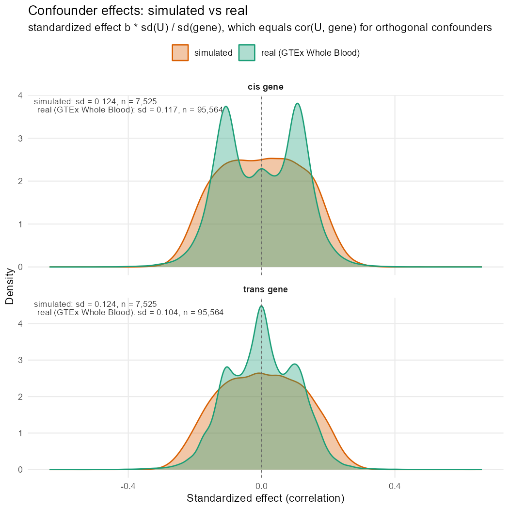
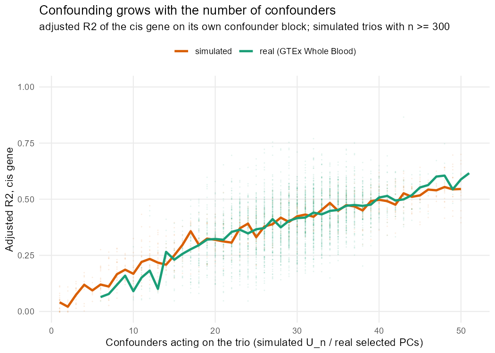

# Revised simulation study — methodology

Working record of the simulation and inference methodology for the revision. Kept
current as the work proceeds. Numbers here are measured, not intended.

Run everything from the **repository root**.

| stage | script | output |
| --- | --- | --- |
| real-data confounder effects | `pc_distribution_invest/compute_pc_dist_bounds.R` | `pc_distribution_invest/data/real_pc_effect_pools.RData`, 2 PNGs |
| real-data SNP effects | `pc_distribution_invest/compute_effects_snp_on_gene.R` | 2 PNGs |
| simulation | `simulation/updated_data_simulation.R` | `simulation/simulated_data/simulated_trios.RData` |
| calibration check | `simulation/verify_simulation.R` | console report + `simulation_results/simulated_vs_real_conf_effects.png`, `r2_vs_confounder_count.png` |
| confounder selection | `simulation_results/run_confounder_selection.R` | `simulation_results/data/selection_group_n*.RData`, then `selection_results.RData` + `.csv` |
| inference | `simulation_results/run_all_inference.R` (drives `apply_{mrgn,mrpc,gmac,mrggi}.R`) | `simulation_results/data/{mrgn,mrpc,gmac,mrggi}_group_n*.RData`, then `inference_{method}.RData` + `.csv` and the joined `inference_results.RData` + `.csv` |

**Table 1. The six stages of the pipeline, in dependency order.** Stages 1–2
measure the real GTEx data that sets the simulation's parameter bounds; stage 3
generates the trios; stage 4 checks what stage 3 realized against what stage 1
measured; stage 5 selects confounders; stage 6 runs the three methods over the
result. Stages 1 and 2 are independent of each other, as are 4 and 5, so either
pair can run in either order.

**Stages 5 and 6 are split because selection is the expensive part** — ~30 min
per sample-size group, ~2.5 h over all five — and it does not depend on which
method is fitted afterwards. Stage 5 caches each group; stage 6 loads the cache
rather than recomputing, and validates it against the current request so a cache
built from different simulated data is detected rather than silently reused.
Running stage 5 first is optional: stage 6 computes and caches any group it finds
missing.

Within stage 6 **each method checkpoints separately per group**, so re-running
one method leaves the others' results untouched. `methods` controls what runs;
`rerun.inference` controls whether existing checkpoints are recomputed. Note this
covers GMAC too — a completed GMAC group is skipped on a later MRGN-only run.
Combining always reads every method checkpoint present on disk, not just the
configured ones, so a single-method run cannot silently drop the other methods'
columns from the master.

Shared helpers live in `simulation/simulation_utils.R` and
`simulation_results/inference_utils.R`, both free of top-level side effects so
they can be sourced anywhere. Each folder carries a `README.md` describing its
scripts, data files and figures; this document covers the methodology only.

Every measured number below was last reproduced on 2026-08-20 against the current
`simulation/simulated_data/simulated_trios.RData` (1,500 datasets, `set.seed(234)`).
The §3 and §4 tables come straight from `verify_simulation.R`; the per-model and
resampling figures in §1, §2 and §4 are separate one-off diagnostics on the same
file.

---

## 1. Generating models

Each dataset is one trio — genotype `V1`, cis gene `T1`, trans gene `T2` — plus
four covariate blocks. Topology comes from `MRGN::gen.graph.skel()` and the data
from `MRGN::simData.from.graph()`.

| model | trio structure | inference label |
| --- | --- | --- |
| model0 | `V1 → T1`, `T2` independent | M0.1 |
| model1 | `V1 → T1 → T2` (cis mediates) | M1.1 |
| model2 | `V1 → T1 ← T2` (trans mediates) | M2.1 |
| model3 | `V1 → T1`, `V1 → T2` | M3 |
| model4 | `V1 → T1 → T2`, `V1 → T2` | M4 |

**Table 2. The five generating models and the label an inference must return to
be scored correct.** `trio structure` is the edge set `gen.graph.skel()` builds
among the three trio variables; the four covariate blocks of Table 3 attach to
every one of them. The `.1` suffix on the M0/M1/M2 labels marks the variant in
which the *cis* gene plays the structural role — mediator in M1, collider parent
in M2 — as against the `.2` variant where the trans gene does. Because the
simulation always puts the cis gene in `T1`, only the `.1` form can ever be the
truth here. M3 and M4 take no suffix: M3 is symmetric in the two genes, and
MRGN's scheme gives M4 a single label. This is the mapping `TRUTH.LABEL` encodes,
written out explicitly rather than deferring to `MRGN::convert.truth()`.

The cis gene is always `T1`, so the truth is always the `.1` variant. The label
lookup is explicit in `inference_utils.R` (`TRUTH.LABEL`) rather than
`MRGN::convert.truth()`, which maps by sorted position and mislabels when the
input does not contain all five models.

### Covariate blocks

| block | role | count | `conf.coef.ranges` |
| --- | --- | --- | --- |
| `K` | known clinical covariates (`pcr`, `platform`, `sex`) | 3 at n = 670, else 0 | `c(0, 0)` |
| `U` | unobserved confounders, `U → T1` and `U → T2` | `Uniform{1..50}` | `c(0, 0.3)` |
| `W` | intermediate, `T1 → W → T2` (reversed for model2) | 1 | `c(0.05, 0.5)` |
| `Z` | common child, `T1 → Z ← T2` | 1 | `c(1, 1.5)` |

**Table 3. The four covariate blocks attached to every trio.** `count` is how
many columns of that block a dataset carries; `conf.coef.ranges` is the interval
`gen.conf.coefs()` draws each coefficient's magnitude from before flipping its
sign at `neg.freq = 0.5`. Only `U` is a confounder in the causal sense — a common
parent of both genes, and the block a selection method is scored on recovering.
`W` sits between the genes and `Z` below them, so both are covariates a method
must learn to *reject*: conditioning on `W` blocks the mediated path, and
conditioning on `Z` opens a collider. All four entries must stay in the list even
when a block is empty, since `gen.graph.skel()` indexes it positionally. Note the
`U` interval is a **raw slope**, not a correlation, so it is not directly
comparable to the real bounds in Table 5 — see §3.

`U` is drawn `rmvnorm(mean = 0, sigma = I)`, so the confounders are mutually
orthogonal, as principal components are in the real data.

- **The `K` block is deliberately null**, carried over verbatim from
  `Simulation/sim_data.R`. The clinical covariates are real observed data but
  carry no effect on `T1` or `T2`, so the n = 670 arm differs from the others
  only by three extra columns handed to every method as known confounders.
  Verified in the generated data, over the 300 n = 670 datasets: the `K`
  coefficients on `T1` are centred at zero (medians −0.0075 / −0.0061 / −0.0006)
  and their p-values are uniform — median 0.51 and a rejection rate at α = 0.05
  of 0.043 / 0.087 / 0.063, i.e. near the nominal null rate. Individual trios do reach
  small p-values (min 0.0011 over 900 tests), exactly as a null should.
- **`K` is only available at n = 670**, since `pcr`/`platform`/`sex` are observed
  for exactly the 670 Whole Blood donors.

---

## 2. Scenario grid

`5 models × 5 sample sizes (50, 150, 300, 670, 1000) × 3 effect sizes × 20
replicates = 1,500 datasets`, 300 per sample-size group, one row per dataset in
`scenarios`.

The replicate count is set by the cost of **confounder selection**, not by the
cost of simulating — see §4. Cutting it from 50 to 20 leaves detection power
essentially unchanged and costs only per-cell precision: with 75 cells, 20
replicates gives a standard error near 0.11 on a per-cell accuracy of 0.5, so
read the marginals rather than individual cells.

| parameter | draw |
| --- | --- |
| `minor.freq` (θ) | `Uniform{0.01, 0.02, …, 0.50}` |
| `b.snp` | `runif` over the stratum: small `(0, 0.5]`, medium `(0.5, 1.0]`, large `(1.0, 1.5]` |
| `b.med` | `runif` over the stratum: small `(0, 0.3]`, medium `(0.3, 0.5]`, large `(0.5, 1.0]` |
| `SD` (residual σ) | 1, following Yang et al. 2017 |
| `U_n` | `Uniform{1..50}`, capped at `sample.size − 6` |
| `W_n`, `Z_n` | 1 each |
| `K_n` | 3 at n = 670, else 0 |

**Table 4. The parameters drawn per dataset, on top of the factorial grid.**
`model`, `sample.size`, `effect_size` and `replicate` come from the grid above;
these columns are drawn independently for each of its 1,500 rows, so every cell
of the design spans the full range of MAF and confounder count rather than
holding them fixed. `b.snp` and `b.med` are drawn independently *within* a
stratum, so a trio can pair a strong SNP with weak mediation or the reverse —
except in the large stratum, where the two ranges do not overlap and `b.snp`
always exceeds `b.med`. `U_n`'s cap keeps the confounder count below the residual
degrees of freedom; it binds only at n = 50, where it truncates the uniform draw
at 44 and is why adjusted `R²` is unreliable in that group.

Genotypes are drawn under Hardy-Weinberg and **resampled until all three
genotype classes appear**. This bites only at low θ and small `n`: 181 of the
1,500 datasets needed more than one draw, the median is 1, and the worst case
took 612 resamples at θ = 0.01, n = 50. Where it does bite it inflates the
realized MAF — 1.30× on average for nominal θ ≤ 0.05 pooled over sample sizes,
and 2.10× for those same θ at n = 50 alone. Above θ = 0.10 the distortion is
gone (ratio 1.010 for θ ∈ (0.10, 0.25], 0.998 above that). So the lowest-MAF,
smallest-`n` scenarios do not simulate quite what their θ says. Known and
accepted.

**`b.snp` and `b.med` are drawn from separate ranges**, both indexed by the same
`effect_size` stratum, and independently within a stratum. The SNP gets the wider
range because it drives everything downstream: `cor(V1, T1)` caps `cor(V1, W)`
and `cor(V1, Z)`, since `W` and `Z` are children of the genes and correlation
multiplies along a path. Measured on the current run, common-child detection
correlates 0.46 with `b.snp` and 0.40 with `b.med`, but −0.04 with `b.snp/b.med`
— the two absolute effect sizes both matter, their ratio does not (§4). The range
`(0, 1.5]` also matches Yang et al. 2017, who drew `β₁c ~ U(0.5, 1.5)`.

Only `b.snp` was widened. **`b.med` keeps the breakpoints of the pre-revision
simulation** (0.3 and 0.5, from the original `effect_sizes` list) rather than
splitting `(0, 1]` into equal thirds, so the mediation strata stay comparable
with the published study.

**The strata are contiguous and the draws are continuous.** Each stratum's upper
bound is the next one's lower bound, and values come from `runif()` over the
interval rather than from a `seq(..., by = 0.05)` grid. Both properties matter,
and an earlier version of this design had neither: with disjoint intervals
(small `[0.05, 0.50]`, medium `[0.55, 1.00]`) every value in `(0.50, 0.55)` was
unreachable, and on a 0.05 grid `b.snp = 0.51` or `0.52` could not occur at all
regardless of where the bounds sat. `draw.effect.sizes()` now errors if the
strata do not join up. Checked on the current data: no empty 0.01-wide bin
anywhere in either range, and 44 datasets fall in the old `(0.50, 0.55)` hole.

**Neither parameter may be exactly 0.** `b.snp = 0` removes the `V1 → T1` edge,
so a "model0" trio would carry no edges and its `M0.1` truth label would be
wrong; `b.med = 0` does the same to model1, model2 and model4. A lower bound of 0
is allowed in the spec — `runif()` does not return its lower bound — and the
draws are floored to make that guarantee explicit rather than trusting the RNG.
One consequence of the asymmetric ranges: in the large stratum `b.snp` always
exceeds `b.med` (1.0–1.5 vs 0.5–1.0), so that cell cannot produce strong
mediation with a weak SNP.

**`SD` must not be scaled by `b.med`.** `Simulation/sim_data.R` used
`SD = sample(seq(0.3, 1.5, 0.1)) * b.med`, but `b.med` here is drawn from the same
stratum as `b.snp`, so scaling the noise by it holds `b.snp/SD` roughly constant
across strata (measured 1.06 / 1.38 / 1.22) and the effect-size factor goes flat
and non-monotone — partial `|cor(V1,T1)|` of 0.55 / 0.63 / 0.48 for small /
medium / large. The original script had no effect-size strata, so its formula
does not transfer.

---

## 3. Confounder effect size

### The change

`conf.coef.ranges$U` was `c(0.05, 0.5)`; it is now `c(0, 0.3)`.

`gen.conf.coefs()` draws `|a| ~ Uniform` over this interval and flips the sign at
`neg.freq = 0.5`. The target is the distribution of real confounder effects on
cis and trans genes in Whole Blood, measured by
`pc_distribution_invest/compute_pc_dist_bounds.R` over 3,248 trios:

| per-PC effect on the cis gene, 95,564 values | 2.5% | 50% | 97.5% | sd | max |
| --- | --- | --- | --- | --- | --- |
| standardized `b·sd(PC)/sd(Y)` | −0.203 | 0.000 | 0.200 | 0.117 | 0.661 |

**Table 5. The real confounder effect distribution the `U` block is calibrated
against.** Every selected PC of every one of the 3,248 GTEx Whole Blood trios
contributes one value: that PC's standardized effect on the trio's cis gene,
which for mutually orthogonal predictors is exactly `cor(PC, T1)`. This is the
*target*, not a setting — the simulation is judged by whether its realized
per-confounder correlations reproduce these quantiles (Table 6), not by whether
the nominal `conf.coef.ranges$U` of Table 3 matches them, since that interval is
on the raw-slope scale. The distribution is conditional on selection: these are
the PCs that FDR 0.05 already retained, which is why the density dips at zero
rather than peaking there (Figure 1) even though the median is 0.000. Produced by
`compute_pc_dist_bounds.R`, which reports the matching trans-gene distribution
(−0.189 / 0.002 / 0.191, sd 0.104) alongside it.

That is ±0.20 at the central 95% and ±0.27 at the central 99%. The bound is set
at 0.3 rather than 0.2 because **the interval is a raw slope while the target is
a correlation** — the two differ by `sd(T1)`, which exceeds 1 and grows with
`U_n`, so a nominal 0.3 realizes a standardized effect well below 0.3 (measured
median `|r|` 0.098, sd 0.123, max 0.336 against the real 0.101 / 0.117 / 0.661).
The bound was chosen on the realized scale, which is the one that has to match;
see the caveat below.

The previous upper bound of 0.5 sat well above the real distribution on either
scale and produced an adjusted `R²(T1 | U)` of 0.676 against 0.412 in real data
— roughly 1.6× too much confounding, since `R²` is additive over an orthogonal
block (`R² = Σᵢ cor(Uᵢ, T)²`) and each trio carries ~26 confounders.

### One caveat on scale

`conf.coef.ranges` is consumed as a **raw regression slope**, while the ±0.20 /
±0.27 real bounds above are **correlations**. The two differ by `sd(T1)`, which
is not 1 and which grows with `U_n`, so the realized standardized effect comes
out well below the nominal 0.3 and drifts with the confounder count. The
nominal interval is therefore not directly comparable to the real quantiles;
what matters is the realized distribution, which `verify_simulation.R` reports
and which is tabulated next.

This also means the nominal bound is not portable: change `U_n`'s range, `SD`,
or `b.snp`, and the same 0.3 realizes a different correlation. Rerun
`verify_simulation.R` after any such change rather than assuming the calibration
holds.

### Measured result

Per-confounder standardized effect, n = 670 datasets against the real pool.
`verify_simulation.R` also writes `simulated_vs_real_conf_effects.png`, which
overlays the two densities for the cis and trans gene.

| | n | sd | median \|r\| | max \|r\| |
| --- | --- | --- | --- | --- |
| simulated cis | 7,525 | 0.124 | 0.100 | 0.349 |
| real cis | 95,564 | 0.117 | 0.101 | 0.661 |
| simulated trans | 7,525 | 0.124 | 0.098 | 0.386 |
| real trans | 95,564 | 0.104 | 0.077 | 0.653 |

**Table 6. Realized per-confounder effects, simulated against real — the primary
calibration check.** Each simulated value is one `cor(Uᵢ, gene)`; each real value
one `cor(PC, gene)` from Table 5. Only the **n = 670** datasets contribute to the
simulated rows: a sample correlation carries about `1/√n` of noise on top of the
population effect, so a like-for-like comparison against a pool measured on 670
donors has to hold `n` fixed — at n = 50 the same generating model would show an
`sd` near 0.18 with nothing wrong. The 8,021-against-95,564 count ratio is
expected (300 trios × median 26 confounders against 3,248 trios × ~30 PCs) and
carries no information. **`sd` and `median |r|` are the two numbers that have to
agree, and they do** (0.122 / 0.098 against 0.117 / 0.101). `max |r|` does not
and cannot: an extreme order statistic grows with sample count, so a pool 12×
larger reaches further into the tail. From `verify_simulation.R`.



**Figure 1. Density of the per-confounder standardized effect, simulated against
real, for the cis gene (top facet) and the trans gene (bottom).** The same values
Table 6 summarizes, shown as full distributions — densities rather than counts,
since the real pool holds 12× more values; each panel prints its own `sd` and `n`.
The bulk of the two distributions overlaying is what the recalibration was aiming
for. The two visible discrepancies are both expected. The real densities **dip at
zero** while the simulated ones peak there, because the real PCs were *selected*
at FDR 0.05 and near-null effects are filtered out by construction, whereas
`gen.conf.coefs()` draws `|a| ~ Uniform(0, 0.3)` and keeps whatever it draws. And
the real tails reach ±0.66 where the simulated ones stop near ±0.35, the order-
statistic effect noted in Table 6. Written by `verify_simulation.R`.

Adjusted `R²` of each gene on its own `U` block:

| `U_n` | simulated `R²` | real |
| --- | --- | --- |
| ≤ 10 | 0.114 | 0.084 (at 9.5 PCs) |
| 10–20 | 0.262 | 0.279 (at 18) |
| 20–30 | 0.383 | 0.378 (at 26) |
| 30–40 | 0.466 | 0.451 (at 34) |
| 40–50 | 0.530 | 0.521 (at 43) |

**Table 7. Aggregate confounding: adjusted `R²` of the cis gene on its own `U`
block, binned by confounder count.** The complement to Table 6 — that table
checks the size of one confounder's effect, this one checks what the whole block
explains together. The two are linked by `R² ≈ U_n × E[r²]` over an orthogonal
block, so matching the per-confounder effect *and* the count means matching the
total. Simulated rows use n ≥ 300 datasets only, since adjusted `R²` becomes
unstable once `U_n` is an appreciable fraction of `n` (§7). The real column is
the median `R²` of real trios carrying about that many selected PCs, with their
actual median count in parentheses. **The claim is the whole column, not a single
row**: the simulation tracks the real curve across the full 1–50 range rather
than agreeing at one point.



**Figure 2. Adjusted `R²` against confounder count, one point per trio, simulated
against real, with a median line for each.** The unbinned form of Table 7. Drawn
per trio because the calibration claim is about the whole relationship: a matched
median `R²` alone could hide a wrong slope, and the slope is what `E[r²]` — the
quantity `conf.coef.ranges$U` actually controls — determines. The x axis is
`U_n` for simulated trios and the count of selected PCs for real ones. Simulated
points are restricted to n ≥ 300 for the reason given in Table 7. The two median
lines sitting on top of one another across the full range is the result; the
visible spread around them is trio-to-trio variation, not miscalibration.

Overall median **0.367 cis against the real 0.412** — the small gap is because
`U_n` has median 26 while real trios carry a median of 30 selected PCs, and
`R² = U_n × E[r²]`. Before the change the median was 0.676.

One caveat on that before-and-after: `simulated_trios_precalibration.RData` was
generated with both the old `U` bound *and* the old shared `b.snp`/`b.med` range
of `(0.1, 1.0]`, so the drop from 0.676 to 0.373 is not attributable to the `U`
bound alone. A larger `b.snp` puts more variance into `T1` that the `U` block
does not explain, which lowers `R²` on its own. Both changes push the same way.

By sample size the median adjusted `R²` is 0.330 / 0.374 / 0.387 / 0.361 / 0.370
at n = 50 / 150 / 300 / 670 / 1000 — flat apart from n = 50, where adjusted `R²`
is unreliable because `U_n` reaches 44 against 50 observations.

### The SNP effect brackets real Whole Blood

The real reference is a **partial** correlation: `compute_effects_snp_on_gene.R`
regresses each gene on the genotype adjusted for that trio's PCs. The comparable
simulated quantity is therefore `cor(V1, T1 | U)`, not the marginal
`cor(V1, T1)` — conditioning on `U` removes ~37% of `T1`'s variance, so the two
differ substantially (median 0.371 partial against 0.281 marginal). Comparing the
marginal to the real value understates the simulated effect, which an earlier
draft of this document did.

| stratum | 2.5% | median | 97.5% |
| --- | --- | --- | --- |
| small | 0.008 | **0.143** | 0.434 |
| medium | 0.094 | 0.396 | 0.672 |
| large | 0.217 | 0.580 | 0.749 |

**Table 8. Simulated SNP effect by effect-size stratum, on the partial-correlation
scale.** The quantity is `cor(V1, T1 | U)` — **partial, not marginal**, because
the real reference from `compute_effects_snp_on_gene.R` regresses each gene on the
genotype *adjusted for that trio's PCs*, and conditioning on `U` removes ~37% of
`T1`'s variance (median 0.371 partial against 0.281 marginal). Comparing the
marginal figure to the real one understates the simulated effect, which an earlier
draft did. Columns are the 2.5th, 50th and 97.5th percentiles across the 500
datasets in each stratum. Read against real GTEx cis-eQTLs, which peak near ±0.13
with the central 99% inside ±0.45: **the three strata are not three points on a
realism scale.** Only the small stratum is calibrated to GTEx; medium and large
deliberately overshoot so the confounder-selection filter has enough signal to be
testable at all (§4).

Real GTEx cis-eQTL partial correlations peak near ±0.13 with the central 99%
inside ±0.45. **The small stratum is the GTEx-like case** — its median of 0.143
sits essentially on the real modal value — while medium and large deliberately
extend past the real range to give the confounder-selection filter something to
detect (§4). Overall, 61.1% of simulated trios fall inside the real central 99%.

The extension has precedent: Yang et al. 2017 simulate `β₁c ~ U(0.5, 1.5)` with
no confounding on the cis gene at all, yielding `cor(L, C) ≈ 0.39`. The
manuscript should still say plainly that the medium and large strata are stronger
than GTEx, so results pooled across strata are an upper bound on what the same
methods would achieve on real trios; the small stratum is the honest estimate.

### Does confounder strength affect causal inference? Only through what selection misses

Weakening the confounders was done to match GTEx, but it is worth knowing what it buys
on the inference side. Tested directly with a paired experiment: the same 600 trios
(n = 50 and n = 300, 20 replicates per cell) generated twice, changing **only**
`conf.coef.ranges$U` between `c(0, 0.3)` and the manuscript's `c(0.15, 0.5)`. `set.seed()`
is reset before each dataset and the two ranges consume the same number of RNG draws, so
the genotypes, the `U` matrix and every noise draw are identical between arms — the only
difference is confounder magnitude. Realized adjusted `R²` was 0.33 against 0.68.

MRGN **overall accuracy** — the fraction of all trios in the cell whose generating model
was recovered exactly — varying how much of the true confounder set it was given
(selection is not involved; the sets are constructed directly):

| metric | confounders MRGN adjusted for | weak conf. R² = 0.33 | strong conf. R² = 0.68 | change |
| --- | --- | --- | --- | --- |
| **overall accuracy**<br>(all 5 models pooled) | all true confounders | 53.7% | 52.7% | −1.0 pp |
| | random half of true confounders | 47.7% | 37.3% | **−10.4 pp** |
| | no confounders | 46.0% | 33.7% | **−12.3 pp** |
| **recall for M1 only**<br>(true-M1 trios called M1) | all true confounders | 66.7% | 66.7% | 0.0 pp |
| | random half of true confounders | 65.0% | 56.7% | **−8.3 pp** |
| | no confounders | 61.7% | 50.0% | **−11.7 pp** |

**Table 9. Confounder strength costs performance only in proportion to what is
left unadjusted.** All figures are at n = 300.

*The two metrics.* The top block is **overall accuracy** — of all 300 trios in a
cell, the percentage whose generating model MRGN recovered, **pooled over all
five models**, not M1 alone. The bottom block is **recall for M1 specifically** —
of the 60 trios in a cell whose true model is M1, the percentage MRGN called M1.
Both require an exact label match, so a true `M1.1` returned as `M1.2` or `Other`
counts as wrong. Because the design is balanced at 60 trios per model, overall
accuracy is the mean of the five per-class recalls, of which M1's is one.

*The two middle columns* are those percentages under the two confounder
strengths: the calibrated range `c(0, 0.3)` and the manuscript's `c(0.15, 0.5)`,
which realize an adjusted `R²` of the cis gene on its `U` block of 0.33 and 0.68
respectively. Higher is better in both.

*The `change` column* is the strong-minus-weak difference of the two cells to its
left, in **percentage points** — so −10.4 pp means moving from weak to strong
confounding costs 10.4 points of accuracy (47.7% → 37.3%), not a 10.4% relative
change. It is the quantity the experiment exists to measure.

*Rows* are how much of that trio's true `U` block MRGN was handed. The sets are
built directly from the known truth, so **confounder selection plays no part**:
this separates the effect of confounding on causal inference from the effect of
failing to find the confounders. `random half of true confounders` approximates
the recall CS-q
actually achieves (§5), and the same half is drawn in both arms.

Read across a row for the cost of confounder strength at a fixed level of
adjustment — the comparison the table is for — and down a block for the cost of
missing confounders at a fixed strength. Cell counts are 300 trios per cell in
the top block and 60 in the bottom, giving standard errors near 3 and 6
percentage points, so the ~10 pp gaps are real and the −1.0 pp and 0.0 pp cells
are indistinguishable from no effect.

**Confounder strength is irrelevant when the confounders are actually adjusted for** —
regressing them out removes them whatever their size, and the two arms differ by one
point. It costs about ten points once half the set is missed, which is precisely the
regime CS-q operates in (§5: 52.9% recall at n = 670). So the recalibration does not
improve inference by making the problem easier; it reduces the *bias from confounders
selection fails to find*. M1 shows the same interaction on its own (lower block of
Table 9): no gap at all when fully adjusted, 8.3 pp at half, 11.7 pp with none.

Precision for M1 moves the same way but far less: 62.5 / 57.4 / 51.4 calibrated against
62.5 / 53.1 / 50.8 at manuscript strength, a 1.7-point gap unadjusted where recall loses
11.7. Under-adjusted confounding therefore makes MRGN *miss* true M1 trios rather than
call M1 spuriously — consistent with unmodelled confounding inflating the `T1`–`T2`
association and pushing trios toward the denser models. With 60 trios per class the
standard error is ~6 points, so the recall gap is real and the precision gap is not.

**At n = 50 none of this is the binding constraint.** Per-class recall for M4 is **0%** in
every cell — both strengths, all three adjustment levels — M2.1 likewise 0%, M1 10% even
with the true confounders, and overall accuracy 8.7%. That is sample size, not
confounding. There is also a degrees-of-freedom artifact there: adjusting for *half* the
confounders beats adjusting for all (14.7% against 8.7%), because with `U_n` up to 44 on
50 observations the fully adjusted model has roughly three residual degrees of freedom
left. Only MRGN was tested; GMAC would need its permutation batch.

### Known limitation

`gen.graph.skel()` draws `T1`'s and `T2`'s weights from the same
`conf.coef.ranges$U`, so both genes share one effect distribution. Real data has
`R²` 0.412 cis versus 0.307 trans; the simulation cannot reproduce that asymmetry
without leaving `simData.from.graph()`.

---

## 4. Confounder selection and inference

`run_all_inference.R` drives one `apply_<method>.R` process per method; together they run
these inferences per trio:

| method | confounders |
| --- | --- |
| MRGN | the true ones (trio + `K` + that trio's own `U`) |
| MRGN | CS-q selected |
| MRGN | CS-α selected |
| MRPC | the true ones |
| MRPC | CS-q selected |
| MRPC | CS-α selected — off by default, does not finish |
| GMAC | whatever GMAC selects for itself |
| GMAC | the true ones |
| MR-GGI | none — the bare trio |
| MR-GGI | the true ones |
| MR-GGI | CS-q selected |
| MR-GGI | CS-α selected |

**Table 10. The inferences run on every trio.** The rows differ *only* in which
covariates the method is handed, which is what makes the comparison isolate the
cost of confounder **selection** from the cost of the inference method itself.
The truth rows are the ceiling: the method given exactly the trio's own `U`
block, with `W` and `Z` withheld — an intermediate and a collider are covariates
a method should reject (Table 3), so including them would not be a baseline but a
mistake. Each row becomes one prefixed block of columns in the master results
table (`mrgn.truth.*`, `mrgn.CSq.*`, `mrpc.CSa.*`, …).

**Every method now has a truth arm.** GMAC previously had none, on the reasoning
that it selects internally and cannot be handed a fixed set; that is true of its
*batch* path, where selection and testing happen together, but not of
`apply.gmac()`, which takes a confounder matrix directly. The oracle arm uses
that path and bypasses selection entirely, so `gmac.*` and `gmac.truth.*` come
from different code paths by necessity. GMAC still reports a mediation call
rather than a model label, so it is cross-tabbed rather than scored `correct`.

**MR-GGI's four arms are not confounder adjustments and must not be read as
such.** `MRggi()` has no covariate argument; the arms differ in which covariates
ride along as extra columns of `y`, and the estimator is strictly pairwise, so
`B.T1T2` and `p.T1T2` are *identical* in all four. What the covariates change is
`MRggi()`'s own multiplicity correction across each gene's pairs. MR-GGI
therefore writes two edge calls — `edge` from the raw p (arm-invariant, and the
column comparable with GMAC and MRGN) and `edge.fdr` from the adjusted one (the
only column that varies by arm). See
[`MRGGI_METHODS.md`](MRGGI_METHODS.md) §4.

**MRPC's truth arm is attempted only at n ≤ 300 by default**
(`mrpc.truth.max.n`), as a budget control. Measured on 10 trios at n = 670 with
the 180 s cap:

| confounders | wall | outcome |
| --- | --- | --- |
| 4 | 0.8 s | finished |
| 18 | 4.0 s | finished |
| 20, 21, 33, 34, 37, 38, 47, 53 | 180.0–180.7 s | **all timed out** |

**Table 12b. The truth arm's cost is bimodal in the confounder count.** 8/10
timeouts, 24.1 min for 10 trios, extrapolating to ~12.1 h per 300-trio group for
a column that is 80% `NA`. Everything at or above ~20 confounders hit the wall;
everything below finished in seconds. The truth arm's median is 25–29
confounders, so at n = 670 it sits on the wrong side of that split — whereas at
n ≤ 300 the CS-q arm saw no timeouts at all.

Worth recording separately: **the cap is enforced.** The worst overrun was 180.7 s
against 180 s (1.00×), so `withTimeout()` does bound the fit and the arm cannot
run away — the cost is real work up to the cap, not a failure to interrupt.

Above the threshold the arm is recorded as *not attempted*, which the tables keep
distinct from *attempted and did not finish* — the second is a measurement, the
first is not. Raise the threshold if the cost is acceptable; the recipe is in
`inference_config.R`.

`select.confounders()` produces two confounder sets per trio:

- **CS-q** — q-value FDR at 5%, `adjust_by = "all"`
- **CS-α** — no multiplicity correction, per-test α = 0.01

`MRGN::get.conf.trios()` is called **once per group**, with `adjust_by = "all"`.
CS-q is its output directly; CS-α is derived by thresholding the returned
`reg.pvalues` at α, which is exactly what `adjust_by = "none"` does internally —
the package builds `sigmat = reg.pvalues < alpha` and then
`apply(sigmat, 1, which)`, so the two routes are identical.

Everything expensive inside `get.conf.trios()` — `propagate::bigcor()` over the
variant/covariate correlations and the per-trio-per-covariate regressions in
`p.from.reg()` — is common to both settings and does not depend on `adjust_by`,
so calling it twice doubled the cost for nothing. Measured at ~0.955 ms per
(trio × covariate) test, a 300-trio group with an 8,340-column pool takes ~40 min
per call.

Two consequences for the recorded results:

- `CSq.filter_int_child` and `CSa.filter_int_child` now **always agree**, since
  one call serves both settings and the `filter_int_child = FALSE` fallback is
  therefore shared. Both columns are still written, so the results schema is
  unchanged. (They agreed under the two-call version as well — the fallback is
  deterministic — but only by construction rather than by design.)
- `sel$time.seconds` is now the wall clock of the single call, not the sum of two.

Selection and GMAC both index a covariate pool by row, so datasets are processed
in groups sharing a sample size, and each group is checkpointed.

### The pooled covariate design

Each trio contributes its own private `U`/`W`/`Z` columns to a shared pool, so a
group's pool is ~8,340 columns over 300 trios (mean 27.8 confounder columns per
trio). This differs from the real analysis, where every trio is scored against
one common ~670-PC matrix, and from Yang et al. 2017, whose pool is 350 variables
for 1,000 trios. Two consequences, recorded rather than fixed:

- `filter_int_child = TRUE` q-values 300 × 8,340 ≈ 2.5M correlations together, so
  a covariate must clear `|r| ≈ 0.60` at n = 50 to survive.
- CS-α at α = 0.01 over 8,340 columns implies ~83 false-positive confounders per
  trio, which is why every fit in `run.group()` is wrapped in `safely()`.

**This is what sets the replicate count.** The pool grows with the trio count, so
selection costs `O(trios × pool) = O(replicates²)`:

| replicates | trios/group | pool | min/group | ×5 groups |
| --- | --- | --- | --- | --- |
| 50 | 750 | 20,850 | 249 | 20.7 h |
| **20 (chosen)** | **300** | **8,340** | **40** | **3.3 h** |
| 10 | 150 | 4,170 | 10 | 0.8 h |

**Table 11. Why the design runs 20 replicates rather than 50.** Because every
trio contributes its own covariates to the group's pool, both factors in
selection's `O(trios × pool)` cost grow with the replicate count — so the cost is
**quadratic in replicates**, and halving the count quarters the bill. `pool` is
the resulting column count per group and `min/group` the measured selection time
at ~0.955 ms per (trio × covariate) test; `×5 groups` extrapolates to a full run
over all five sample sizes. The bolded row is what the current data uses. The row
above it is what the earlier 50-replicate (3,750-dataset) design cost, and is why
it was cut. Note this is a cost of the private-pool design (§6), not of the
methods: a shared pool of fixed width would make selection linear in replicates.

Cutting replicates is nearly free statistically. The pooled q-value threshold is
roughly `0.2 / pool_size`, so a 2.5× smaller pool moves the z cutoff only from
4.42 to 4.22 — measured, the common-child pass rate at n = 1000 went 0.557 (50
replicates) to 0.547 (20). What shrinks is per-cell precision, not sensitivity.

### What the two settings actually select

Measured end to end on the n = 50 group: 300 trios, 7,967 pool columns, **30.2
min for both settings** from the single `get.conf.trios()` call.

| setting | median selected/trio | range | trios with none |
| --- | --- | --- | --- |
| CS-q | 1 | 0–3 | 9 |
| CS-α | **82** | 61–105 | 0 |

**Table 12. What each selection setting actually returns, measured on the n = 50
group.** 300 trios scored against a 7,967-column pool, of which roughly 26 per
trio are that trio's true confounders — so 26 is the number both rows should be
near. Neither is, **and they miss in opposite directions**: CS-q's FDR correction
across 2.4M tests leaves a median of one covariate per trio, while CS-α's
uncorrected α = 0.01 returns ~80 by arithmetic alone (`7,967 × 0.01 = 80`, against
82 observed), essentially all false. `trios with none` counts trios left with no
selected covariate at all. Both failures follow from the private-covariate pool
(§6) rather than from the methods, and the CS-α row in particular is why every fit
in `run.group()` is wrapped in `safely()` — 82 covariates against 50 observations
is rank-deficient by construction.

Neither is close to the ~26 confounders actually acting on a trio, and they fail
in opposite directions:

- **CS-q is far too conservative here.** A q-value FDR across 300 × 7,967 ≈ 2.4M
  tests leaves a median of one selected covariate per trio. Most of a trio's true
  confounders go unadjusted.
- **CS-α is unusable at n = 50.** α = 0.01 over 7,967 columns yields ~80 false
  positives by construction (`7967 × 0.01 = 80`, against 82 observed), and at
  n = 50 almost no true confounder clears p < 0.01 anyway — that needs
  `|r| > 0.36`, while the true per-confounder effect is ~0.12. So essentially all
  82 are false positives, handed to MRGN and MRPC as 82 covariates against 50
  observations. Every such fit is rank-deficient, which is what `safely()` in
  `run.group()` is absorbing.

Both are consequences of the pooled private-covariate design rather than of the
methods: each trio is scored against 7,967 columns of which ~28 are its own. The
n = 50 CS-α arm in particular should be treated as uninformative rather than as a
measurement of how MRGN or MRPC behave.

### Confounder selection has no power at n = 50

`get.conf.trios()` finds no intermediate or common child variables in the n = 50
group and raises "No common child or intermediate variables detected";
`select.confounders()` catches this and falls back to `filter_int_child = FALSE`,
recording it in the `CSq.filter_int_child` / `CSa.filter_int_child` columns.

**This is not a calibration artefact — it persists after the confounder effects
are corrected.** There are three distinct obstacles, and which one binds depends
on `n`.

`verify_simulation.R` separates them. The observed correlations *fall* with `n`
because a sample correlation carries about `1/√n` of noise; de-noising with
`√(mean(r²) − 1/n)` recovers a true effect that is constant across `n`, which is
the point:

| n | med \|rVW\| | true rW | med \|rVZ\| | true rZ | W pooled | Z pooled | W α=.05 | Z α=.05 |
| --- | --- | --- | --- | --- | --- | --- | --- | --- |
| 50 | 0.134 | 0.139 | 0.199 | 0.259 | 0.000 | 0.053 | 0.170 | 0.357 |
| 150 | 0.094 | 0.112 | 0.189 | 0.275 | 0.020 | 0.253 | 0.213 | 0.553 |
| 300 | 0.072 | 0.121 | 0.150 | 0.250 | 0.083 | 0.337 | 0.367 | 0.603 |
| 670 | 0.059 | 0.116 | 0.170 | 0.269 | 0.170 | 0.510 | 0.430 | 0.683 |
| 1000 | 0.066 | 0.121 | 0.132 | 0.254 | 0.253 | 0.493 | 0.530 | 0.693 |

**Table 13. Whether the intermediate `W` and the common child `Z` are detectable
at all, by sample size — and which of three obstacles is binding.** Columns come
in pairs. `med |rVW|` / `med |rVZ|` are the observed median correlations with the
variant; `true rW` / `true rZ` de-noise them with `√(mean(r²) − 1/n)`, since a
sample correlation carries about `1/√n` of noise. **That is why the observed
medians fall with `n` while the de-noised ones stay flat** — the underlying
effect is a property of the generating model, not of the sample size, and the
de-noised columns confirm the simulation behaves that way. `W pooled` / `Z pooled`
are the fraction of trios clearing the q-value threshold `get.conf.trios()`
actually applies; `W α=.05` / `Z α=.05` the fraction clearing an uncorrected
α = 0.05. **The level of the α columns is raw power; the gap between the α and
pooled columns is the multiplicity cost** — which is what lets the three obstacles
enumerated below be read off separately rather than confounded. From
`verify_simulation.R`.

1. **Effect size.** The true `|cor(V1, W)| ≈ 0.121` and `|cor(V1, Z)| ≈ 0.254`.
   From `n = (z/r)²`, `W` needs n ≈ 264 uncorrected or ≈ 1,224 at the pooled
   threshold; `Z` needs ≈ 60 and ≈ 277. `Z` is roughly 2.1× better coupled
   because it hangs off the trio by two edges with coefficients `U(1, 1.5)`,
   while `W` hangs off one with `U(0.05, 0.5)`.
2. **Sample size.** At n = 50 the uncorrected pass rate for `W` is 0.170 against
   a 0.05 null rate — power is the binding constraint there.
3. **Multiplicity.** At n = 1000 the uncorrected rate for `W` is 0.530 but the
   pooled rate is 0.253; for `Z`, 0.693 against 0.493. At large `n` the pooled
   threshold, not power, is what binds.

The recalibration roughly doubled both effects — de-noised at n = 1000, `rW`
went 0.063 → 0.121 and `rZ` 0.130 → 0.268 against the pre-recalibration run —
and the required sample sizes fell accordingly. Widening `b.snp` is the main
lever, but the lower `U` bound pushes the same way (less `U` variance in `T1`
leaves the SNP a larger share), and the two cannot be separated from the two
saved runs. `Z` now clears the pooled threshold from about n = 277, so the
n = 300, 670 and 1000 groups detect common children in 34%, 51% and 49% of trios.

**The n = 50 group no longer returns nothing — confirmed by running it.** 5.3% of
its trios now carry a detectable common child, which is enough that
`get.conf.trios()` passes the filtering step instead of raising "No common child
or intermediate variables detected", and `select.confounders()` no longer falls
back to `filter_int_child = FALSE`. This was the symptom that started the
revision.

Detection at n = 50 is still poor in absolute terms, so the group's confounder
sets will contain colliders for most trios and should be caveated in the
analysis. Check `CSq.filter_int_child` / `CSa.filter_int_child` on each run:
they record whether the fallback fired.

Both blocks are capped above by `|cor(V1, T1)|`, since `W` and `Z` are downstream
of `T1` and correlation multiplies along a path. Measured at n = 1000:

| link | median \|r\| |
| --- | --- |
| `cor(V1, T1)` variant → cis gene | 0.280 |
| `cor(T1, W)` | 0.325 |
| `cor(T1, Z)` | 0.664 |

**Table 14. The correlation chain that caps `W` and `Z` detection, measured at
n = 1000.** `W` and `Z` hang off the genes, so their correlation with the variant
is the product of the links along the path — while the filter tests them against
the **variant**, not against the genes. That gap is the whole problem: `Z`'s
coupling to the genes is strong (0.664), but what the filter sees is
`0.280 × 0.664 = 0.186`. The first link is therefore the bottleneck, which is why
the levers that worked were the ones raising `cor(V1, T1)`, and why raising `Z`'s
own coefficients would not have helped — at 0.664 it is already close to the
`1/√2 = 0.707` ceiling that two roughly equal parents impose. `W`, with one
parent, has no such ceiling and remains the available lever.

`0.280 × 0.664 = 0.186` against an observed `cor(V1, Z)` of 0.161. `Z`'s effect on
the *genes* is large, but the filter tests it against the *variant*, and the first
link is the bottleneck — which is why the levers that worked were the ones acting
on `cor(V1, T1)`: a wider `b.snp` directly, and a smaller `U` block indirectly, by
leaving less competing variance in `T1`. Raising `Z`'s own coefficients would not
have helped, since `cor(T1, Z)` is already near its ceiling (below).

`Z` is already at its structural ceiling — with two roughly equal parents
`cor(T1, Z) → 1/√2 = 0.707` as the coefficients grow, and `U(1, 1.5)` already
reaches 0.664. `W` is not: a single parent means `cor(T1, W) → 1`, and
`U(0.05, 0.5)` reaches only 0.325. Moving `W` to `Z`'s range would roughly triple
`cor(V1, W)` and is the remaining lever if the intermediate needs to be more
detectable. `W`'s range is the same `c(0.05, 0.5)` the `U` block used before it
was recalibrated, which may be a copy rather than a considered choice.

### The failure is conditional, not universal

Detection depends on the absolute effect sizes and on `n`, not on `b.snp`
relative to `b.med`. Measured over all 1,500 datasets, common-child detection at
the pooled threshold correlates:

| with | `cor` |
| --- | --- |
| `b.snp` | 0.456 |
| `b.med` | 0.399 |
| `b.snp / b.med` | −0.038 |

**Table 15. What predicts common-child detection, over all 1,500 datasets.**
Point-biserial correlations between a trio's generating coefficients and whether
its `Z` cleared the pooled threshold. The comparison that matters is **`b.snp`
against `b.med` against their ratio**: both absolute effect sizes predict
detection and to a similar degree, while the ratio predicts nothing. Values are
attenuated by pooling across sample sizes — the pass rate rises with `n` while
the coefficients are drawn independently of it — so read the ranking rather than
the magnitudes.

**`b.med` matters about as much as `b.snp`**, which corrects an earlier reading
of these numbers. `Z` is a common child of *both* genes, and `V1` reaches `T2`
through `b.med` in model1 and model4, so the mediation coefficient does sit on a
`V1 → T2 → Z` path — it is not confined to the `T1 → T2` edge. What the ratio
measures is the *balance* between two coefficients that both help, which is why
it carries no signal.

So the filter works where the trio's effects are strong and `n` is adequate, and
n = 50 remains the weakest case by a wide margin. Rerun the stratum breakdown
after any change to the effect ranges — it is the quickest check on whether the
filter has anything to work with.

Two per-model details, both correct behaviour rather than defects. In **model2**
the intermediate is upstream (`T2 → W → T1`), so `W` and `V1` are both parents of
`T1` and marginally independent — median `|cor(V1, W)| = 0.030` at n = 1000,
de-noising to 0.017, and the filter can never find it. In **model3** `V1`
reaches `Z` through both genes with independently signed coefficients, so the two
paths partly cancel and the median `|cor(V1, Z)|` is 0.058 at n = 1000, the
lowest of the five models (model1 is next at 0.098, model0 highest at 0.177).
Note the cancellation shows up in the *median*, not in the RMS: model3's
de-noised `rZ` is not correspondingly low, because the cancellation is
sign-dependent and leaves a wide spread rather than a uniformly small effect.

There is also a design mismatch worth recording. `get.conf.trios()` identifies an
intermediate or common child by its correlation with variants **across the whole
group**: in real GTEx every trio is scored against the same PC matrix, so a PC
that is a common child for many trios correlates with many variants and stands
out. Here each trio owns a private `W` and `Z` correlated with exactly one
variant out of 750, which is not the setting the filter was designed for.

The consequence is material: with the filter off, the common child `Z` is
selected as a confounder for essentially every n = 50 trio (measured on the
pre-revision data: median p = 8e−10 against `T1` or `T2`; `Z` beat every true `U`
in 96.5% of trios). MRGN and MRPC then condition on a collider. **The n = 50
group should be caveated or excluded in the analysis.**

---

## 5. Why confounder selection now looks worse than in the published study

The pre-revision simulation reported confounder-selection recall above 90%
(`MRGN_v8.pdf`, lines 219–222: ">90% when the number of true confounders per trio
was modest (<25)", dropping "to approximately 65% for trios with many (>25)").
The revised simulation gets 52.9% at n = 670. **The whole difference is the
confounder effect size, and the revised value is the honest one.**

This section documents the comparison because the drop looks alarming and is
easy to mistake for a regression in the pipeline.

### The two runs are directly comparable

`Simulation/sim_data_with_many_confounders.R` produced 300 trios at n = 670 — the
same sample size and trio count as the revised n = 670 group.

| | old many-confounder | revised n = 670 | real GTEx |
| --- | --- | --- | --- |
| sample size | 670 | 670 | 670 |
| trios | 300 | 300 | 3,248 |
| pooled covariates | 10,550 | 8,125 | 670 |
| `conf.coef.ranges$U` | `c(0.15, 0.5)` | `c(0, 0.3)` | — |
| `U_n` | 15–50 (median 34) | 1–50 (median 26) | 6–51 (median 30) |
| `SD` | ≈0.63 (`b.med`-scaled) | 1 | — |
| `b.snp` | `U(0.5, 1.5)` | `(0, 1.5]` stratified | — |
| **median \|cor(U, T1)\|** | **0.149** | **0.098** | **0.101** |
| **adjusted R²(T1 \| U)** | **0.830** | **0.370** | **0.412** |

**Table 16. The published simulation, the revised one, and real Whole Blood, side
by side.** The comparison is like-for-like by construction:
`sim_data_with_many_confounders.R` produced 300 trios at n = 670, exactly matching
the revised n = 670 group, so **sample size, trio count and multiplicity burden
are held fixed** and only the generating parameters differ. The upper rows are
the settings that changed; the two bolded rows are the realized confounding those
settings produce, and are the only ones the rest of §5 depends on. Read across
them: the old run carried roughly **1.5× the per-confounder effect and 2.0× the
aggregate `R²` of real Whole Blood**, while the revised run sits essentially on
the real values for both. The real column has no entries for the generating
parameters because they are not settings there — they are what is being measured.

The old simulation carried **twice the confounding of real Whole Blood**; the
revised one sits essentially on it, matched on both the aggregate `R²` and the
per-confounder correlation.

### Recall, same measurement on both

Recall of a trio's own `U` block by CS-q (`adjust_by = "all"`, FDR 5%). The old
columns are computed from the selection output saved with the paper
(`confs_mrgn_mrpc_get_conf_out_all.RData`,
`many_conf_data/confs_mrgn_mrpc_REG.RData`), not re-run.

| true confounders | old 5k | old many-conf | revised n = 670 | revised n = 1000 |
| --- | --- | --- | --- | --- |
| ≤ 10 | 98.4% | — | 68.2% | 78.1% |
| 10–15 | 95.5% | 96.2% | 58.0% | 77.6% |
| 15–20 | — | 94.6% | 57.5% | 73.8% |
| 20–25 | — | 93.2% | 52.9% | 69.5% |
| 25–30 | — | 89.0% | 48.2% | 68.4% |
| 30–35 | — | 84.9% | 47.4% | 64.5% |
| 35–40 | — | 80.6% | 43.6% | 66.1% |
| 40–45 | — | 75.9% | 42.7% | 59.9% |
| 45–51 | — | 70.8% | 41.2% | 57.4% |
| **overall** | **97.5%** | **83.9%** | **52.9%** | **69.6%** |

**Table 17. CS-q recall of a trio's own `U` block: the published runs against the
revised one.** The same measurement on every column — the fraction of a trio's
true confounders that `adjust_by = "all"` at FDR 5% returns — binned by how many
that trio has, so the level and the count-dependence can be read separately. The
old columns are computed from the selection output saved with the paper, not
re-run; `old 5k` is the 1–15-confounder simulation and `old many-conf` the 15–50
one, and together they reproduce Figure 3 of the manuscript. Both revised columns
use the calibrated confounders of Table 16. **Read the table by row, not by
column total: the revised curve has the same downward shape shifted down ~30
points at every confounder count.** A uniform level shift is what rules out every
count-dependent explanation — pool size, multiplicity, saturation — and points at
the per-confounder effect size instead (Tables 18–19).

The old columns reproduce Figure 3 of the manuscript. The revised curve has the
**same shape shifted down ~30 points at every confounder count** — a uniform
level shift, which already rules out anything count-dependent.

### It is not sample size, pool size or multiplicity

Sample size and trio count are identical by construction. The pools differ by
22%, but what sets the Benjamini-Hochberg threshold is the *fraction* of tests
that are true positives, and that is nearly the same:

| | true positives | total tests | fraction |
| --- | --- | --- | --- |
| old many-conf | 300 × 34 = 10,200 | 3.17M | 0.00322 |
| revised n = 670 | 300 × 26 = 7,800 | 2.59M | 0.00301 |

**Table 18. Ruling out multiplicity as the explanation.** What sets a
Benjamini-Hochberg threshold is not the raw number of tests but the **fraction**
of them that are true positives, so the two runs' differing pool sizes are only
relevant through that last column. `true positives` is trios × median true
confounders per trio; `total tests` is trios × pool width. The pools differ by
22% but the fraction by only 7% — so both runs face effectively the same
correction, and multiplicity cannot account for a 30-point recall gap. With
sample size and trio count already identical by construction (Table 16), this
leaves the per-confounder effect size as the only surviving candidate.

Within 7% of each other, so both runs face effectively the same multiplicity
burden.

### It is the per-confounder effect size

```
OLD:  sd(T1) = sqrt(34 × 0.1158 + 0.375 + 0.63²) = 2.17   r = 0.340 / 2.17 = 0.157
NEW:  sd(T1) = sqrt(26 × 0.0300 + 0.225 + 1.00²) = 1.42   r = 0.173 / 1.42 = 0.122
```

At n = 670 that is the difference between p ≈ 1e-4, which clears the ~1.6e-4
threshold, and p ≈ 1e-2, which misses it by two orders of magnitude.

The `U` coefficient interval is the dominant term but not the only one — `U_n`
and `SD` also changed. Isolating the interval:

| change applied | R²(T1 \| U) | per-confounder `r` |
| --- | --- | --- |
| old settings | 0.836 | 0.157 |
| `U` interval only, `c(0.15,0.5)` → `c(0,0.3)` | 0.569 | 0.129 |
| plus `U_n` 34 → 26 and `SD` 0.63 → 1 | 0.389 | 0.122 |

**Table 19. Decomposing the drop in confounding across the three parameters that
changed together.** `conf.coef.ranges$U` was not the only thing that moved
between the two runs — `U_n` and `SD` changed as well — so the interval cannot be
credited with the whole effect without checking. Each row **adds one change to
the row above it**, ending at the revised settings, so the differences between
consecutive rows are the individual contributions. The interval alone accounts
for roughly 80% of the move in the per-confounder correlation and two-thirds of
the move in `R²`. Computed from the closed form for `sd(T1)` given above rather
than by re-simulating, which is why the figures differ slightly from the measured
0.370 in Table 16.

So the interval accounts for roughly 80% of the move in `r` and two-thirds of the
move in `R²`.

### The controlled test

Taking the **revised** n = 670 data and scaling only the true confounders' effect
back to old strength, changing nothing else:

| | recall |
| --- | --- |
| revised, as calibrated (R² 0.37) | 52.9% |
| revised, scaled to R² ≈ 0.62 | 72.6% |
| revised, scaled to old strength (R² ≈ 0.83) | **80.4%** |
| old run, actually observed | **82.7%** |

**Table 20. The controlled test — rescale only the confounders, hold everything
else fixed.** Takes the revised n = 670 data and multiplies the true confounders'
effects to hit each target `R²`, changing nothing else: same trios, same pool,
same sample size, same SNP effects, same selection procedure. Recall climbs with
confounding strength and the third row lands within two points of the old run's
independently observed 82.7% (fourth row). **Where Tables 16–18 narrow the field
by elimination, this row-by-row match confirms the survivor** — the effect size
is not merely the leading explanation but a sufficient one, since reinstating it
alone reproduces the published number on the new data.

Scaling the confounders alone reproduces the old result on the new data. Nothing
else is required to explain the gap.

### What this means for the manuscript

**With GTEx-realistic confounding, CS-q recovers about 53% of true confounders at
n = 670 and 70% at n = 1000, not >90%.** The published figure is contingent on a
confounding level roughly twice what Whole Blood shows. Matching real `R²`
exactly (0.412 against the current 0.370) would not change this — that is a
1.06× scaling of `r`, worth perhaps three points of recall.

Two caveats to weigh alongside it:

- **The benchmark is mildly circular.** The real PC effect pool is *conditional
  on selection* — those are the PCs that FDR 0.05 already found. Generating from
  that distribution and then asking CS-q to recover them should in principle give
  high recall. That it gives 53% says the simulated selection problem is harder
  than the real one, most plausibly because the real analysis scores each trio
  against 670 shared PCs while the simulation uses 8,125 trio-private columns.
- **The simulation does not run the procedure the paper applied to GTEx.**
  `GTEx/data/PC_LRNA_PC_Selection_manu.R:127` uses `adjust_by = 'individual'`;
  `select.confounders()` uses `'all'`. Worth about 2 points at n = 670 (52.9% →
  ~55%) but it is a different estimator, and the mismatch should be reconciled
  before the manuscript claims to evaluate the deployed method.

### Reproducing this comparison

Not part of the pipeline; run ad hoc. `get.conf.trios()`'s `reg.pvalues` is a
2-df F test of `lm(covariate ~ T1 + T2)`, so the whole matrix has a closed form
in `cor(cov, T1)`, `cor(cov, T2)` and `cor(T1, T2)` and can be computed
vectorized in seconds instead of the ~40 min the package takes. Validated
against the saved old run: the vectorized route gives 82.7% where the saved
`get.conf.trios()` output gives 83.9%, the 1.2-point gap being the
`filter_int_child` step the shortcut skips.


## 6. The private covariate pool, and what it costs

§5 shows the confounder effect size explains the drop from the published recall.
This section covers a second, independent understatement — the **structure** of
the covariate pool — which has been present in every version of the simulation,
old and new, and so explains none of that gap while depressing both sides of it.

Every trio generates its own `U`/`W`/`Z` columns and contributes them to the
group's shared pool. No covariate is ever a candidate confounder for more than
the one trio that produced it. The real analysis and Yang et al. 2017 both do the
opposite: one modest pool of candidates that many trios draw on.

| | distinct covariates | trios per covariate | candidates per trio | signal density |
| --- | --- | --- | --- | --- |
| this simulation, n = 670 | 8,125 | 1 | 8,125 | **0.3%** |
| real GTEx Whole Blood | 670 PCs | ~142 | 670 | **4.5%** |
| Yang et al. 2017 | 350 | many | 350 | ~0.5–5% |

**Table 21. Pool structure: this simulation against the real analysis and against
Yang et al. 2017.** `trios per covariate` is the column that separates the
designs — here every covariate belongs to exactly one trio and is a candidate
for no other, while a real PC is a candidate for ~142 trios simultaneously.
`candidates per trio` is what each trio is scored against, and `signal density`
is a trio's true confounders as a fraction of that, which is the quantity a
Benjamini-Hochberg threshold actually responds to (Table 18). At 0.3% it is **15×
lower here than in the real analysis**, and the simulation is the outlier of the
three — Yang et al. 2017 sits with the real data, not with this design. Note this
structure is common to the old and the revised simulation alike, so unlike the
effect size it explains **none** of the §5 gap; it depresses both sides of it.

Signal density — a trio's true confounders as a fraction of the candidates it is
scored against — is what sets the Benjamini-Hochberg threshold, and it is 15×
lower here than in the real analysis.

### Measured cost

Same simulated data, same effects, same `n`; each trio keeps its own confounders
and is given a random draw of null columns to hit the target pool width, which
reproduces a shared pool's density without altering a single effect size.

CS-q recall at n = 670, 300 trios:

| | private pool (8,125) | shared-like pool (670) |
| --- | --- | --- |
| calibrated confounders, R² = 0.37 | **52.9%** | **65.6%** |
| old-strength confounders, R² = 0.83 | 80.4% | 86.0% |

**Table 22. What the private pool costs, measured — CS-q recall at n = 670, 300
trios.** The `shared-like` column keeps each trio's own confounders and adds a
random draw of null columns sized to hit the target pool width, which reproduces
a shared pool's **signal density without altering a single effect size**, so the
two columns differ in structure alone. Rows vary the confounder strength, so the
table crosses the §6 factor with the §5 one. **Read it as an interaction, not two
main effects**: the private pool costs ~13 points at realistic confounder
strength but only ~6 at the old strength, because strong effects clear any
threshold while weak ones sit right at it. That is why the design looked harmless
in the published simulation — it was being tested with confounders twice as
strong as real ones. The **top-right cell is the most realistic combination
available**: GTEx-calibrated effects at GTEx-like density.

At n = 1000 the same manipulation moves recall from 69.6% to 79.0%.

**The private pool costs about 13 points at realistic confounder strength but
only 6 at the old strength.** Strong effects clear any threshold, so multiplicity
barely bites; weak ones sit right at it. The design has therefore been hiding its
own cost — it looked harmless in the published simulation precisely because the
confounders there were twice as strong as real ones.

Combining with §5, the most realistic cell — GTEx-calibrated confounders and
GTEx-like density — is **65.6% at n = 670**. That is probably the closest
available estimate of what confounder selection achieves on the real Whole Blood
data, where there is no ground truth to check against.

`adjust_by` does not rescue this, and for a reason worth recording: both schemes
see the *same* signal density. `"all"` sees `U_n/P` true positives across all
tests; `"individual"` corrects within a covariate column and sees
`(NT × U_n / P) / NT = U_n/P`. Identical. Measured, the two converge as the pool
becomes shared — 7.2 points apart under a private pool, 1.5 points under a shared
one. `"individual"`'s small edge is π₀-estimation behaviour, not structure.

### The deeper mismatch: every covariate has exactly one role

Density is the measurable part. The structural problem is larger.

**In the real data a single PC can be a confounder for trio A and a common child
for trio B.** That is the entire premise of `filter_int_child`: it flags
covariates correlated with *many variants across the group*, on the logic that a
covariate sitting downstream of many genes will show up that way.

**The current design makes that impossible.** Every covariate belongs to exactly
one trio and holds exactly one role, permanently. Each `W` and `Z` therefore
correlates with precisely one variant out of 300 — which is why the filter has so
little to work with (§4), and it is arguably a more serious mismatch than the
density arithmetic. **The filter is not being tested on the problem it was
designed for.**

This reframes the n = 50 filter result in §4. That section attributes the failure
to power, effect size and multiplicity, all of which hold. But even at n = 1000
with a strong SNP the filter is being asked to detect a covariate that is
downstream of a single trio, when the statistic it computes is designed to find
covariates downstream of many. A shared pool would not merely raise the pass
rates; it would change what the filter is being evaluated on.

### What a shared design would require

Not implemented. Recorded so the decision is informed:

- **The pool must be per sample-size group.** Covariates have to share the trios'
  row dimension, so the n = 670 group needs its own 670-row pool. This is natural
  — selection already runs per group.
- **`W` and `Z` must come from the shared pool too**, not stay trio-private.
  Otherwise the design still has no covariate holding different roles for
  different trios, and the point above is unaddressed.
- **Trios within a group stop being independent.** Sharing confounders is exactly
  what makes the design realistic, but replicates within a sample-size group
  would no longer be i.i.d., which affects standard errors on the per-cell
  accuracies in §2.


## 7. Diagnostics recorded per dataset

`params` carries every generating parameter plus `n.resamples` and
`R2.T1.U` / `R2.T2.U`.

> `R2.T1.U` / `R2.T2.U` are **unadjusted** `R²`, inflated whenever `U_n` is an
> appreciable fraction of `n`. Measured on the current run: median 0.453
> unadjusted against 0.367 adjusted overall, and 0.694 against 0.330 at n = 50
> with median `U_n = 25` — an inflation of 0.36 there, regardless of the true
> value. Compare `verify_simulation.R`'s adjusted figures against the real
> 0.41 / 0.31 instead.

`conf.effects` holds the cis and trans regressions of each gene on all
covariates. These condition on the collider `Z` and the mediator `W` and omit
`V1`, so they are not comparable to `compute_pc_dist_bounds.R`, which regresses
on PCs only.

---

## 7b. Varying the confounder structure

Every trio in the main simulation carries the same covariate structure: `U`
confounders plus exactly one intermediate `W` and one common child `Z`. Since `W`
and `Z` are the two covariates a method must *reject* (Table 3), that design
tests both hazards at once and cannot say which one drives a failure. Three
further simulations isolate them, at **n = 670 only** and **MRGN only**:

| case | structure | `W_n` | `Z_n` | `filter_int_child` |
| --- | --- | --- | --- | --- |
| `u_only` | confounders only | 0 | 0 | `FALSE` |
| `u_w` | + 1 intermediate | 1 | 0 | `TRUE` |
| `u_z` | + 1 common child | 0 | 1 | `TRUE` |
| `u_w_z` | + both — **the main simulation** | 1 | 1 | `TRUE` |

**Table 13. The four covariate structures.** 300 trios each (5 models × 3 effect
sizes × 20 replicates), generated with identical effect-size strata, minor allele
frequencies, `U_n` range, residual SD and coefficient ranges. Only `W_n` and
`Z_n` vary, so a difference between the tables has one possible cause. Each case
draws under its own seed, so the three are independent rather than one set of
trios with columns deleted.

`filter_int_child` is off for `u_only` because there is nothing to filter — no
trio in that group contributes a `W` or `Z`, and `get.conf.trios()` does not
no-op in that case but stops with *"No common child or intermediate variables
detected"*. `select.confounders()` already catches that and falls back, so
setting it explicitly changes no result; it makes the intent visible rather than
leaving the right answer to an error handler.

All three run MRGN under all three confounder arms, so the oracle/CS-q/CS-α
comparison of §5 can be read within each structure. Generated by
`simulation/confounder_structure_simulation.R`, run by
`simulation_results/run_structure_sims.R`, tabulated by
`results_scripts/confusion_structures.R`.

---

## 8. Open items

- The real effect pools are **conditional on selection** (those PCs were retained
  at FDR 0.05), so they describe confounders strong enough to have been found.
  Recovery rates should not be read as covering near-null confounders.
- The cis/trans asymmetry (§3) is not reproduced.
- `conf.coef.ranges` is a raw slope while the bound is a correlation (§3), so the
  nominal 0.3 is calibrated only for the current `U_n`, `SD` and `b.snp`.
- `conf.r.squared()` reports unadjusted `R²` (§6).
- The low-MAF resampling distortion (§2) is unaddressed.
- The before/after comparisons against
  `simulated_trios_precalibration.RData` (§3, §4) confound two changes — the `U`
  bound and the `b.snp`/`b.med` ranges moved in the same run. Isolating either
  would need a third run.
- `W`'s `c(0.05, 0.5)` is the range the `U` block used before recalibration and
  may be a copy rather than a considered choice (§4). It is the remaining lever
  if the intermediate needs to be more detectable.
- The n = 50 group's `CSq.filter_int_child` / `CSa.filter_int_child` columns still
  need checking on the next inference run (§4).
