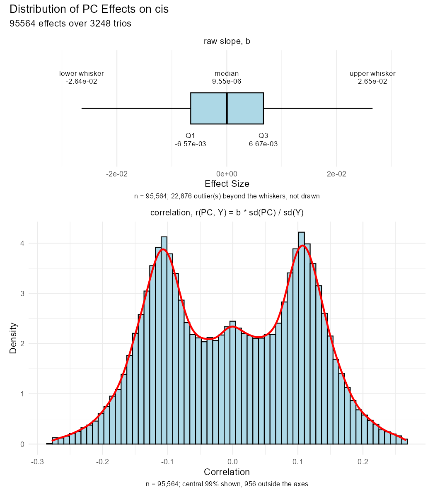
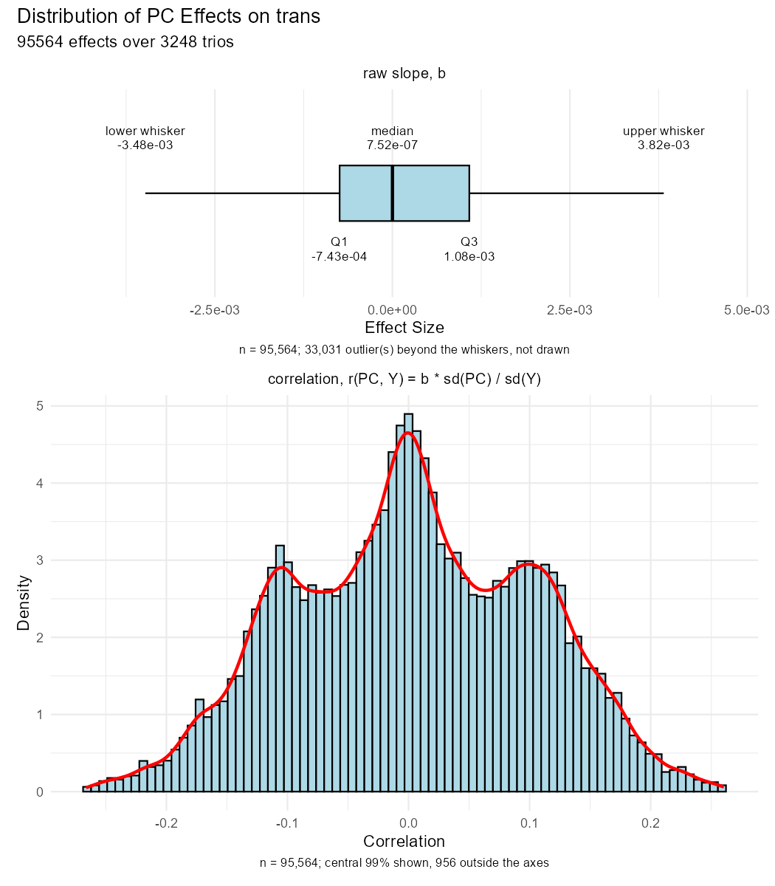
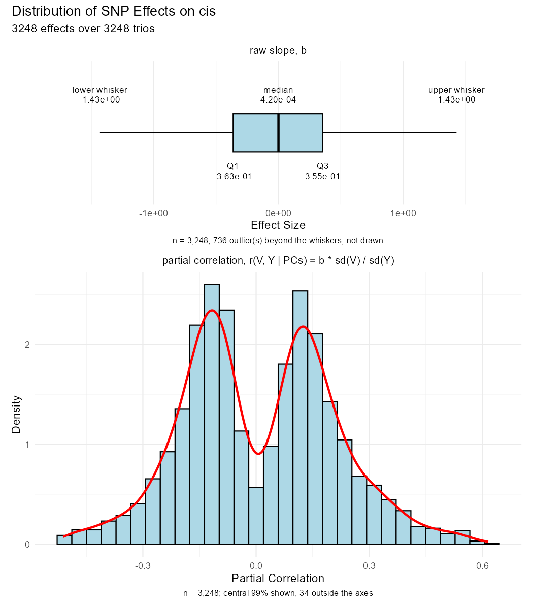
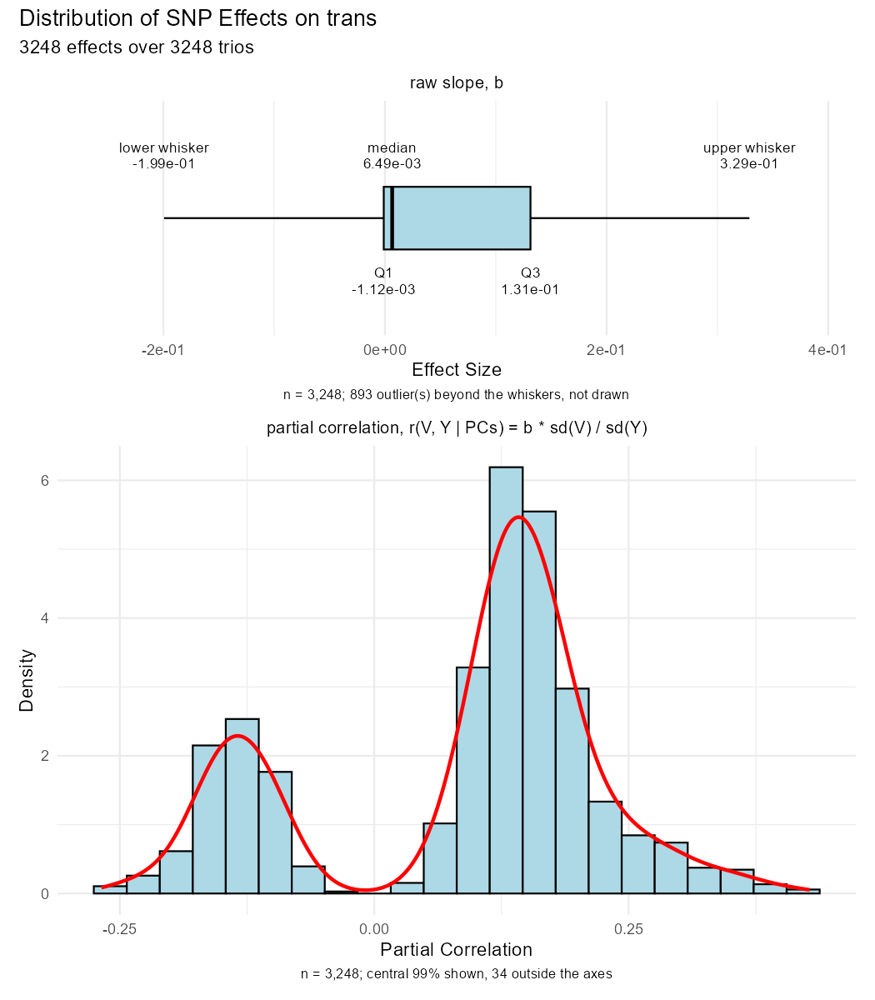

# `pc_distribution_invest/` — real effect sizes in GTEx Whole Blood

Supporting analysis for the revision. Two questions, one per script:

1. How large are the effects of the selected confounding **PCs** on cis and trans gene
   expression? — this sets the bound on `conf.coef.ranges$U` in the simulation.
2. How large is the effect of the **SNP** on each gene? — this is what the simulated
   `b.snp` is compared against.

Both read the same input and pool their estimates over all 3,248 Whole Blood trios.

## Contents

| file | what it is |
| --- | --- |
| `compute_pc_dist_bounds.R` | script — PC-on-gene effects; also caches the pooled effects for the calibration check |
| `compute_effects_snp_on_gene.R` | script — SNP-on-gene effects, adjusted for the PCs |
| `PC_effects_distribution_cis.png` | figure — PC effects on the cis gene (T1) |
| `PC_effects_distribution_trans.png` | figure — PC effects on the trans gene (T2) |
| `SNP_effects_distribution_cis.png` | figure — SNP effects on the cis gene |
| `SNP_effects_distribution_trans.png` | figure — SNP effects on the trans gene |
| [`data/`](data/) | cached effect pools consumed by `simulation/verify_simulation.R` |

Each figure is a two-panel stack built with `patchwork`: a boxplot of the **raw
slopes** with its five-number summary printed as text, over a histogram + density of
the **standardized** effects, trimmed to the central 99% with the excluded count in
the caption. The two panels are separate plots rather than facets because the scales
differ by orders of magnitude.

## Running

Both scripts run top to bottom with no arguments, from the **repository root**:

```r
setwd("path/to/MRGN_Manuscript_Repo")
source("bioinfo_revision/pc_distribution_invest/compute_pc_dist_bounds.R")
source("bioinfo_revision/pc_distribution_invest/compute_effects_snp_on_gene.R")
```

Each records the root, loads `GTEx/data/data.with.PCs.WholeBlood.RData`, `setwd()`s
into this folder to write its PNGs, and restores the root working directory at the
end. Requires `MRGN` (for `loadRData`), `ggplot2`, `patchwork`. Runtime is a few
minutes each — one `lm()` per trio per target.

`data.with.PCs.WholeBlood.RData` is gitignored, so these two scripts cannot be rerun
from a fresh clone without it. The cached pools in `data/` are what the rest of the
pipeline actually needs.

## Input layout

Each element of `data.with.pcs` is a `670 x p` data frame laid out by
`GTEx/data/PC_LRNA_PC_Selection_manu.R`:

| columns | contents |
| --- | --- |
| 1 | SNP genotype (V) |
| 2 | cis gene expression (T1) |
| 3 | trans gene expression (T2) |
| 4-6 | known covariates: `pcr`, `platform`, `sex` |
| 7+ | the PCs selected for that trio (`PC<k>`) |

## `compute_pc_dist_bounds.R`

For each trio it regresses the cis gene (and then the trans gene) on the PCs selected
for that trio, and pools the slopes across all trios into one distribution.

Three details matter for the result to be interpretable:

- **Only `PC*` columns are used.** `pcr`, `platform` and `sex` are binary known
  covariates whose slopes are an order of magnitude larger than the PC slopes, so
  including them in the same histogram mixes two different scales.
- **Degenerate PCs are dropped** (`SD.TOL = 1e-08`). `PC670` is the null direction
  left over after centering 670 samples; the PC-selection step retains it in 431 trios
  with SD ~1e-13. It is not exactly constant, so `lm()` does not alias it away — its
  slope instead explodes to ~1e11 and swamps every real effect.
- **Effects are standardized** as `b * sd(PC) / sd(Y)`. The residualized expression
  SDs span 8 orders of magnitude across trios (4e-04 to 3.8e+04), so raw slopes are
  not comparable trio to trio. Here that standardized slope is *exactly* the Pearson
  correlation `cor(PC, Y)`: a standardized regression coefficient equals the marginal
  correlation when the predictors are mutually uncorrelated, and principal components
  are orthogonal by construction. Checked on the real trios — the largest off-diagonal
  correlation among a trio's retained PC columns is ~5e-15, and the standardized
  coefficients match `cor(PC, Y)` to ~2e-15. Note this is the *marginal* correlation,
  not the partial correlation (which differs by up to ~0.05).

### Result

95,564 PC-gene correlations per target:

| target | 2.5% | median | 97.5% | sd | max abs |
| --- | --- | --- | --- | --- | --- |
| cis | -0.203 | 0.000 | 0.200 | 0.117 | 0.661 |
| trans | -0.189 | 0.002 | 0.191 | 0.104 | 0.653 |




Both distributions are symmetric about zero and effectively bounded by
`|effect| <~ 0.3`, with a hard ceiling near 0.66. cis and trans genes behave almost
identically.

The dip at zero is not an artifact of the fit: these PCs were *selected* for
significant association with the trio (FDR 0.05, see `get.conf.trios` in
`PC_LRNA_PC_Selection_manu.R`), so near-null effects are filtered out by construction.
This is the distribution of effects **conditional on selection**, which is the
relevant one for choosing simulation parameters. Regressing on the full `PCs.matrix`
instead of the selected subset would give the unconditional distribution.

The last thing the script does is `cache.effect.pools()`, which writes the two
standardized vectors to `data/real_pc_effect_pools.RData` for
`simulation/verify_simulation.R` to compare the simulated effects against. Only the
standardized column crosses over — a raw slope carries the units of one trio's
residualized expression and is meaningless outside it. The writer refuses to save a
pool containing a value outside `[-1, 1]`, which is the cheapest tell that a raw slope
leaked in.

## `compute_effects_snp_on_gene.R`

Same shape, same plotting code, one estimate per trio instead of one per PC: it
regresses the gene on the genotype **adjusted for that trio's PCs** and keeps the
genotype coefficient.

- **The other gene is deliberately not in the model.** The simulation generates
  `T1 = b.snp * V + (confounding) + e` and `T2 = b.med * T1 + ...`, so the parameter
  these effects calibrate is the V → gene effect adjusted for confounding only.
  Conditioning on the other gene would adjust away a mediator or condition on a
  collider, and estimates a different quantity than `b.snp`. That conditional version
  is MRGN's `b11`/`b21` test, not what is wanted here.
- **The standardized scale here is not exactly a correlation.** `b * sd(V) / sd(Y)` is
  the standardized *partial* regression coefficient; unlike the PC script, `V` is not
  orthogonal to the PCs. Measured over 25 trios it sits within ~5% of the semipartial
  correlation and within ~0.11 of the partial correlation. Use
  `t / sqrt(t^2 + df.residual)` if the exact partial correlation is wanted.
- Trios are **skipped** (and counted in the printed summary) when the genotype is
  monomorphic, the fit has no residual degrees of freedom, the genotype is aliased by
  rank deficiency, or fewer than 3 complete cases survive. Missing genotypes are
  dropped before the fit so the slope and the SDs used to standardize it come from the
  same rows.

### Result

Roughly one effect per trio. On the partial-correlation scale the distribution peaks
near ±0.13 with the central 99% inside ±0.45 — the reference the simulated
`median |cor(V1, T1)| = 0.286` is judged against in [`../METHODS.md`](../METHODS.md) §3.




## Shared helpers

Both scripts define their own copies of `select.effect.scale()`, `empty.effects()`,
`summarize.effects()`, `fd.binwidth()`, `fmt.effect()`, `box.summary()`,
`plot.raw.boxplot()`, `plot.std.histogram()` and `plot.distribution()`. The bodies are
near-identical apart from the axis labels and the `get.*.effects()` /
`collect.*.effects()` pair each drives. They are duplicated rather than factored out so
each script runs standalone; a change to the figures has to be made in both.
