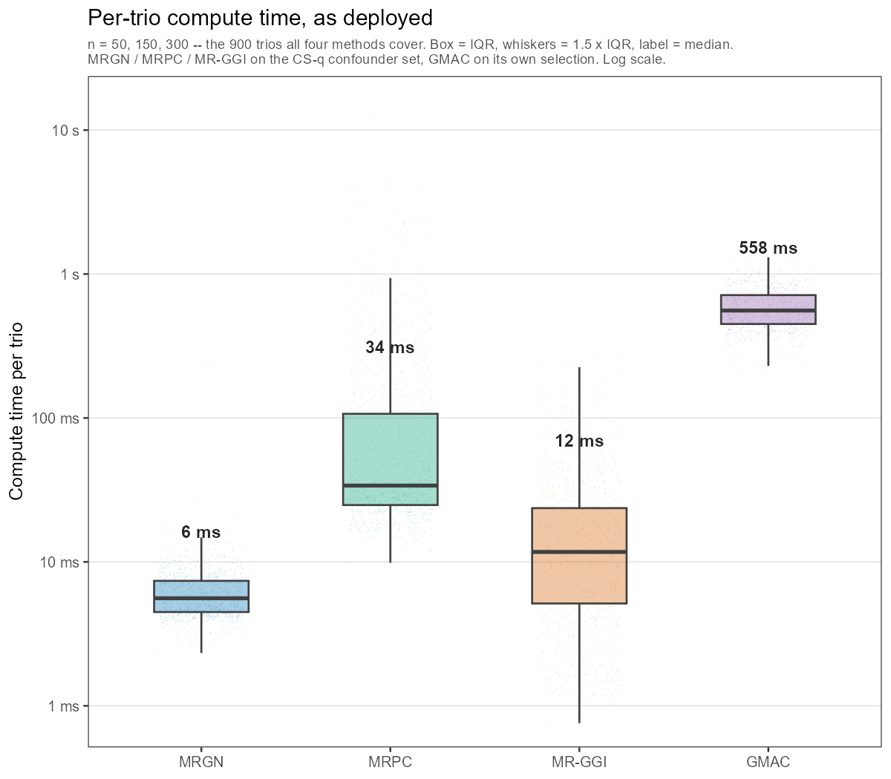
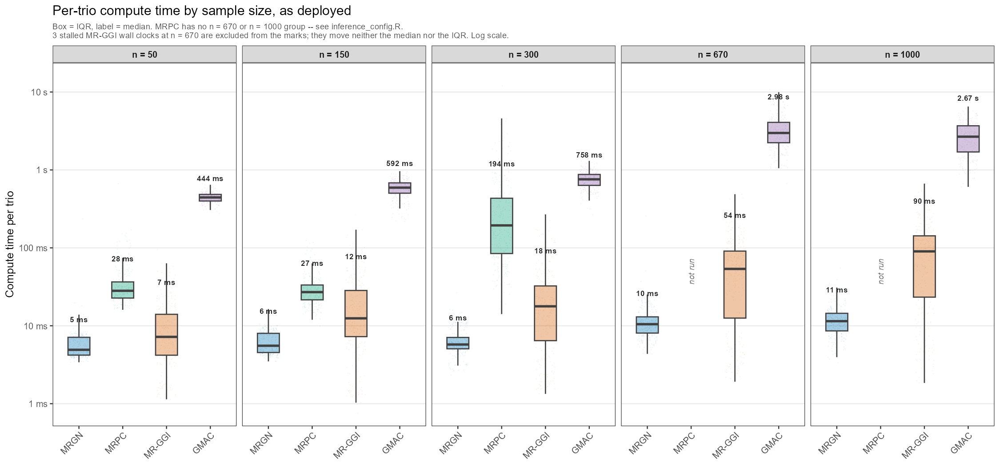
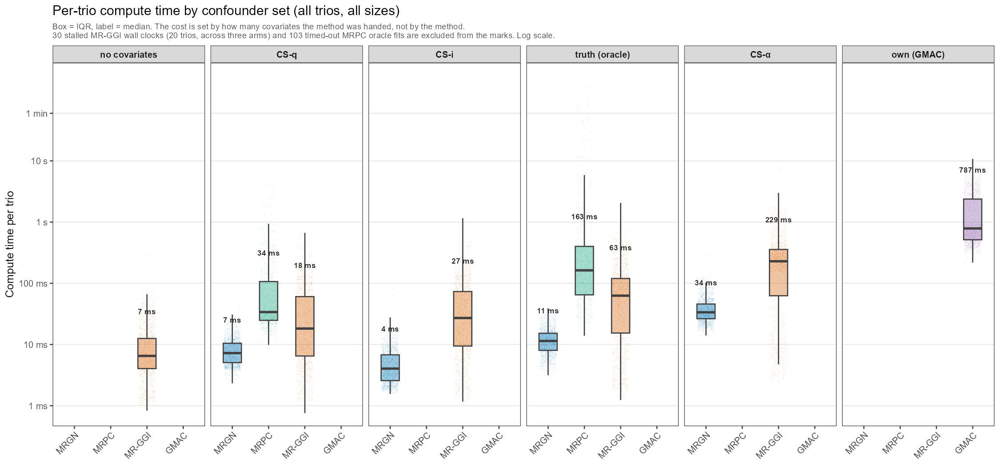

# Per-trio compute time

Generated by [`compute_time.R`](../simulation_results/results_scripts/compute_time.R) on 2026-08-27.

Median and interquartile range of the time to fit **one trio**, for each of the four
inference methods. Machine-readable versions:
[`compute_time.csv`](../simulation_results/tables/compute_time.csv) (the tables below,
plus mean/min/max and a per-sample-size split) and
[`compute_time_long.csv`](../simulation_results/tables/compute_time_long.csv) (one row
per trio per method per arm, if you want to re-cut it).

## 1. Headline: the deployed configuration

Each method on the confounder set it would actually be run under -- CS-q for MRGN, MRPC
and MR-GGI, its own selection for GMAC -- restricted to **n = 50, 150 and 300: the 900
trios all four methods cover**. Section 4 says why the restriction is there.

| method | confounders | trios | median | IQR (Q1 - Q3) | IQR width | total, all trios |
| --- | --- | --- | --- | --- | --- | --- |
| MRGN | CS-q | 900 | 6 ms | 4 ms - 7 ms | 3 ms | 5.81 s |
| MRPC | CS-q | 900 | 34 ms | 25 ms - 107 ms | 82 ms | 2.7 min |
| MR-GGI | CS-q | 900 | 12 ms | 5 ms - 24 ms | 18 ms | 19.02 s |
| GMAC | own selection | 900 | 558 ms | 450 ms - 714 ms | 264 ms | 8.9 min |

The same four on **every trio each method has** -- 1,500 for MRGN, GMAC and MR-GGI, 900
for MRPC. MRPC's row here is the identical 900 trios as above, while the other three now
include n = 670 and n = 1000, which is where their cost is. Read it as three numbers and
a placeholder, not as a four-way comparison.

| method | confounders | trios | median | IQR (Q1 - Q3) | IQR width | total, all trios |
| --- | --- | --- | --- | --- | --- | --- |
| MRGN | CS-q | 1,500 | 7 ms | 5 ms - 10 ms | 5 ms | 13.29 s |
| MRPC | CS-q | 900 | 34 ms | 25 ms - 107 ms | 82 ms | 2.7 min |
| MR-GGI | CS-q | 1,500 | 18 ms | 6 ms - 61 ms | 54 ms | 1.2 min |
| GMAC | own selection | 1,500 | 787 ms | 515 ms - 2.38 s | 1.87 s | 39.6 min |

## 2. By sample size

| method | confounders | n = 50 | n = 150 | n = 300 | n = 670 | n = 1000 |
| --- | --- | --- | --- | --- | --- | --- |
| MRGN | CS-q | 5 ms 4 ms - 7 ms | 6 ms 5 ms - 8 ms | 6 ms 5 ms - 7 ms | 10 ms 8 ms - 13 ms | 11 ms 9 ms - 14 ms |
| MRPC | CS-q | 28 ms 23 ms - 37 ms | 27 ms 22 ms - 33 ms | 194 ms 85 ms - 433 ms | *not run* | *not run* |
| MR-GGI | CS-q | 7 ms 4 ms - 14 ms | 12 ms 7 ms - 28 ms | 18 ms 6 ms - 32 ms | 54 ms 13 ms - 91 ms | 90 ms 23 ms - 143 ms |
| GMAC | own selection | 444 ms 399 ms - 485 ms | 592 ms 503 ms - 682 ms | 758 ms 633 ms - 875 ms | 2.98 s 2.23 s - 4.08 s | 2.67 s 1.70 s - 3.69 s |

Median on the first line, IQR beneath it.

## 3. Every arm

The deployed row is one column of a wider picture. For all four methods the per-trio cost
is set by **how many covariates the method was handed**, not by the method. MR-GGI is the
clearest case: median 23 ms with no covariates, 1.3 min against CS-alpha's median of 98 --
a factor of ~3,400 on the same trios, because its cost is quadratic in the covariate count
(it tests every gene pair). The other two move far less: MRGN spans 7-34 ms across its
three arms and MRPC 34-163 ms across its two, a factor of five each.

| method | arm | covariates (median) | trios scored | median | IQR (Q1 - Q3) | IQR width |
| --- | --- | --- | --- | --- | --- | --- |
| MRGN | CS-q | -- | 1,500 | 7 ms | 5 ms - 10 ms | 5 ms |
| MRGN | CS-i | -- | 1,500 | 4 ms | 3 ms - 7 ms | 4 ms |
| MRGN | truth (oracle) | -- | 1,500 | 11 ms | 8 ms - 15 ms | 7 ms |
| MRGN | CS-α | -- | 1,500 | 34 ms | 26 ms - 46 ms | 19 ms |
| MRPC | CS-q | -- | 900 | 34 ms | 25 ms - 107 ms | 82 ms |
| MRPC | truth (oracle) | -- | 797 | 163 ms | 65 ms - 401 ms | 336 ms |
| MR-GGI | no covariates | 0 | 1,500 | 7 ms | 4 ms - 13 ms | 8 ms |
| MR-GGI | CS-q | 5 | 1,500 | 18 ms | 6 ms - 61 ms | 54 ms |
| MR-GGI | CS-i | 9 | 1,500 | 27 ms | 9 ms - 73 ms | 64 ms |
| MR-GGI | truth (oracle) | 27 | 1,500 | 63 ms | 15 ms - 120 ms | 104 ms |
| MR-GGI | CS-α | 98 | 1,500 | 229 ms | 63 ms - 357 ms | 295 ms |
| GMAC | own selection | -- | 1,500 | 787 ms | 515 ms - 2.38 s | 1.87 s |

## 4. What these numbers are, and what they are not

**They time the fit, not the pipeline.** Every `time.seconds` column is wall clock around
the inference call for one trio and nothing else: `MRGN::infer.trio()`, `MRPC::MRPC()`
inside its timeout, `apply.gmac()`'s permutation test, `mrggi.one.trio()`. Confounder
**selection is excluded from all four** -- CS-q and CS-alpha are computed once per group
in the selection stage and shared, and GMAC's selection happens inside the batch `gmac()`
call and is recorded only as a group attribute. So this is *time to fit one trio given a
confounder set*, which is the quantity that is comparable across the four. It is not
end-to-end cost per trio.

**MRGN's bootstrap is excluded.** `mrgn.*.time.seconds` covers `infer.trio()` only; the
opt-in edge-probability bootstrap is timed separately and is roughly 200-250x the fit it
wraps -- 1,000 resamples, each a fresh `infer.trio()`. If bootstrap edge probabilities are
wanted, MRGN's per-trio cost is the sum of the two columns and it stops being the cheapest
method in section 1:

| arm | fit (median) | bootstrap (median) | ratio |
| --- | --- | --- | --- |
| CS-q | 7 ms | 1.52 s | 210x |
| truth (oracle) | 11 ms | 2.81 s | 246x |
| CS-α | 34 ms | 8.26 s | 246x |

**MRPC has no n = 670 or n = 1000 group.** Those two have not been rerun under the raised
180 s cap (`inference_config.R`), so pooling every trio would score MRPC on an easier
subset than the other three. That is why section 1 leads with n <= 300.

**MRPC's timeouts are censored, not slow.** A fit that hits the 180 s cap returns no model and no time, so it is excluded from the quantiles and counted separately (`n_timed_out` in the CSV). The CS-q arm has none at n <= 300; the oracle arm loses 103 of 900, all at n = 300.

**Twenty MR-GGI trios carry machine stalls.** All at n = 670, all with wall clocks of 3,000-53,000 s clustered at near-identical values across trios that were in flight on different workers at the same instant, and all wildly out of line with their own covariate counts -- dataset 191 has 78 covariates and 53,192 s, against 155 s for a 106-covariate trio at n = 1000. That is the machine suspending, not MR-GGI computing, so they are excluded from every statistic here and counted in `n_stalled` instead. **The medians and IQRs are identical either way** -- all thirty sit above the 75th percentile of their cell -- so nothing is lost; what the exclusion buys is a `mean`, `max` and `total_hours` in the CSV that mean something. Left in, MR-GGI's CS-q arm would report 10.9 total hours of which 9.3 are a sleeping laptop. Affected trios: .

**MRGN's CS-i arm ran on a quiet machine, and it shows.** It reports a 4 ms median
against CS-q's 7 ms while carrying *more* covariates (2.6-24.0 per trio against
0.5-21.7), which inverts the relationship every other row in section 3 follows. The arm
is not cheaper. It was run on its own, after the fact, as a single pass
(`apply_mrgn_csi.R`), whereas the truth/CS-q/CS-α arms were timed inside the original run
with three other method processes competing for the same cores. That is a clean
demonstration of the caveat below rather than an exception to section 3: **do not read a
factor-of-two gap between arms timed in different runs as a property of the arms.**

**This is not a controlled benchmark.** These are wall-clock times harvested from the
production inference run, not from a timing harness. MRGN, GMAC and MR-GGI ran their
groups on a `parallel::makeCluster()`; MRPC did not (`apply_mrpc.R` never builds one), so
a trio timed inside a busy worker carries CPU contention that a serial fit does not. Read
factor-of-two differences as noise and factor-of-a-hundred differences as real.
