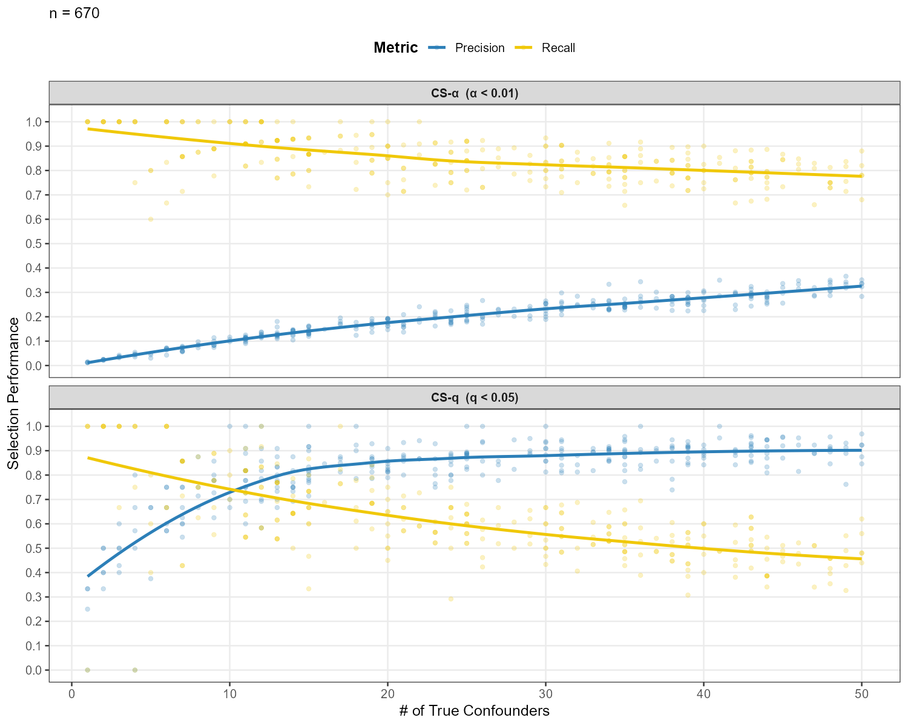
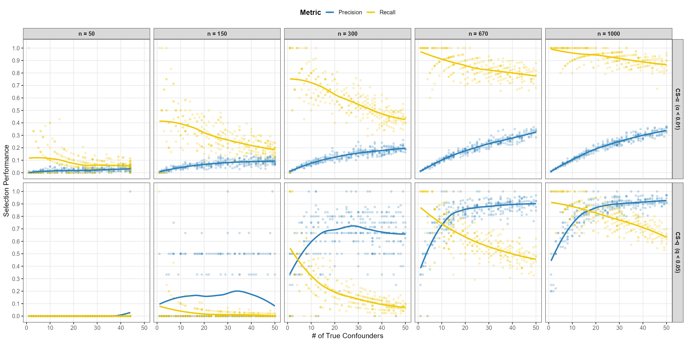
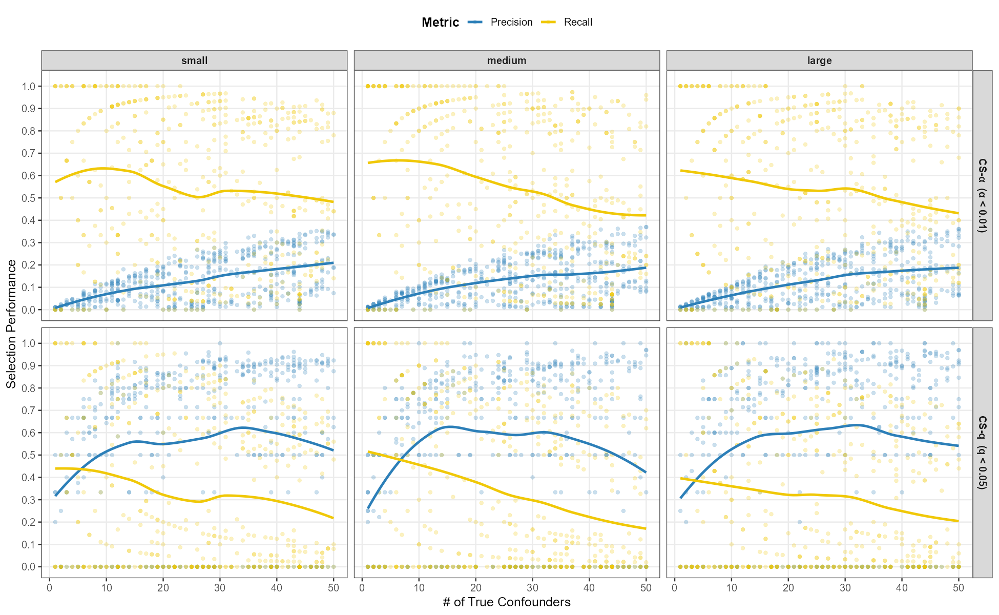
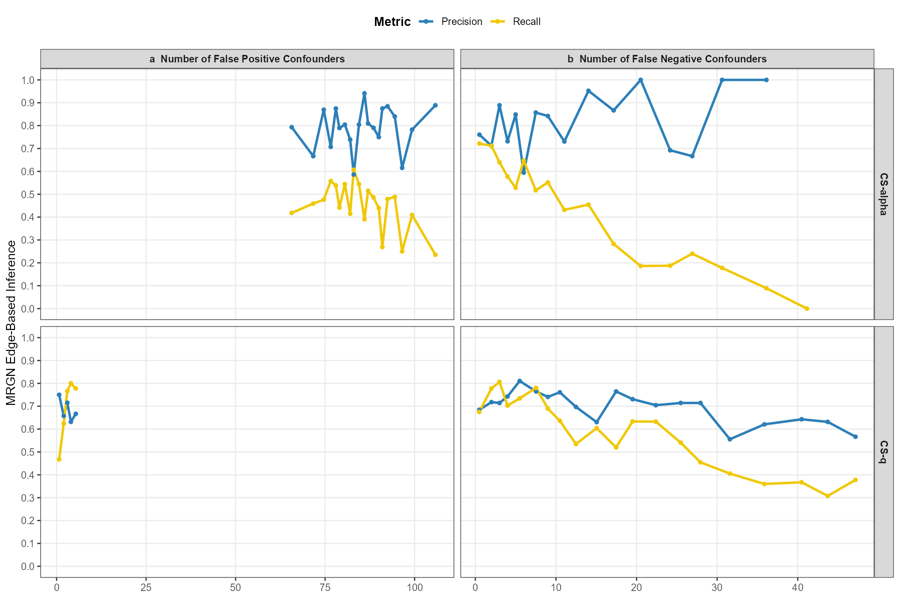
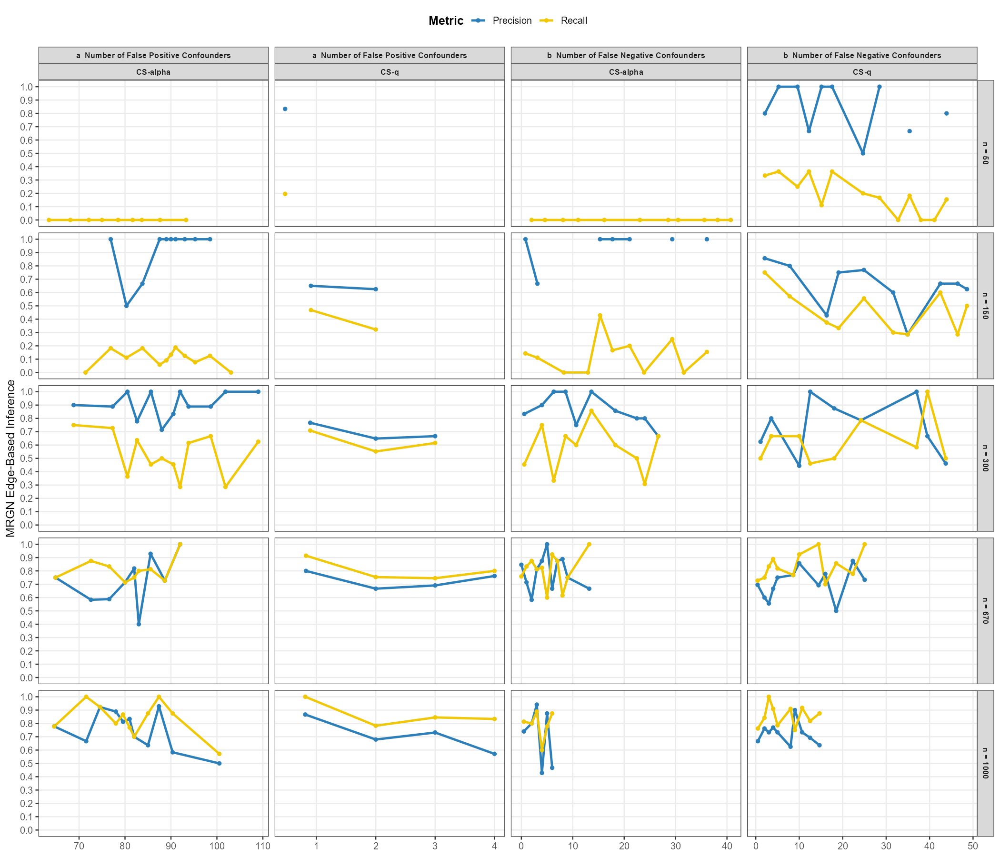
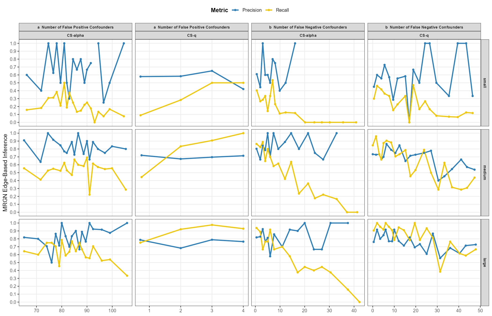

# Confounder selection: CS-q against CS-α

Generated by `results_scripts/make_selection_report.R` from `data/selection_results.csv`. Do not edit by hand; rerun the script.

---

## 1. What the two selections are

Both come from the same `get.conf.trios()` / `select.confounders()` call and differ in one thing only -- the threshold applied to the regression p-values:

| selection | threshold | set by |
| --- | --- | --- |
| **CS-q** | Benjamini-Hochberg FDR, q < 0.05 | `selection_fdr` |
| **CS-α** | raw per-test cutoff, α < 0.01 | `alpha` |

That single difference drives everything below, and it is why CS-α's behaviour is closer to arithmetic than to statistics. An uncorrected cutoff applied to a pool of `N` null columns returns `α × N` of them by construction, whatever the data does.

### The pool is the thing to hold in mind

Every trio contributes its own `U`/`W`/`Z` columns to the group's pool, and no covariate is a candidate for any trio but the one that generated it (METHODS.md §6, Table 21). So each trio is scored against the **whole group's** covariate count, not its own:

| n | Pool width | Median true confounders | Signal density | α × pool | Median CS-α false positives |
| ---: | ---: | ---: | ---: | ---: | ---: |
| 50 | 7,981 | 25 | 0.31% | 80 | 80 |
| 150 | 8,838 | 27 | 0.31% | 88 | 90 |
| 300 | 8,674 | 29 | 0.33% | 87 | 88 |
| 670 | 8,125 | 25 | 0.31% | 81 | 82 |
| 1000 | 8,212 | 26.5 | 0.32% | 82 | 83 |

**Table S1. Pool width, and the arithmetic behind CS-α.** The last two columns are the point: CS-α's false-positive count tracks `α × pool` to within a few percent at every sample size. It is not selecting badly -- it is doing exactly what an uncorrected threshold must do against 8,000 candidates. Signal density, a trio's true confounders as a share of what it is scored against, is ~0.3% throughout, which is 15× below the real GTEx analysis (METHODS.md Table 21).

---

## 2. Metrics

Per trio, against the confounders that trio actually has:

```
precision = tp / (tp + fp)      of what was selected, the share that was real
recall    = tp / (tp + fn)      of what was real, the share that was selected
```

matching the definitions carried with the published study (`Manuscript/scripts/6_6_2023_all_conf_types_simulation_updated_2025.Rmd`).

**Precision is undefined for a trio that selected nothing**, and that is not an edge case here: at n = 50, CS-q selected nothing at all for **156 of 300 trios**. Those trios are excluded from the precision mean and counted separately in the `Selected nothing` column. Scoring an empty selection as precision 0 would claim it selected wrongly; scoring it 1 would claim it selected perfectly. It did neither.

---

## 3. Scorecard

### 3a. Sample-size view

| Selection | Group | Trios | Pool width | Median true | Median selected | Precision | Recall | Selected nothing | Median FP | FP from other trios |
| ---: | ---: | ---: | ---: | ---: | ---: | ---: | ---: | ---: | ---: | ---: |
| CS-q | 50 | 300 | 7,981 | 25 | 0 | 0.7% | 0.0% | 156 | 0 | 0 |
| CS-q | 150 | 300 | 8,838 | 27 | 1 | 15.3% | 2.1% | 20 | 1 | 0 |
| CS-q | 300 | 300 | 8,674 | 29 | 5 | 64.8% | 19.2% | 3 | 2 | 0 |
| CS-q | 670 | 300 | 8,125 | 25 | 16 | 82.0% | 61.5% | 0 | 2 | 1 |
| CS-q | 1000 | 300 | 8,212 | 26.5 | 23 | 83.7% | 79.2% | 0 | 3 | 1 |
| CS-alpha | 50 | 300 | 7,981 | 25 | 82 | 2.0% | 7.9% | 0 | 80 | 79 |
| CS-alpha | 150 | 300 | 8,838 | 27 | 97 | 6.9% | 28.9% | 0 | 90 | 88 |
| CS-alpha | 300 | 300 | 8,674 | 29 | 102 | 13.5% | 58.0% | 0 | 88 | 86 |
| CS-alpha | 670 | 300 | 8,125 | 25 | 103 | 19.3% | 85.2% | 0 | 82 | 81 |
| CS-alpha | 1000 | 300 | 8,212 | 26.5 | 106 | 20.8% | 92.6% | 0 | 83 | 81 |

**Table S2. Selection performance by sample size**, effect treatments pooled. Precision and recall are means over the trios where each is defined.

### 3b. Effect-size view

| Selection | Group | Trios | Pool width | Median true | Median selected | Precision | Recall | Selected nothing | Median FP | FP from other trios |
| ---: | ---: | ---: | ---: | ---: | ---: | ---: | ---: | ---: | ---: | ---: |
| CS-q | small | 500 | 8,366 | 26.5 | 5 | 55.5% | 33.5% | 58 | 2 | 0 |
| CS-q | medium | 500 | 8,366 | 27 | 5 | 54.6% | 33.1% | 57 | 1 | 0 |
| CS-q | large | 500 | 8,366 | 25 | 5 | 56.5% | 30.6% | 64 | 1 | 0 |
| CS-alpha | small | 500 | 8,366 | 26.5 | 99 | 12.9% | 55.5% | 0 | 85 | 84 |
| CS-alpha | medium | 500 | 8,366 | 27 | 98 | 12.3% | 54.9% | 0 | 84 | 83 |
| CS-alpha | large | 500 | 8,366 | 25 | 96 | 12.3% | 53.3% | 0 | 84.5 | 83 |

**Table S3. Selection performance by effect treatment**, summed across all five sample sizes. Read the three rows against each other rather than against Table S2: each pools the same five sample sizes, so the comparison between treatments is clean even though the levels carry the mixing that pooling causes.

**The effect treatment barely moves selection.** CS-q precision runs 55.5% / 54.6% / 56.5% across small / medium / large and recall 33.5% / 33.1% / 30.6%; a spread of about one point against the ~80-point swing sample size produces. That is the expected result and worth stating rather than assuming: the effect treatment sets the **T1→T2 causal effect**, while selection is a set of regressions of each gene on the covariate pool. The treatment is not in those regressions, so the flatness here is a check that the two are wired up independently, not a finding about selection.

---

## 4. Figure 3 -- selection performance against confounder count

Reproduces `Manuscript/figures/Figure_Confounder_Selection_Performance.pdf` on the revised simulation. One point per trio, LOESS smooth.

### 4a. n = 670, the published layout



**Figure 3.** Directly comparable to the published figure. **The shapes reproduce and the precision levels reproduce closely**: CS-α precision climbs from ~0.01 to ~0.33 against the published ~0.30, and CS-q precision plateaus at ~0.90 against the published ~0.85. Recall is the axis that has moved -- see §7.

### 4b. Sample-size view



**Figure 3b.** The same two panels at every n. **This is the figure to read, not a pooled one.** CS-q spans two orders of magnitude of power across these five columns -- it selects nothing for over half the trios at n = 50 and a median of 23 covariates at n = 1000 -- so any curve pooling them describes neither end.

### 4c. Effect-size view



**Figure 3c.** Each panel pools all five sample sizes, so the levels carry that mixing; what is readable is that the three columns are nearly identical, which is the graphical form of Table S3.

---

## 5. Figure 4 -- what selection errors cost MRGN

Reproduces `Manuscript/figures/SF7_Confounder_Selection_Impact_On_Inference.pdf`. Precision and recall are set-level quantities and cannot be computed per trio, so the x-axis is binned into equal-count groups and both metrics are computed within each bin. Bins holding fewer than 15 trios are dropped. Scored on the **edge**: `M0`/`M3` are edge-absent, `M1`/`M2`/`M4` edge-present.



**Figure 4.** All sample sizes together, the published layout.



**Figure 4b. The sample-size view is the one that carries mechanism.** The number of false positives a selection makes is itself strongly a function of n, so a pooled series traverses several power regimes as it moves along its own x-axis.



**Figure 4c.** By effect treatment.

---

## 6. Selection confusion matrices

A 2×2 over **covariate-trio pairs**: every candidate column in the pool either is or is not a true confounder of the trio, and either was or was not selected for it. Counts are summed over the trios in each group.

**Read these with the pool width in view.** The true-negative cell dominates by two orders of magnitude -- roughly 8,000 of every 8,100 pairs are correctly-rejected nulls -- so specificity exceeds 99% for both selections and separates them not at all. That is a property of a 0.3% signal density, not a finding about either method. Precision and recall are the informative margins, which is why §3 leads with them.

### 6a. Sample-size view

#### CS-q -- n = 50

|   | Selected | Not selected |
| --- | --- | --- |
| True confounder | 1 | 7,380 |
| Not a confounder | 145 | 2,386,774 |

Precision 0.7% | recall 0.0% | specificity 100.0% | 2,394,300 candidate covariate-trio pairs.

#### CS-q -- n = 150

|   | Selected | Not selected |
| --- | --- | --- |
| True confounder | 96 | 8,142 |
| Not a confounder | 344 | 2,642,818 |

Precision 21.8% | recall 1.2% | specificity 100.0% | 2,651,400 candidate covariate-trio pairs.

#### CS-q -- n = 300

|   | Selected | Not selected |
| --- | --- | --- |
| True confounder | 1,039 | 7,035 |
| Not a confounder | 490 | 2,593,636 |

Precision 68.0% | recall 12.9% | specificity 100.0% | 2,602,200 candidate covariate-trio pairs.

#### CS-q -- n = 670

|   | Selected | Not selected |
| --- | --- | --- |
| True confounder | 4,166 | 3,359 |
| Not a confounder | 708 | 2,429,267 |

Precision 85.5% | recall 55.4% | specificity 100.0% | 2,437,500 candidate covariate-trio pairs.

#### CS-q -- n = 1000

|   | Selected | Not selected |
| --- | --- | --- |
| True confounder | 5,706 | 1,906 |
| Not a confounder | 810 | 2,455,178 |

Precision 87.6% | recall 75.0% | specificity 100.0% | 2,463,600 candidate covariate-trio pairs.

#### CS-alpha -- n = 50

|   | Selected | Not selected |
| --- | --- | --- |
| True confounder | 489 | 6,892 |
| Not a confounder | 24,191 | 2,362,728 |

Precision 2.0% | recall 6.6% | specificity 99.0% | 2,394,300 candidate covariate-trio pairs.

#### CS-alpha -- n = 150

|   | Selected | Not selected |
| --- | --- | --- |
| True confounder | 2,029 | 6,209 |
| Not a confounder | 26,845 | 2,616,317 |

Precision 7.0% | recall 24.6% | specificity 99.0% | 2,651,400 candidate covariate-trio pairs.

#### CS-alpha -- n = 300

|   | Selected | Not selected |
| --- | --- | --- |
| True confounder | 4,197 | 3,877 |
| Not a confounder | 26,488 | 2,567,638 |

Precision 13.7% | recall 52.0% | specificity 99.0% | 2,602,200 candidate covariate-trio pairs.

#### CS-alpha -- n = 670

|   | Selected | Not selected |
| --- | --- | --- |
| True confounder | 6,198 | 1,327 |
| Not a confounder | 24,683 | 2,405,292 |

Precision 20.1% | recall 82.4% | specificity 99.0% | 2,437,500 candidate covariate-trio pairs.

#### CS-alpha -- n = 1000

|   | Selected | Not selected |
| --- | --- | --- |
| True confounder | 6,909 | 703 |
| Not a confounder | 24,967 | 2,431,021 |

Precision 21.7% | recall 90.8% | specificity 99.0% | 2,463,600 candidate covariate-trio pairs.

### 6b. Effect-size view

#### CS-q -- small effect

|   | Selected | Not selected |
| --- | --- | --- |
| True confounder | 3,938 | 9,100 |
| Not a confounder | 914 | 4,169,048 |

Precision 81.2% | recall 30.2% | specificity 100.0% | 4,183,000 candidate covariate-trio pairs.

#### CS-q -- medium effect

|   | Selected | Not selected |
| --- | --- | --- |
| True confounder | 3,541 | 9,452 |
| Not a confounder | 840 | 4,169,167 |

Precision 80.8% | recall 27.3% | specificity 100.0% | 4,183,000 candidate covariate-trio pairs.

#### CS-q -- large effect

|   | Selected | Not selected |
| --- | --- | --- |
| True confounder | 3,529 | 9,270 |
| Not a confounder | 743 | 4,169,458 |

Precision 82.6% | recall 27.6% | specificity 100.0% | 4,183,000 candidate covariate-trio pairs.

#### CS-alpha -- small effect

|   | Selected | Not selected |
| --- | --- | --- |
| True confounder | 6,904 | 6,134 |
| Not a confounder | 42,532 | 4,127,430 |

Precision 14.0% | recall 53.0% | specificity 99.0% | 4,183,000 candidate covariate-trio pairs.

#### CS-alpha -- medium effect

|   | Selected | Not selected |
| --- | --- | --- |
| True confounder | 6,485 | 6,508 |
| Not a confounder | 42,407 | 4,127,600 |

Precision 13.3% | recall 49.9% | specificity 99.0% | 4,183,000 candidate covariate-trio pairs.

#### CS-alpha -- large effect

|   | Selected | Not selected |
| --- | --- | --- |
| True confounder | 6,433 | 6,366 |
| Not a confounder | 42,235 | 4,127,966 |

Precision 13.2% | recall 50.3% | specificity 99.0% | 4,183,000 candidate covariate-trio pairs.

---

## 7. FIGURES FROM A SUPERSEDED RUN: METHODS.md Table 17

**METHODS.md §5 Table 17 reports CS-q recall figures that this data does not reproduce.** The table gives 52.9% overall at n = 670 and 69.6% at n = 1000; the current selection gives **61.5%** and **79.2%**. Every bin in that table is 8-12 points below what `data/selection_results.csv` yields, at both sample sizes.

The offset is uniform, which rules out a difference in how the mean was taken. The source is `legacy/first_pass/selection_results.RData`, which reproduces Table 17 almost exactly (52.6% and 69.5% overall, every bin within rounding). **Table 17 was computed before the 2026-08-22 re-simulation and was not refreshed after it.**

What changed between the two passes, measured directly:

| Quantity | first pass | current |
| --- | --- | --- |
| trio confounder counts (`U_n`) | identical | identical |
| generating models | identical | identical |
| residual SD | identical | identical |
| SNP effect (`b.snp`) | -- | changed |
| mediation effect (`b.med`) | -- | changed |
| R²(T1 | U) at n = 670 | 0.390 | 0.437 |
| CS-q recall at n = 670 | 52.6% | 61.5% |

**Table S4. The two passes differ only in the causal effect sizes.** `U_n`, the generating models and the residual SD are bit-identical between the passes, so the confounder structure is the same trios. What moved is `b.snp` and `b.med`, and with them R²(T1 | U) -- confounders explain **more** of T1's variance in the current run (0.437 against 0.390 at n = 670), because shrinking the causal effects raises the share of variance the confounders account for.

**§5's mechanism survives; its magnitude does not.** The argument is that the recall drop against the published study is explained by per-confounder effect size, and R²(T1 | U) is indeed what moved. But against the published `old many-conf` figure of 83.9%, the current drop is ~22 points at n = 670 and only ~5 points at n = 1000 -- not the ~30 points §5 claims at every confounder count. At n = 1000 the revised selection is close to the published many-confounder run.

**Recommended:** regenerate Table 17 from `data/selection_results.csv` and restate §5's
headline. This report does not do it, because Table 17 also carries the two published
columns, which are computed from files outside this pipeline.

---

## 8. Summary

1. **The two selections sit at opposite ends of one trade-off.** At n = 670 CS-α recalls 85.2% of a trio's confounders at 19.3% precision; CS-q recalls 61.5% at 82.0%. Neither dominates; they are different points on the same curve.

2. **CS-α's cost is structural, not statistical.** Its false-positive count is `α × pool` to within a few percent at every sample size (Table S1), so it hands any downstream method a median of ~103 covariates. That is what makes it unusable for MRPC, which must run a PC algorithm over the resulting node set -- see `INFERENCE_PERFORMANCE.md`.

3. **Selection has essentially no power at n = 50.** CS-q selected nothing for 156 of 300 trios and recalls 0.0% overall. Every n = 50 inference result should be read as an unadjusted analysis.

4. **The effect treatment does not reach selection** (Table S3), as it should not: it sets the T1→T2 causal effect, which is not in the selection regressions.

5. **METHODS.md Table 17 needs regenerating** (§7). It is sourced from the superseded first pass and understates current CS-q recall by 8-12 points.

