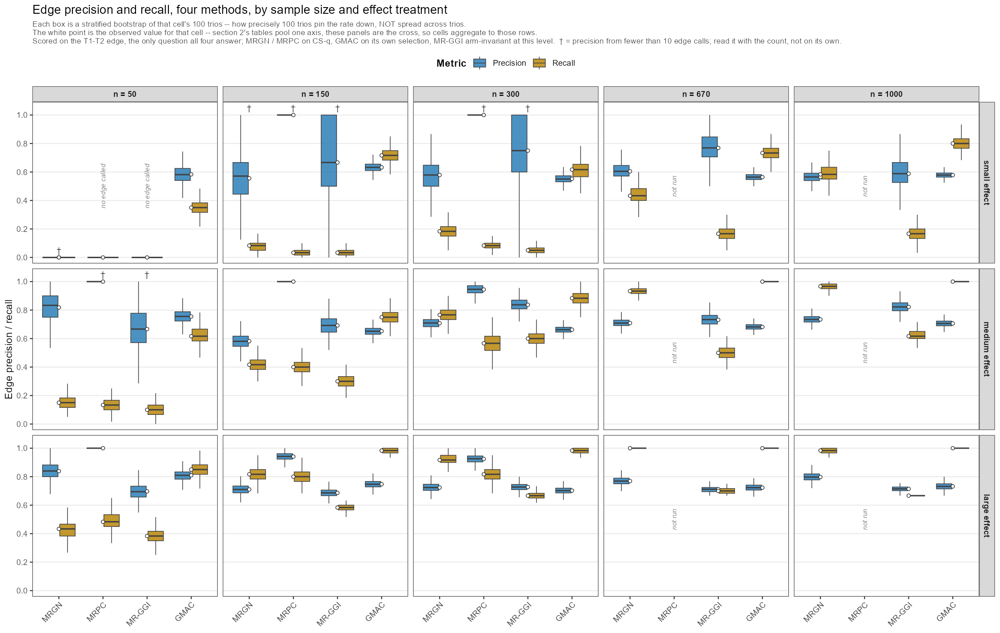

# Inference performance: MRGN, MRPC, GMAC and MR-GGI

Generated by `results_scripts/make_inference_report.R` from `tables/confusion_counts_long.csv`. Do not edit by hand; rerun the script.

---

## 1. Scope, and three things that will mislead you if unstated

1,500 simulated trios -- 5 generating models × 3 effect treatments × 20 replicates × 5 sample sizes -- with confounder selection and inference as described in `METHODS.md`. Companion to `CONFOUNDER_SELECTION.md`, which scores the selection this report consumes.

**MRPC covers three sample sizes, not five.** The n = 670 and n = 1000 groups were dropped: MRPC times out on 61% and 75% of trios respectively even in its cheap arm, at ~10 h per group. Every MRPC row below is n ≤ 300, and any comparison against another method must be restricted to those three groups. The others are complete at all five.

**MR-GGI's four arms are not confounder adjustments.** `MRggi()` has no covariate argument. The arms differ in which covariates ride along as extra columns of `y`, and the estimator is strictly pairwise, so `B.T1T2` and `p.T1T2` are **identical** in all four. What the covariates change is `MRggi()`'s own multiplicity correction across each gene's pairs. Hence two levels: `edge`, from the raw p-value, which is arm-invariant and is the column comparable with GMAC and MRGN; and `edge.fdr`, from the adjusted p-value, which is the only thing that varies by arm. Reading the arms as adjustment strength is the single easiest mistake to make with this table.

**GMAC is not model-scored.** It returns a mediation call rather than a model label, so it is cross-tabbed against the generating model and is only comparable to the others on the edge.

### The two views

Every matrix appears twice. The **sample-size view** fixes n and pools the three effect treatments; the **effect-size view** fixes the treatment and sums across all five sample sizes. Both are aggregations of the same counts, and each hides what the other shows -- a method can look stable in n while collapsing at one effect size. Sample-size groups hold 300 trios; effect-size groups hold 500 (300 for MRPC, which has three sample sizes rather than five).

---

## 2. Scorecards

`Accuracy` is the share of trios given the right label -- the diagonal at the model level, and the two correct edge cells at the edge level. `No call` is the share landing in a column that is never right for any model (`Other`, `Failed`, `Weak instrument`); those count against accuracy but are not wrong **calls**. `Edge precision`/`recall` are for the edge-present class.

**All four at once.** The scorecards below take one method at a time and one view at a time. This figure is the full 5 x 3 grid -- sample size across, effect treatment down -- with all four methods in every panel, scored on the T1-T2 edge, which is the only question all four answer. Each method appears on the arm it would actually be run under: CS-q for MRGN and MRPC, its own selection for GMAC, and for MR-GGI the raw-p edge call, which is arm-invariant by construction.

**The box is a bootstrap, not a spread across trios.** Precision and recall are set-level quantities -- one trio does not have a precision -- so there is no per-trio distribution to draw. Each box is a stratified nonparametric bootstrap of that cell's 100 trios, resampled within each generating model so that the twenty replicates per model the design fixes stay fixed; it shows how tightly 100 trios pin the rate down. The white point is the observed value **for that cell**. Note that the scorecards below pool one axis or the other -- the sample-size view sums the three effect treatments, the effect-size view sums the five sample sizes -- so a panel here is a finer split than either, and these cells *aggregate to* the table rows rather than matching them one for one. Written by `make_edge_pr_figure.R`; the interval endpoints and the denominator behind every box are in [`tables/edge_pr_grid.csv`](../simulation_results/tables/edge_pr_grid.csv).

Two annotations carry results rather than decoration. **`no edge called`** marks a cell where the method called zero trios edge-present, so its precision is 0/0 -- undefined, not zero; MRPC and MR-GGI both do this at n = 50, small effect. **`†`** marks a precision computed from fewer than ten edge calls. Those are the cells to distrust: MRPC's 1.00 precision at n = 150 and n = 300, small effect, rests on 2 and 5 calls respectively, and its 1.00 at n = 50, medium on 8. The bootstrap of a two-call cell collapses onto 1.00 and looks like certainty, which is exactly the misreading the dagger is there to block.

### 2a. MRGN

**MRGN, model level -- sample size view**

| Arm | Group | Trios | Accuracy | No call | Edge precision | Edge recall |
| ---: | ---: | ---: | ---: | ---: | ---: | ---: |
| truth | n = 50 | 300 | 14.3% | 69.3% | -- | -- |
| truth | n = 150 | 300 | 46.3% | 28.3% | -- | -- |
| truth | n = 300 | 300 | 63.3% | 14.7% | -- | -- |
| truth | n = 670 | 300 | 75.3% | 9.3% | -- | -- |
| truth | n = 1000 | 300 | 79.3% | 6.7% | -- | -- |
| CSq | n = 50 | 300 | 14.7% | 65.7% | -- | -- |
| CSq | n = 150 | 300 | 22.7% | 42.3% | -- | -- |
| CSq | n = 300 | 300 | 34.3% | 25.0% | -- | -- |
| CSq | n = 670 | 300 | 51.3% | 13.3% | -- | -- |
| CSq | n = 1000 | 300 | 55.3% | 8.0% | -- | -- |
| CSa | n = 50 | 300 | 0.0% | 100.0% | -- | -- |
| CSa | n = 150 | 300 | 6.7% | 81.7% | -- | -- |
| CSa | n = 300 | 300 | 36.3% | 37.0% | -- | -- |
| CSa | n = 670 | 300 | 54.0% | 12.3% | -- | -- |
| CSa | n = 1000 | 300 | 55.7% | 11.0% | -- | -- |
| CSi | n = 50 | 300 | 9.7% | 73.3% | -- | -- |
| CSi | n = 150 | 300 | 23.0% | 44.0% | -- | -- |
| CSi | n = 300 | 300 | 35.7% | 24.7% | -- | -- |
| CSi | n = 670 | 300 | 52.7% | 12.7% | -- | -- |
| CSi | n = 1000 | 300 | 56.0% | 8.3% | -- | -- |

**MRGN, model level -- effect size view**

| Arm | Group | Trios | Accuracy | No call | Edge precision | Edge recall |
| ---: | ---: | ---: | ---: | ---: | ---: | ---: |
| truth | small effect | 500 | 30.0% | 50.4% | -- | -- |
| truth | medium effect | 500 | 63.6% | 18.0% | -- | -- |
| truth | large effect | 500 | 73.6% | 8.6% | -- | -- |
| CSq | small effect | 500 | 12.0% | 60.8% | -- | -- |
| CSq | medium effect | 500 | 40.6% | 21.6% | -- | -- |
| CSq | large effect | 500 | 54.4% | 10.2% | -- | -- |
| CSa | small effect | 500 | 11.8% | 68.0% | -- | -- |
| CSa | medium effect | 500 | 37.2% | 43.2% | -- | -- |
| CSa | large effect | 500 | 42.6% | 34.0% | -- | -- |
| CSi | small effect | 500 | 12.8% | 59.8% | -- | -- |
| CSi | medium effect | 500 | 40.4% | 24.8% | -- | -- |
| CSi | large effect | 500 | 53.0% | 13.2% | -- | -- |

**MRGN, edge level -- sample size view**

| Arm | Group | Trios | Accuracy | No call | Edge precision | Edge recall |
| ---: | ---: | ---: | ---: | ---: | ---: | ---: |
| truth | n = 50 | 300 | 22.7% | 69.3% | 100.0% | 15.6% |
| truth | n = 150 | 300 | 67.0% | 28.3% | 100.0% | 62.2% |
| truth | n = 300 | 300 | 81.3% | 14.7% | 98.0% | 80.6% |
| truth | n = 670 | 300 | 87.0% | 9.3% | 96.3% | 87.8% |
| truth | n = 1000 | 300 | 90.0% | 6.7% | 95.9% | 91.7% |
| CSq | n = 50 | 300 | 23.7% | 65.7% | 81.4% | 19.4% |
| CSq | n = 150 | 300 | 38.0% | 42.3% | 65.3% | 43.9% |
| CSq | n = 300 | 300 | 50.7% | 25.0% | 70.0% | 62.2% |
| CSq | n = 670 | 300 | 61.7% | 13.3% | 71.0% | 78.9% |
| CSq | n = 1000 | 300 | 66.7% | 8.0% | 70.7% | 84.4% |
| CSa | n = 50 | 300 | 0.0% | 100.0% | -- | 0.0% |
| CSa | n = 150 | 300 | 15.7% | 81.7% | 90.5% | 10.6% |
| CSa | n = 300 | 300 | 54.7% | 37.0% | 86.0% | 57.8% |
| CSa | n = 670 | 300 | 67.7% | 12.3% | 76.2% | 80.0% |
| CSa | n = 1000 | 300 | 67.7% | 11.0% | 73.5% | 81.7% |
| CSi | n = 50 | 300 | 19.0% | 73.3% | 88.2% | 16.7% |
| CSi | n = 150 | 300 | 38.7% | 44.0% | 67.3% | 42.2% |
| CSi | n = 300 | 300 | 50.3% | 24.7% | 68.7% | 62.2% |
| CSi | n = 670 | 300 | 62.7% | 12.7% | 71.4% | 80.6% |
| CSi | n = 1000 | 300 | 67.0% | 8.3% | 71.4% | 84.4% |

**MRGN, edge level -- effect size view**

| Arm | Group | Trios | Accuracy | No call | Edge precision | Edge recall |
| ---: | ---: | ---: | ---: | ---: | ---: | ---: |
| truth | small effect | 500 | 42.6% | 50.4% | 96.0% | 39.7% |
| truth | medium effect | 500 | 76.4% | 18.0% | 97.0% | 75.0% |
| truth | large effect | 500 | 89.8% | 8.6% | 98.5% | 88.0% |
| CSq | small effect | 500 | 19.8% | 60.8% | 57.5% | 25.7% |
| CSq | medium effect | 500 | 53.4% | 21.6% | 70.0% | 64.7% |
| CSq | large effect | 500 | 71.2% | 10.2% | 75.9% | 83.0% |
| CSa | small effect | 500 | 18.0% | 68.0% | 62.0% | 20.7% |
| CSa | medium effect | 500 | 48.4% | 43.2% | 81.9% | 54.3% |
| CSa | large effect | 500 | 57.0% | 34.0% | 81.5% | 63.0% |
| CSi | small effect | 500 | 20.2% | 59.8% | 58.5% | 26.3% |
| CSi | medium effect | 500 | 52.0% | 24.8% | 70.2% | 63.7% |
| CSi | large effect | 500 | 70.4% | 13.2% | 76.8% | 81.7% |

### 2b. MRPC

**MRPC, model level -- sample size view**

| Arm | Group | Trios | Accuracy | No call | Edge precision | Edge recall |
| ---: | ---: | ---: | ---: | ---: | ---: | ---: |
| truth | n = 50 | 300 | 8.3% | 81.3% | -- | -- |
| truth | n = 150 | 300 | 27.7% | 60.0% | -- | -- |
| truth | n = 300 | 300 | 25.3% | 60.3% | -- | -- |
| CSq | n = 50 | 300 | 14.3% | 71.3% | -- | -- |
| CSq | n = 150 | 300 | 35.7% | 46.0% | -- | -- |
| CSq | n = 300 | 300 | 38.0% | 33.3% | -- | -- |

**MRPC, model level -- effect size view**

| Arm | Group | Trios | Accuracy | No call | Edge precision | Edge recall |
| ---: | ---: | ---: | ---: | ---: | ---: | ---: |
| truth | small effect | 300 | 2.7% | 93.3% | -- | -- |
| truth | medium effect | 300 | 17.3% | 68.0% | -- | -- |
| truth | large effect | 300 | 41.3% | 40.3% | -- | -- |
| CSq | small effect | 300 | 5.3% | 86.3% | -- | -- |
| CSq | medium effect | 300 | 31.3% | 45.3% | -- | -- |
| CSq | large effect | 300 | 51.3% | 19.0% | -- | -- |

**MRPC, edge level -- sample size view**

| Arm | Group | Trios | Accuracy | No call | Edge precision | Edge recall |
| ---: | ---: | ---: | ---: | ---: | ---: | ---: |
| truth | n = 50 | 300 | 13.7% | 81.3% | 100.0% | 6.7% |
| truth | n = 150 | 300 | 37.7% | 60.0% | 100.0% | 28.9% |
| truth | n = 300 | 300 | 36.3% | 60.3% | 100.0% | 31.7% |
| CSq | n = 50 | 300 | 23.0% | 71.3% | 100.0% | 20.6% |
| CSq | n = 150 | 300 | 48.3% | 46.0% | 96.1% | 41.1% |
| CSq | n = 300 | 300 | 54.7% | 33.3% | 93.6% | 48.9% |

**MRPC, edge level -- effect size view**

| Arm | Group | Trios | Accuracy | No call | Edge precision | Edge recall |
| ---: | ---: | ---: | ---: | ---: | ---: | ---: |
| truth | small effect | 300 | 3.7% | 93.3% | 100.0% | 1.1% |
| truth | medium effect | 300 | 25.7% | 68.0% | 100.0% | 16.7% |
| truth | large effect | 300 | 58.3% | 40.3% | 100.0% | 49.4% |
| CSq | small effect | 300 | 8.0% | 86.3% | 100.0% | 3.9% |
| CSq | medium effect | 300 | 44.3% | 45.3% | 97.1% | 36.7% |
| CSq | large effect | 300 | 73.7% | 19.0% | 94.7% | 70.0% |

### 2c. GMAC

**GMAC, edge level -- sample size view**

| Arm | Group | Trios | Accuracy | No call | Edge precision | Edge recall |
| ---: | ---: | ---: | ---: | ---: | ---: | ---: |
| gmac | n = 50 | 300 | 63.3% | 0.0% | 73.6% | 60.6% |
| gmac | n = 150 | 300 | 66.0% | 0.0% | 68.1% | 81.7% |
| gmac | n = 300 | 300 | 62.3% | 0.0% | 64.5% | 82.8% |
| gmac | n = 670 | 300 | 66.3% | 0.0% | 65.9% | 91.1% |
| gmac | n = 1000 | 300 | 68.7% | 0.0% | 67.2% | 93.3% |

**GMAC, edge level -- effect size view**

| Arm | Group | Trios | Accuracy | No call | Edge precision | Edge recall |
| ---: | ---: | ---: | ---: | ---: | ---: | ---: |
| gmac | small effect | 500 | 50.8% | 0.0% | 58.1% | 64.3% |
| gmac | medium effect | 500 | 67.8% | 0.0% | 68.7% | 85.0% |
| gmac | large effect | 500 | 77.4% | 0.0% | 73.9% | 96.3% |

### 2d. MR-GGI

**MR-GGI, edge level -- sample size view**

| Arm | Group | Trios | Accuracy | No call | Edge precision | Edge recall |
| ---: | ---: | ---: | ---: | ---: | ---: | ---: |
| mrggi | n = 50 | 300 | 14.7% | 73.0% | 69.0% | 16.1% |
| mrggi | n = 150 | 300 | 22.3% | 58.7% | 68.8% | 30.6% |
| mrggi | n = 300 | 300 | 29.7% | 48.7% | 77.5% | 43.9% |
| mrggi | n = 670 | 300 | 31.0% | 39.3% | 72.6% | 45.6% |
| mrggi | n = 1000 | 300 | 35.0% | 35.7% | 73.7% | 48.3% |

**MR-GGI, edge level -- effect size view**

| Arm | Group | Trios | Accuracy | No call | Edge precision | Edge recall |
| ---: | ---: | ---: | ---: | ---: | ---: | ---: |
| mrggi | small effect | 500 | 7.2% | 82.6% | 67.6% | 8.3% |
| mrggi | medium effect | 500 | 29.0% | 45.8% | 77.4% | 42.3% |
| mrggi | large effect | 500 | 43.4% | 24.8% | 70.9% | 60.0% |

**MR-GGI, model level -- sample size view**

| Arm | Group | Trios | Accuracy | No call | Edge precision | Edge recall |
| ---: | ---: | ---: | ---: | ---: | ---: | ---: |
| mrggi | n = 50 | 300 | 3.7% | 0.0% | -- | -- |
| mrggi | n = 150 | 300 | 12.0% | 0.0% | -- | -- |
| mrggi | n = 300 | 300 | 17.3% | 0.0% | -- | -- |
| mrggi | n = 670 | 300 | 21.7% | 0.0% | -- | -- |
| mrggi | n = 1000 | 300 | 24.7% | 0.0% | -- | -- |

**MR-GGI, model level -- effect size view**

| Arm | Group | Trios | Accuracy | No call | Edge precision | Edge recall |
| ---: | ---: | ---: | ---: | ---: | ---: | ---: |
| mrggi | small effect | 500 | 7.2% | 0.0% | -- | -- |
| mrggi | medium effect | 500 | 20.0% | 0.0% | -- | -- |
| mrggi | large effect | 500 | 20.4% | 0.0% | -- | -- |

**MR-GGI, edge.fdr level -- sample size view**

| Arm | Group | Trios | Accuracy | No call | Edge precision | Edge recall |
| ---: | ---: | ---: | ---: | ---: | ---: | ---: |
| none | n = 50 | 300 | 14.7% | 73.0% | 69.0% | 16.1% |
| none | n = 150 | 300 | 22.3% | 58.7% | 68.8% | 30.6% |
| none | n = 300 | 300 | 29.7% | 48.7% | 77.5% | 43.9% |
| none | n = 670 | 300 | 31.0% | 39.3% | 72.6% | 45.6% |
| none | n = 1000 | 300 | 35.0% | 35.7% | 73.7% | 48.3% |
| truth | n = 50 | 300 | 12.3% | 73.0% | 63.6% | 11.7% |
| truth | n = 150 | 300 | 21.7% | 58.7% | 68.9% | 28.3% |
| truth | n = 300 | 300 | 27.0% | 48.7% | 77.3% | 37.8% |
| truth | n = 670 | 300 | 29.0% | 39.3% | 71.4% | 41.7% |
| truth | n = 1000 | 300 | 33.3% | 35.7% | 73.8% | 43.9% |
| CSq | n = 50 | 300 | 14.7% | 73.0% | 69.0% | 16.1% |
| CSq | n = 150 | 300 | 21.7% | 58.7% | 67.9% | 29.4% |
| CSq | n = 300 | 300 | 28.0% | 48.7% | 78.0% | 39.4% |
| CSq | n = 670 | 300 | 28.7% | 39.3% | 71.2% | 41.1% |
| CSq | n = 1000 | 300 | 33.3% | 35.7% | 73.8% | 43.9% |
| CSa | n = 50 | 300 | 10.3% | 73.0% | 56.0% | 7.8% |
| CSa | n = 150 | 300 | 21.0% | 58.7% | 68.1% | 27.2% |
| CSa | n = 300 | 300 | 24.7% | 48.7% | 75.3% | 33.9% |
| CSa | n = 670 | 300 | 28.0% | 39.3% | 70.6% | 40.0% |
| CSa | n = 1000 | 300 | 33.3% | 35.7% | 73.8% | 43.9% |
| CSi | n = 50 | 300 | 13.7% | 73.0% | 66.7% | 14.4% |
| CSi | n = 150 | 300 | 21.7% | 58.7% | 68.4% | 28.9% |
| CSi | n = 300 | 300 | 27.3% | 48.7% | 77.5% | 38.3% |
| CSi | n = 670 | 300 | 28.7% | 39.3% | 71.2% | 41.1% |
| CSi | n = 1000 | 300 | 33.3% | 35.7% | 73.8% | 43.9% |

**MR-GGI, edge.fdr level -- effect size view**

| Arm | Group | Trios | Accuracy | No call | Edge precision | Edge recall |
| ---: | ---: | ---: | ---: | ---: | ---: | ---: |
| none | small effect | 500 | 7.2% | 82.6% | 67.6% | 8.3% |
| none | medium effect | 500 | 29.0% | 45.8% | 77.4% | 42.3% |
| none | large effect | 500 | 43.4% | 24.8% | 70.9% | 60.0% |
| truth | small effect | 500 | 7.0% | 82.6% | 70.0% | 7.0% |
| truth | medium effect | 500 | 26.0% | 45.8% | 77.8% | 35.0% |
| truth | large effect | 500 | 41.0% | 24.8% | 69.4% | 56.0% |
| CSq | small effect | 500 | 7.2% | 82.6% | 71.0% | 7.3% |
| CSq | medium effect | 500 | 26.2% | 45.8% | 76.8% | 36.3% |
| CSq | large effect | 500 | 42.4% | 24.8% | 70.3% | 58.3% |
| CSa | small effect | 500 | 6.4% | 82.6% | 66.7% | 6.0% |
| CSa | medium effect | 500 | 24.8% | 45.8% | 77.2% | 32.7% |
| CSa | large effect | 500 | 39.2% | 24.8% | 68.2% | 53.0% |
| CSi | small effect | 500 | 7.0% | 82.6% | 70.0% | 7.0% |
| CSi | medium effect | 500 | 26.0% | 45.8% | 77.0% | 35.7% |
| CSi | large effect | 500 | 41.8% | 24.8% | 69.9% | 57.3% |

---

## 3. Critical findings

### 3.1 For MRPC the oracle arm is not a ceiling -- it is a handicap

CS-q beats the true-confounder arm at every sample size, on both model and edge accuracy:

| n | truth model | CS-q model | truth edge | CS-q edge | truth no call | CS-q no call |
| ---: | ---: | ---: | ---: | ---: | ---: | ---: |
| 50 | 8.3% | 14.3% | 13.7% | 23.0% | 81.3% | 71.3% |
| 150 | 27.7% | 35.7% | 37.7% | 48.3% | 60.0% | 46.0% |
| 300 | 25.3% | 38.0% | 36.3% | 54.7% | 60.3% | 33.3% |

**The mechanism is node count, not covariate quality.** The truth arm hands MRPC a median of 25, 27 and 29 true confounders at n = 50, 150 and 300; CS-q selects a median of 0, 1 and 5 (`CONFOUNDER_SELECTION.md` Table S2). MRPC runs a PC algorithm over the trio plus whatever it is given, so the truth arm is asking for conditional-independence tests over ~25 extra nodes on the same observations.

**The signature is the no-call rate, not wrong calls.** The truth arm fails to return a fitted topology roughly twice as often as CS-q, and at n = 300 it additionally spends 103 of 300 trios timing out where CS-q times out on none. MRPC is not orienting these edges incorrectly -- it is not returning them.

At n = 50 the comparison is starkest: CS-q's median selection is **empty**, so adjusting for nothing at all beats adjusting for the 25 true confounders. Written up as METHODS.md Table 12c.

**This is continuous with the CS-α exclusion.** CS-α selects a median of 82-102 covariates -- the far end of a trend already visible between CS-q's 0-5 and truth's 25-29. MRPC's CS-α arm is not a separate failure mode; it is this curve taken further, which is why it is excluded outright rather than attempted and timed out.

### 3.2 MR-GGI's arms differ only in multiplicity, and the correction is not the one requested

The `edge` scorecard is identical across all four arms by construction, and the generator asserts it. Only `edge.fdr` moves, and it moves **downward** as covariates are added -- adding columns to `y` adds pairs to each gene's family, so the T1-T2 p-value is corrected for more tests and fewer edges survive. That is a multiplicity effect and must not be reported as confounder adjustment.

**The requested correction is silently ignored.** `MRggi()` calls `p.adjust(pval.idx, method = p.adjust.methods)` -- base R's vector of every method name, with a trailing `s` -- so `match.arg()` takes the first element and the correction is **always Holm**, whatever `mrggi.p.adjust` is set to. `inference_config.R` sets `"bonferroni"` and does not get it. Read every `edge.fdr` number as Holm-adjusted, and recompute from `mrggi.<arm>.p.T1T2` if a different correction is wanted.

### 3.3 MR-GGI's weak-instrument gate dominates its small-n behaviour

MR-GGI's no-call column is not a failed fit but a refused one: a first-stage F below 10 means the instrument cannot support a Wald ratio, and the trio is not tested. That gate fires on 70.0% of trios at n = 50 and falls to 15.3% at n = 1000. Its accuracy curve is therefore mostly a curve of how often it was willing to answer, and the two should not be conflated.

### 3.4 Every method is unusable at n = 50, for the same upstream reason

Confounder selection has no power at n = 50 -- CS-q selects nothing for 156 of 300 trios (`CONFOUNDER_SELECTION.md` §3). Every n = 50 row in this report should be read as an essentially unadjusted analysis, not as a method comparison under adjustment.

### 3.5 The effect treatment barely touches selection but strongly drives inference

This is the clearest reason the two views are both needed, and it is a dissociation rather than a redundancy.

**On selection the treatment does almost nothing.** CS-q precision moves about one point across small / medium / large, and recall about three (`CONFOUNDER_SELECTION.md` Table S3). That is the correct behaviour: the treatment sets the T1→T2 **causal effect**, which does not appear in the regressions of each gene on the covariate pool that selection performs.

**On inference it is as strong a lever as sample size.** For MRGN's CS-q arm at the model level:

| View | Group | Accuracy | No call |
| ---: | ---: | ---: | ---: |
| sample size | n = 50 | 14.7% | 65.7% |
|  | n = 1000 | 55.3% | 8.0% |
| effect treatment | small effect | 12.0% | 60.8% |
|  | large effect | 54.4% | 10.2% |

The two spans are comparable. **A sample-size table therefore averages over a range as wide as the one it reports**, and the effect-size view is not a secondary cut of the same result -- it is a second axis of equal size. Across every arm and level:

| Method | Arm | Level | Sample-size span | Effect span | Larger axis |
| ---: | ---: | ---: | ---: | ---: | ---: |
| MRGN | truth | model | 65.0 pts | 43.6 pts | sample size |
| MRGN | truth | edge | 67.3 pts | 47.2 pts | sample size |
| MRGN | CSq | model | 40.7 pts | 42.4 pts | effect |
| MRGN | CSq | edge | 43.0 pts | 51.4 pts | effect |
| MRGN | CSa | model | 55.7 pts | 30.8 pts | sample size |
| MRGN | CSa | edge | 67.7 pts | 39.0 pts | sample size |
| MRGN | CSi | model | 46.3 pts | 40.2 pts | sample size |
| MRGN | CSi | edge | 48.0 pts | 50.2 pts | effect |
| MRPC | truth | model | 19.3 pts | 38.7 pts | effect |
| MRPC | truth | edge | 24.0 pts | 54.7 pts | effect |
| MRPC | CSq | model | 23.7 pts | 46.0 pts | effect |
| MRPC | CSq | edge | 31.7 pts | 65.7 pts | effect |
| GMAC | gmac | edge | 6.3 pts | 26.6 pts | effect |
| MR-GGI | mrggi | edge | 20.3 pts | 36.2 pts | effect |
| MR-GGI | mrggi | model | 21.0 pts | 13.2 pts | sample size |
| MR-GGI | none | edge.fdr | 20.3 pts | 36.2 pts | effect |
| MR-GGI | truth | edge.fdr | 21.0 pts | 34.0 pts | effect |
| MR-GGI | CSq | edge.fdr | 18.7 pts | 35.2 pts | effect |
| MR-GGI | CSa | edge.fdr | 23.0 pts | 32.8 pts | effect |
| MR-GGI | CSi | edge.fdr | 19.7 pts | 34.8 pts | effect |

**Table I1. How much accuracy each axis moves, by arm.** `span` is the best group minus the worst within that view. **The effect treatment is the larger axis for MRPC and MR-GGI in every arm**, and for MRPC's CS-q edge it is more than twice the sample-size span (65.7 against 31.7 points). Only MRGN's `truth` and `CS-α` arms are flatter in the treatment than in n.

**GMAC is the extreme case, and in the direction least expected.** It is nearly insensitive to sample size -- 6.3 points from n = 50 to n = 1000, a 20-fold increase in data -- while moving 26.6 points across the effect treatments. Reporting GMAC by sample size alone would show a method that barely responds to anything; the effect view shows where its variance actually lives.

The mechanism is the obvious one, and it is worth stating because it explains why the dissociation is not a contradiction: the treatment is invisible to selection because selection never looks at the T1→T2 relationship, and decisive for inference because that relationship is precisely what inference has to detect.

---

## 4. Appendix: every matrix, both views

Columns are the generating model, rows the inferred label. The last column is precision, the bottom row recall, and the bottom-right cell overall accuracy. Labels are coarse: `M0.1` and `M0.2` both report as `M0`. `Other` is a fitted trio matching none of the eight topologies; it is never right for any model, so its precision is blank rather than 0.

### MRGN

#### MRGN -- `truth` arm, model level, sample-size view

##### n = 50

| inferred \ true | M0 | M1 | M2 | M3 | M4 | Total | Precision |
| --- | --- | --- | --- | --- | --- | --- | --- |
| M0 | 18 | 3 | 14 | 11 | 5 | 51 | 0.3529 |
| M1 | 0 | 7 | 7 | 0 | 7 | 21 | 0.3333 |
| M2 | 0 | 0 | 7 | 0 | 0 | 7 | 1.0000 |
| M3 | 0 | 0 | 1 | 11 | 1 | 13 | 0.8462 |
| M4 | 0 | 0 | 0 | 0 | 0 | 0 |  |
| Other | 42 | 50 | 31 | 38 | 47 | 208 |  |
| **Total** | **60** | **60** | **60** | **60** | **60** | **300** |  |
| **Recall** | **0.3000** | **0.1167** | **0.1167** | **0.1833** | **0.0000** |  | **0.1433** |

##### n = 150

| inferred \ true | M0 | M1 | M2 | M3 | M4 | Total | Precision |
| --- | --- | --- | --- | --- | --- | --- | --- |
| M0 | 44 | 4 | 1 | 8 | 5 | 62 | 0.7097 |
| M1 | 0 | 36 | 23 | 0 | 31 | 90 | 0.4000 |
| M2 | 0 | 0 | 15 | 0 | 0 | 15 | 1.0000 |
| M3 | 0 | 0 | 1 | 37 | 3 | 41 | 0.9024 |
| M4 | 0 | 0 | 0 | 0 | 7 | 7 | 1.0000 |
| Other | 16 | 20 | 20 | 15 | 14 | 85 |  |
| **Total** | **60** | **60** | **60** | **60** | **60** | **300** |  |
| **Recall** | **0.7333** | **0.6000** | **0.2500** | **0.6167** | **0.1167** |  | **0.4633** |

##### n = 300

| inferred \ true | M0 | M1 | M2 | M3 | M4 | Total | Precision |
| --- | --- | --- | --- | --- | --- | --- | --- |
| M0 | 50 | 3 | 2 | 3 | 1 | 59 | 0.8475 |
| M1 | 2 | 49 | 22 | 0 | 22 | 95 | 0.5158 |
| M2 | 0 | 0 | 25 | 0 | 2 | 27 | 0.9259 |
| M3 | 2 | 0 | 0 | 44 | 3 | 49 | 0.8980 |
| M4 | 0 | 2 | 1 | 1 | 22 | 26 | 0.8462 |
| Other | 6 | 6 | 10 | 12 | 10 | 44 |  |
| **Total** | **60** | **60** | **60** | **60** | **60** | **300** |  |
| **Recall** | **0.8333** | **0.8167** | **0.4167** | **0.7333** | **0.3667** |  | **0.6333** |

##### n = 670

| inferred \ true | M0 | M1 | M2 | M3 | M4 | Total | Precision |
| --- | --- | --- | --- | --- | --- | --- | --- |
| M0 | 51 | 1 | 2 | 3 | 0 | 57 | 0.8947 |
| M1 | 2 | 53 | 15 | 0 | 15 | 85 | 0.6235 |
| M2 | 0 | 0 | 37 | 2 | 2 | 41 | 0.9024 |
| M3 | 0 | 0 | 0 | 49 | 2 | 51 | 0.9608 |
| M4 | 0 | 0 | 0 | 2 | 36 | 38 | 0.9474 |
| Other | 7 | 6 | 6 | 4 | 5 | 28 |  |
| **Total** | **60** | **60** | **60** | **60** | **60** | **300** |  |
| **Recall** | **0.8500** | **0.8833** | **0.6167** | **0.8167** | **0.6000** |  | **0.7533** |

##### n = 1000

| inferred \ true | M0 | M1 | M2 | M3 | M4 | Total | Precision |
| --- | --- | --- | --- | --- | --- | --- | --- |
| M0 | 51 | 1 | 1 | 2 | 1 | 56 | 0.9107 |
| M1 | 4 | 55 | 19 | 0 | 9 | 87 | 0.6322 |
| M2 | 0 | 0 | 35 | 1 | 1 | 37 | 0.9459 |
| M3 | 1 | 0 | 0 | 51 | 0 | 52 | 0.9808 |
| M4 | 0 | 0 | 0 | 2 | 46 | 48 | 0.9583 |
| Other | 4 | 4 | 5 | 4 | 3 | 20 |  |
| **Total** | **60** | **60** | **60** | **60** | **60** | **300** |  |
| **Recall** | **0.8500** | **0.9167** | **0.5833** | **0.8500** | **0.7667** |  | **0.7933** |

#### MRGN -- `truth` arm, model level, effect-size view

##### small effect

| inferred \ true | M0 | M1 | M2 | M3 | M4 | Total | Precision |
| --- | --- | --- | --- | --- | --- | --- | --- |
| M0 | 49 | 8 | 6 | 10 | 8 | 81 | 0.6049 |
| M1 | 2 | 43 | 37 | 0 | 11 | 93 | 0.4624 |
| M2 | 0 | 0 | 1 | 2 | 5 | 8 | 0.1250 |
| M3 | 0 | 0 | 0 | 35 | 8 | 43 | 0.8140 |
| M4 | 0 | 0 | 0 | 1 | 22 | 23 | 0.9565 |
| Other | 49 | 49 | 56 | 52 | 46 | 252 |  |
| **Total** | **100** | **100** | **100** | **100** | **100** | **500** |  |
| **Recall** | **0.4900** | **0.4300** | **0.0100** | **0.3500** | **0.2200** |  | **0.3000** |

##### medium effect

| inferred \ true | M0 | M1 | M2 | M3 | M4 | Total | Precision |
| --- | --- | --- | --- | --- | --- | --- | --- |
| M0 | 74 | 4 | 13 | 10 | 2 | 103 | 0.7184 |
| M1 | 4 | 71 | 32 | 0 | 17 | 124 | 0.5726 |
| M2 | 0 | 0 | 42 | 1 | 0 | 43 | 0.9767 |
| M3 | 2 | 0 | 1 | 71 | 1 | 75 | 0.9467 |
| M4 | 0 | 2 | 1 | 2 | 60 | 65 | 0.9231 |
| Other | 20 | 23 | 11 | 16 | 20 | 90 |  |
| **Total** | **100** | **100** | **100** | **100** | **100** | **500** |  |
| **Recall** | **0.7400** | **0.7100** | **0.4200** | **0.7100** | **0.6000** |  | **0.6360** |

##### large effect

| inferred \ true | M0 | M1 | M2 | M3 | M4 | Total | Precision |
| --- | --- | --- | --- | --- | --- | --- | --- |
| M0 | 91 | 0 | 1 | 7 | 2 | 101 | 0.9010 |
| M1 | 2 | 86 | 17 | 0 | 56 | 161 | 0.5342 |
| M2 | 0 | 0 | 76 | 0 | 0 | 76 | 1.0000 |
| M3 | 1 | 0 | 1 | 86 | 0 | 88 | 0.9773 |
| M4 | 0 | 0 | 0 | 2 | 29 | 31 | 0.9355 |
| Other | 6 | 14 | 5 | 5 | 13 | 43 |  |
| **Total** | **100** | **100** | **100** | **100** | **100** | **500** |  |
| **Recall** | **0.9100** | **0.8600** | **0.7600** | **0.8600** | **0.2900** |  | **0.7360** |

#### MRGN -- `CSq` arm, model level, sample-size view

##### n = 50

| inferred \ true | M0 | M1 | M2 | M3 | M4 | Total | Precision |
| --- | --- | --- | --- | --- | --- | --- | --- |
| M0 | 20 | 9 | 9 | 7 | 6 | 51 | 0.3922 |
| M1 | 1 | 11 | 11 | 3 | 9 | 35 | 0.3143 |
| M2 | 1 | 0 | 4 | 1 | 0 | 6 | 0.6667 |
| M3 | 0 | 0 | 0 | 9 | 0 | 9 | 1.0000 |
| M4 | 0 | 0 | 0 | 2 | 0 | 2 | 0.0000 |
| Other | 38 | 40 | 36 | 38 | 45 | 197 |  |
| **Total** | **60** | **60** | **60** | **60** | **60** | **300** |  |
| **Recall** | **0.3333** | **0.1833** | **0.0667** | **0.1500** | **0.0000** |  | **0.1467** |

##### n = 150

| inferred \ true | M0 | M1 | M2 | M3 | M4 | Total | Precision |
| --- | --- | --- | --- | --- | --- | --- | --- |
| M0 | 18 | 7 | 6 | 1 | 4 | 36 | 0.5000 |
| M1 | 20 | 19 | 17 | 6 | 28 | 90 | 0.2111 |
| M2 | 0 | 0 | 11 | 1 | 0 | 12 | 0.9167 |
| M3 | 0 | 0 | 0 | 16 | 0 | 16 | 1.0000 |
| M4 | 0 | 0 | 0 | 15 | 4 | 19 | 0.2105 |
| Other | 22 | 34 | 26 | 21 | 24 | 127 |  |
| **Total** | **60** | **60** | **60** | **60** | **60** | **300** |  |
| **Recall** | **0.3000** | **0.3167** | **0.1833** | **0.2667** | **0.0667** |  | **0.2267** |

##### n = 300

| inferred \ true | M0 | M1 | M2 | M3 | M4 | Total | Precision |
| --- | --- | --- | --- | --- | --- | --- | --- |
| M0 | 20 | 7 | 7 | 1 | 2 | 37 | 0.5405 |
| M1 | 24 | 37 | 16 | 3 | 31 | 111 | 0.3333 |
| M2 | 1 | 0 | 17 | 2 | 0 | 20 | 0.8500 |
| M3 | 0 | 0 | 5 | 19 | 4 | 28 | 0.6786 |
| M4 | 0 | 1 | 0 | 18 | 10 | 29 | 0.3448 |
| Other | 15 | 15 | 15 | 17 | 13 | 75 |  |
| **Total** | **60** | **60** | **60** | **60** | **60** | **300** |  |
| **Recall** | **0.3333** | **0.6167** | **0.2833** | **0.3167** | **0.1667** |  | **0.3433** |

##### n = 670

| inferred \ true | M0 | M1 | M2 | M3 | M4 | Total | Precision |
| --- | --- | --- | --- | --- | --- | --- | --- |
| M0 | 23 | 6 | 7 | 2 | 1 | 39 | 0.5897 |
| M1 | 24 | 43 | 11 | 1 | 17 | 96 | 0.4479 |
| M2 | 0 | 0 | 36 | 0 | 0 | 36 | 1.0000 |
| M3 | 0 | 0 | 0 | 18 | 3 | 21 | 0.8571 |
| M4 | 0 | 1 | 0 | 33 | 34 | 68 | 0.5000 |
| Other | 13 | 10 | 6 | 6 | 5 | 40 |  |
| **Total** | **60** | **60** | **60** | **60** | **60** | **300** |  |
| **Recall** | **0.3833** | **0.7167** | **0.6000** | **0.3000** | **0.5667** |  | **0.5133** |

##### n = 1000

| inferred \ true | M0 | M1 | M2 | M3 | M4 | Total | Precision |
| --- | --- | --- | --- | --- | --- | --- | --- |
| M0 | 27 | 8 | 1 | 0 | 2 | 38 | 0.7105 |
| M1 | 28 | 46 | 18 | 3 | 14 | 109 | 0.4220 |
| M2 | 0 | 0 | 35 | 2 | 1 | 38 | 0.9211 |
| M3 | 1 | 0 | 1 | 20 | 1 | 23 | 0.8696 |
| M4 | 0 | 0 | 0 | 30 | 38 | 68 | 0.5588 |
| Other | 4 | 6 | 5 | 5 | 4 | 24 |  |
| **Total** | **60** | **60** | **60** | **60** | **60** | **300** |  |
| **Recall** | **0.4500** | **0.7667** | **0.5833** | **0.3333** | **0.6333** |  | **0.5533** |

#### MRGN -- `CSq` arm, model level, effect-size view

##### small effect

| inferred \ true | M0 | M1 | M2 | M3 | M4 | Total | Precision |
| --- | --- | --- | --- | --- | --- | --- | --- |
| M0 | 13 | 16 | 10 | 2 | 8 | 49 | 0.2653 |
| M1 | 25 | 21 | 23 | 8 | 13 | 90 | 0.2333 |
| M2 | 0 | 0 | 1 | 4 | 1 | 6 | 0.1667 |
| M3 | 0 | 0 | 1 | 7 | 5 | 13 | 0.5385 |
| M4 | 0 | 0 | 0 | 20 | 18 | 38 | 0.4737 |
| Other | 62 | 63 | 65 | 59 | 55 | 304 |  |
| **Total** | **100** | **100** | **100** | **100** | **100** | **500** |  |
| **Recall** | **0.1300** | **0.2100** | **0.0100** | **0.0700** | **0.1800** |  | **0.1200** |

##### medium effect

| inferred \ true | M0 | M1 | M2 | M3 | M4 | Total | Precision |
| --- | --- | --- | --- | --- | --- | --- | --- |
| M0 | 37 | 17 | 15 | 6 | 5 | 80 | 0.4625 |
| M1 | 39 | 55 | 33 | 4 | 24 | 155 | 0.3548 |
| M2 | 1 | 0 | 36 | 2 | 0 | 39 | 0.9231 |
| M3 | 0 | 0 | 2 | 30 | 3 | 35 | 0.8571 |
| M4 | 0 | 1 | 0 | 37 | 45 | 83 | 0.5422 |
| Other | 23 | 27 | 14 | 21 | 23 | 108 |  |
| **Total** | **100** | **100** | **100** | **100** | **100** | **500** |  |
| **Recall** | **0.3700** | **0.5500** | **0.3600** | **0.3000** | **0.4500** |  | **0.4060** |

##### large effect

| inferred \ true | M0 | M1 | M2 | M3 | M4 | Total | Precision |
| --- | --- | --- | --- | --- | --- | --- | --- |
| M0 | 58 | 4 | 5 | 3 | 2 | 72 | 0.8056 |
| M1 | 33 | 80 | 17 | 4 | 62 | 196 | 0.4082 |
| M2 | 1 | 0 | 66 | 0 | 0 | 67 | 0.9851 |
| M3 | 1 | 0 | 3 | 45 | 0 | 49 | 0.9184 |
| M4 | 0 | 1 | 0 | 41 | 23 | 65 | 0.3538 |
| Other | 7 | 15 | 9 | 7 | 13 | 51 |  |
| **Total** | **100** | **100** | **100** | **100** | **100** | **500** |  |
| **Recall** | **0.5800** | **0.8000** | **0.6600** | **0.4500** | **0.2300** |  | **0.5440** |

#### MRGN -- `CSa` arm, model level, sample-size view

##### n = 50

| inferred \ true | M0 | M1 | M2 | M3 | M4 | Total | Precision |
| --- | --- | --- | --- | --- | --- | --- | --- |
| M0 | 0 | 0 | 0 | 0 | 0 | 0 |  |
| M1 | 0 | 0 | 0 | 0 | 0 | 0 |  |
| M2 | 0 | 0 | 0 | 0 | 0 | 0 |  |
| M3 | 0 | 0 | 0 | 0 | 0 | 0 |  |
| M4 | 0 | 0 | 0 | 0 | 0 | 0 |  |
| Other | 60 | 60 | 60 | 60 | 60 | 300 |  |
| **Total** | **60** | **60** | **60** | **60** | **60** | **300** |  |
| **Recall** | **0.0000** | **0.0000** | **0.0000** | **0.0000** | **0.0000** |  | **0.0000** |

##### n = 150

| inferred \ true | M0 | M1 | M2 | M3 | M4 | Total | Precision |
| --- | --- | --- | --- | --- | --- | --- | --- |
| M0 | 14 | 3 | 2 | 13 | 1 | 33 | 0.4242 |
| M1 | 0 | 4 | 7 | 2 | 7 | 20 | 0.2000 |
| M2 | 0 | 0 | 1 | 0 | 0 | 1 | 1.0000 |
| M3 | 0 | 0 | 0 | 1 | 0 | 1 | 1.0000 |
| M4 | 0 | 0 | 0 | 0 | 0 | 0 |  |
| Other | 46 | 53 | 50 | 44 | 52 | 245 |  |
| **Total** | **60** | **60** | **60** | **60** | **60** | **300** |  |
| **Recall** | **0.2333** | **0.0667** | **0.0167** | **0.0167** | **0.0000** |  | **0.0667** |

##### n = 300

| inferred \ true | M0 | M1 | M2 | M3 | M4 | Total | Precision |
| --- | --- | --- | --- | --- | --- | --- | --- |
| M0 | 33 | 3 | 2 | 4 | 3 | 45 | 0.7333 |
| M1 | 4 | 34 | 21 | 2 | 30 | 91 | 0.3736 |
| M2 | 0 | 0 | 12 | 0 | 0 | 12 | 1.0000 |
| M3 | 0 | 0 | 0 | 23 | 0 | 23 | 1.0000 |
| M4 | 0 | 0 | 0 | 11 | 7 | 18 | 0.3889 |
| Other | 23 | 23 | 25 | 20 | 20 | 111 |  |
| **Total** | **60** | **60** | **60** | **60** | **60** | **300** |  |
| **Recall** | **0.5500** | **0.5667** | **0.2000** | **0.3833** | **0.1167** |  | **0.3633** |

##### n = 670

| inferred \ true | M0 | M1 | M2 | M3 | M4 | Total | Precision |
| --- | --- | --- | --- | --- | --- | --- | --- |
| M0 | 31 | 3 | 7 | 2 | 2 | 45 | 0.6889 |
| M1 | 19 | 46 | 14 | 1 | 25 | 105 | 0.4381 |
| M2 | 0 | 0 | 33 | 0 | 0 | 33 | 1.0000 |
| M3 | 0 | 0 | 0 | 26 | 3 | 29 | 0.8966 |
| M4 | 0 | 0 | 0 | 25 | 26 | 51 | 0.5098 |
| Other | 10 | 11 | 6 | 6 | 4 | 37 |  |
| **Total** | **60** | **60** | **60** | **60** | **60** | **300** |  |
| **Recall** | **0.5167** | **0.7667** | **0.5500** | **0.4333** | **0.4333** |  | **0.5400** |

##### n = 1000

| inferred \ true | M0 | M1 | M2 | M3 | M4 | Total | Precision |
| --- | --- | --- | --- | --- | --- | --- | --- |
| M0 | 29 | 7 | 1 | 1 | 2 | 40 | 0.7250 |
| M1 | 25 | 43 | 22 | 2 | 11 | 103 | 0.4175 |
| M2 | 0 | 0 | 30 | 2 | 2 | 34 | 0.8824 |
| M3 | 0 | 0 | 0 | 26 | 1 | 27 | 0.9630 |
| M4 | 0 | 0 | 0 | 24 | 39 | 63 | 0.6190 |
| Other | 6 | 10 | 7 | 5 | 5 | 33 |  |
| **Total** | **60** | **60** | **60** | **60** | **60** | **300** |  |
| **Recall** | **0.4833** | **0.7167** | **0.5000** | **0.4333** | **0.6500** |  | **0.5567** |

#### MRGN -- `CSa` arm, model level, effect-size view

##### small effect

| inferred \ true | M0 | M1 | M2 | M3 | M4 | Total | Precision |
| --- | --- | --- | --- | --- | --- | --- | --- |
| M0 | 13 | 14 | 8 | 2 | 6 | 43 | 0.3023 |
| M1 | 21 | 17 | 19 | 3 | 8 | 68 | 0.2500 |
| M2 | 0 | 0 | 1 | 2 | 2 | 5 | 0.2000 |
| M3 | 0 | 0 | 0 | 13 | 4 | 17 | 0.7647 |
| M4 | 0 | 0 | 0 | 12 | 15 | 27 | 0.5556 |
| Other | 66 | 69 | 72 | 68 | 65 | 340 |  |
| **Total** | **100** | **100** | **100** | **100** | **100** | **500** |  |
| **Recall** | **0.1300** | **0.1700** | **0.0100** | **0.1300** | **0.1500** |  | **0.1180** |

##### medium effect

| inferred \ true | M0 | M1 | M2 | M3 | M4 | Total | Precision |
| --- | --- | --- | --- | --- | --- | --- | --- |
| M0 | 36 | 1 | 3 | 8 | 2 | 50 | 0.7200 |
| M1 | 17 | 52 | 29 | 3 | 19 | 120 | 0.4333 |
| M2 | 0 | 0 | 25 | 0 | 0 | 25 | 1.0000 |
| M3 | 0 | 0 | 0 | 35 | 0 | 35 | 1.0000 |
| M4 | 0 | 0 | 0 | 16 | 38 | 54 | 0.7037 |
| Other | 47 | 47 | 43 | 38 | 41 | 216 |  |
| **Total** | **100** | **100** | **100** | **100** | **100** | **500** |  |
| **Recall** | **0.3600** | **0.5200** | **0.2500** | **0.3500** | **0.3800** |  | **0.3720** |

##### large effect

| inferred \ true | M0 | M1 | M2 | M3 | M4 | Total | Precision |
| --- | --- | --- | --- | --- | --- | --- | --- |
| M0 | 58 | 1 | 1 | 10 | 0 | 70 | 0.8286 |
| M1 | 10 | 58 | 16 | 1 | 46 | 131 | 0.4427 |
| M2 | 0 | 0 | 50 | 0 | 0 | 50 | 1.0000 |
| M3 | 0 | 0 | 0 | 28 | 0 | 28 | 1.0000 |
| M4 | 0 | 0 | 0 | 32 | 19 | 51 | 0.3725 |
| Other | 32 | 41 | 33 | 29 | 35 | 170 |  |
| **Total** | **100** | **100** | **100** | **100** | **100** | **500** |  |
| **Recall** | **0.5800** | **0.5800** | **0.5000** | **0.2800** | **0.1900** |  | **0.4260** |

#### MRGN -- `CSi` arm, model level, sample-size view

##### n = 50

| inferred \ true | M0 | M1 | M2 | M3 | M4 | Total | Precision |
| --- | --- | --- | --- | --- | --- | --- | --- |
| M0 | 12 | 11 | 4 | 8 | 4 | 39 | 0.3077 |
| M1 | 0 | 7 | 13 | 1 | 7 | 28 | 0.2500 |
| M2 | 1 | 0 | 3 | 1 | 0 | 5 | 0.6000 |
| M3 | 0 | 0 | 0 | 7 | 0 | 7 | 1.0000 |
| M4 | 0 | 0 | 0 | 1 | 0 | 1 | 0.0000 |
| Other | 47 | 42 | 40 | 42 | 49 | 220 |  |
| **Total** | **60** | **60** | **60** | **60** | **60** | **300** |  |
| **Recall** | **0.2000** | **0.1167** | **0.0500** | **0.1167** | **0.0000** |  | **0.0967** |

##### n = 150

| inferred \ true | M0 | M1 | M2 | M3 | M4 | Total | Precision |
| --- | --- | --- | --- | --- | --- | --- | --- |
| M0 | 22 | 4 | 7 | 3 | 4 | 40 | 0.5500 |
| M1 | 15 | 20 | 15 | 6 | 29 | 85 | 0.2353 |
| M2 | 0 | 0 | 10 | 1 | 0 | 11 | 0.9091 |
| M3 | 0 | 0 | 0 | 15 | 0 | 15 | 1.0000 |
| M4 | 0 | 0 | 0 | 15 | 2 | 17 | 0.1176 |
| Other | 23 | 36 | 28 | 20 | 25 | 132 |  |
| **Total** | **60** | **60** | **60** | **60** | **60** | **300** |  |
| **Recall** | **0.3667** | **0.3333** | **0.1667** | **0.2500** | **0.0333** |  | **0.2300** |

##### n = 300

| inferred \ true | M0 | M1 | M2 | M3 | M4 | Total | Precision |
| --- | --- | --- | --- | --- | --- | --- | --- |
| M0 | 19 | 6 | 9 | 1 | 4 | 39 | 0.4872 |
| M1 | 26 | 37 | 14 | 5 | 28 | 110 | 0.3364 |
| M2 | 1 | 0 | 20 | 1 | 0 | 22 | 0.9091 |
| M3 | 0 | 0 | 2 | 19 | 3 | 24 | 0.7917 |
| M4 | 0 | 1 | 0 | 18 | 12 | 31 | 0.3871 |
| Other | 14 | 16 | 15 | 16 | 13 | 74 |  |
| **Total** | **60** | **60** | **60** | **60** | **60** | **300** |  |
| **Recall** | **0.3167** | **0.6167** | **0.3333** | **0.3167** | **0.2000** |  | **0.3567** |

##### n = 670

| inferred \ true | M0 | M1 | M2 | M3 | M4 | Total | Precision |
| --- | --- | --- | --- | --- | --- | --- | --- |
| M0 | 23 | 5 | 7 | 1 | 1 | 37 | 0.6216 |
| M1 | 24 | 46 | 11 | 1 | 17 | 99 | 0.4646 |
| M2 | 0 | 0 | 36 | 0 | 0 | 36 | 1.0000 |
| M3 | 0 | 0 | 0 | 19 | 3 | 22 | 0.8636 |
| M4 | 0 | 1 | 0 | 33 | 34 | 68 | 0.5000 |
| Other | 13 | 8 | 6 | 6 | 5 | 38 |  |
| **Total** | **60** | **60** | **60** | **60** | **60** | **300** |  |
| **Recall** | **0.3833** | **0.7667** | **0.6000** | **0.3167** | **0.5667** |  | **0.5267** |

##### n = 1000

| inferred \ true | M0 | M1 | M2 | M3 | M4 | Total | Precision |
| --- | --- | --- | --- | --- | --- | --- | --- |
| M0 | 26 | 8 | 1 | 0 | 2 | 37 | 0.7027 |
| M1 | 29 | 46 | 18 | 1 | 13 | 107 | 0.4299 |
| M2 | 0 | 0 | 35 | 3 | 1 | 39 | 0.8974 |
| M3 | 1 | 0 | 1 | 22 | 1 | 25 | 0.8800 |
| M4 | 0 | 0 | 0 | 28 | 39 | 67 | 0.5821 |
| Other | 4 | 6 | 5 | 6 | 4 | 25 |  |
| **Total** | **60** | **60** | **60** | **60** | **60** | **300** |  |
| **Recall** | **0.4333** | **0.7667** | **0.5833** | **0.3667** | **0.6500** |  | **0.5600** |

#### MRGN -- `CSi` arm, model level, effect-size view

##### small effect

| inferred \ true | M0 | M1 | M2 | M3 | M4 | Total | Precision |
| --- | --- | --- | --- | --- | --- | --- | --- |
| M0 | 11 | 16 | 13 | 3 | 10 | 53 | 0.2075 |
| M1 | 25 | 23 | 23 | 6 | 10 | 87 | 0.2644 |
| M2 | 0 | 0 | 1 | 5 | 1 | 7 | 0.1429 |
| M3 | 0 | 0 | 1 | 8 | 4 | 13 | 0.6154 |
| M4 | 0 | 0 | 0 | 20 | 21 | 41 | 0.5122 |
| Other | 64 | 61 | 62 | 58 | 54 | 299 |  |
| **Total** | **100** | **100** | **100** | **100** | **100** | **500** |  |
| **Recall** | **0.1100** | **0.2300** | **0.0100** | **0.0800** | **0.2100** |  | **0.1280** |

##### medium effect

| inferred \ true | M0 | M1 | M2 | M3 | M4 | Total | Precision |
| --- | --- | --- | --- | --- | --- | --- | --- |
| M0 | 35 | 14 | 11 | 4 | 5 | 69 | 0.5072 |
| M1 | 38 | 58 | 30 | 5 | 23 | 154 | 0.3766 |
| M2 | 1 | 0 | 36 | 1 | 0 | 38 | 0.9474 |
| M3 | 0 | 0 | 2 | 30 | 3 | 35 | 0.8571 |
| M4 | 0 | 1 | 0 | 36 | 43 | 80 | 0.5375 |
| Other | 26 | 27 | 21 | 24 | 26 | 124 |  |
| **Total** | **100** | **100** | **100** | **100** | **100** | **500** |  |
| **Recall** | **0.3500** | **0.5800** | **0.3600** | **0.3000** | **0.4300** |  | **0.4040** |

##### large effect

| inferred \ true | M0 | M1 | M2 | M3 | M4 | Total | Precision |
| --- | --- | --- | --- | --- | --- | --- | --- |
| M0 | 56 | 4 | 4 | 6 | 0 | 70 | 0.8000 |
| M1 | 31 | 75 | 18 | 3 | 61 | 188 | 0.3989 |
| M2 | 1 | 0 | 67 | 0 | 0 | 68 | 0.9853 |
| M3 | 1 | 0 | 0 | 44 | 0 | 45 | 0.9778 |
| M4 | 0 | 1 | 0 | 39 | 23 | 63 | 0.3651 |
| Other | 11 | 20 | 11 | 8 | 16 | 66 |  |
| **Total** | **100** | **100** | **100** | **100** | **100** | **500** |  |
| **Recall** | **0.5600** | **0.7500** | **0.6700** | **0.4400** | **0.2300** |  | **0.5300** |

#### MRGN -- `truth` arm, edge level, sample-size view

##### n = 50

| inferred \ true | M0 | M1 | M2 | M3 | M4 | Total | Precision |
| --- | --- | --- | --- | --- | --- | --- | --- |
| T1 - T2 Edge Absent | 18 | 3 | 15 | 22 | 6 | 64 | 0.6250 |
| T1 - T2 Edge Present | 0 | 7 | 14 | 0 | 7 | 28 | 1.0000 |
| Other | 42 | 50 | 31 | 38 | 47 | 208 |  |
| **Total** | **60** | **60** | **60** | **60** | **60** | **300** |  |
| **Recall** | **0.3000** | **0.1167** | **0.2333** | **0.3667** | **0.1167** |  | **0.2267** |

##### n = 150

| inferred \ true | M0 | M1 | M2 | M3 | M4 | Total | Precision |
| --- | --- | --- | --- | --- | --- | --- | --- |
| T1 - T2 Edge Absent | 44 | 4 | 2 | 45 | 8 | 103 | 0.8641 |
| T1 - T2 Edge Present | 0 | 36 | 38 | 0 | 38 | 112 | 1.0000 |
| Other | 16 | 20 | 20 | 15 | 14 | 85 |  |
| **Total** | **60** | **60** | **60** | **60** | **60** | **300** |  |
| **Recall** | **0.7333** | **0.6000** | **0.6333** | **0.7500** | **0.6333** |  | **0.6700** |

##### n = 300

| inferred \ true | M0 | M1 | M2 | M3 | M4 | Total | Precision |
| --- | --- | --- | --- | --- | --- | --- | --- |
| T1 - T2 Edge Absent | 52 | 3 | 2 | 47 | 4 | 108 | 0.9167 |
| T1 - T2 Edge Present | 2 | 51 | 48 | 1 | 46 | 148 | 0.9797 |
| Other | 6 | 6 | 10 | 12 | 10 | 44 |  |
| **Total** | **60** | **60** | **60** | **60** | **60** | **300** |  |
| **Recall** | **0.8667** | **0.8500** | **0.8000** | **0.7833** | **0.7667** |  | **0.8133** |

##### n = 670

| inferred \ true | M0 | M1 | M2 | M3 | M4 | Total | Precision |
| --- | --- | --- | --- | --- | --- | --- | --- |
| T1 - T2 Edge Absent | 51 | 1 | 2 | 52 | 2 | 108 | 0.9537 |
| T1 - T2 Edge Present | 2 | 53 | 52 | 4 | 53 | 164 | 0.9634 |
| Other | 7 | 6 | 6 | 4 | 5 | 28 |  |
| **Total** | **60** | **60** | **60** | **60** | **60** | **300** |  |
| **Recall** | **0.8500** | **0.8833** | **0.8667** | **0.8667** | **0.8833** |  | **0.8700** |

##### n = 1000

| inferred \ true | M0 | M1 | M2 | M3 | M4 | Total | Precision |
| --- | --- | --- | --- | --- | --- | --- | --- |
| T1 - T2 Edge Absent | 52 | 1 | 1 | 53 | 1 | 108 | 0.9722 |
| T1 - T2 Edge Present | 4 | 55 | 54 | 3 | 56 | 172 | 0.9593 |
| Other | 4 | 4 | 5 | 4 | 3 | 20 |  |
| **Total** | **60** | **60** | **60** | **60** | **60** | **300** |  |
| **Recall** | **0.8667** | **0.9167** | **0.9000** | **0.8833** | **0.9333** |  | **0.9000** |

#### MRGN -- `truth` arm, edge level, effect-size view

##### small effect

| inferred \ true | M0 | M1 | M2 | M3 | M4 | Total | Precision |
| --- | --- | --- | --- | --- | --- | --- | --- |
| T1 - T2 Edge Absent | 49 | 8 | 6 | 45 | 16 | 124 | 0.7581 |
| T1 - T2 Edge Present | 2 | 43 | 38 | 3 | 38 | 124 | 0.9597 |
| Other | 49 | 49 | 56 | 52 | 46 | 252 |  |
| **Total** | **100** | **100** | **100** | **100** | **100** | **500** |  |
| **Recall** | **0.4900** | **0.4300** | **0.3800** | **0.4500** | **0.3800** |  | **0.4260** |

##### medium effect

| inferred \ true | M0 | M1 | M2 | M3 | M4 | Total | Precision |
| --- | --- | --- | --- | --- | --- | --- | --- |
| T1 - T2 Edge Absent | 76 | 4 | 14 | 81 | 3 | 178 | 0.8820 |
| T1 - T2 Edge Present | 4 | 73 | 75 | 3 | 77 | 232 | 0.9698 |
| Other | 20 | 23 | 11 | 16 | 20 | 90 |  |
| **Total** | **100** | **100** | **100** | **100** | **100** | **500** |  |
| **Recall** | **0.7600** | **0.7300** | **0.7500** | **0.8100** | **0.7700** |  | **0.7640** |

##### large effect

| inferred \ true | M0 | M1 | M2 | M3 | M4 | Total | Precision |
| --- | --- | --- | --- | --- | --- | --- | --- |
| T1 - T2 Edge Absent | 92 | 0 | 2 | 93 | 2 | 189 | 0.9788 |
| T1 - T2 Edge Present | 2 | 86 | 93 | 2 | 85 | 268 | 0.9851 |
| Other | 6 | 14 | 5 | 5 | 13 | 43 |  |
| **Total** | **100** | **100** | **100** | **100** | **100** | **500** |  |
| **Recall** | **0.9200** | **0.8600** | **0.9300** | **0.9300** | **0.8500** |  | **0.8980** |

#### MRGN -- `CSq` arm, edge level, sample-size view

##### n = 50

| inferred \ true | M0 | M1 | M2 | M3 | M4 | Total | Precision |
| --- | --- | --- | --- | --- | --- | --- | --- |
| T1 - T2 Edge Absent | 20 | 9 | 9 | 16 | 6 | 60 | 0.6000 |
| T1 - T2 Edge Present | 2 | 11 | 15 | 6 | 9 | 43 | 0.8140 |
| Other | 38 | 40 | 36 | 38 | 45 | 197 |  |
| **Total** | **60** | **60** | **60** | **60** | **60** | **300** |  |
| **Recall** | **0.3333** | **0.1833** | **0.2500** | **0.2667** | **0.1500** |  | **0.2367** |

##### n = 150

| inferred \ true | M0 | M1 | M2 | M3 | M4 | Total | Precision |
| --- | --- | --- | --- | --- | --- | --- | --- |
| T1 - T2 Edge Absent | 18 | 7 | 6 | 17 | 4 | 52 | 0.6731 |
| T1 - T2 Edge Present | 20 | 19 | 28 | 22 | 32 | 121 | 0.6529 |
| Other | 22 | 34 | 26 | 21 | 24 | 127 |  |
| **Total** | **60** | **60** | **60** | **60** | **60** | **300** |  |
| **Recall** | **0.3000** | **0.3167** | **0.4667** | **0.2833** | **0.5333** |  | **0.3800** |

##### n = 300

| inferred \ true | M0 | M1 | M2 | M3 | M4 | Total | Precision |
| --- | --- | --- | --- | --- | --- | --- | --- |
| T1 - T2 Edge Absent | 20 | 7 | 12 | 20 | 6 | 65 | 0.6154 |
| T1 - T2 Edge Present | 25 | 38 | 33 | 23 | 41 | 160 | 0.7000 |
| Other | 15 | 15 | 15 | 17 | 13 | 75 |  |
| **Total** | **60** | **60** | **60** | **60** | **60** | **300** |  |
| **Recall** | **0.3333** | **0.6333** | **0.5500** | **0.3333** | **0.6833** |  | **0.5067** |

##### n = 670

| inferred \ true | M0 | M1 | M2 | M3 | M4 | Total | Precision |
| --- | --- | --- | --- | --- | --- | --- | --- |
| T1 - T2 Edge Absent | 23 | 6 | 7 | 20 | 4 | 60 | 0.7167 |
| T1 - T2 Edge Present | 24 | 44 | 47 | 34 | 51 | 200 | 0.7100 |
| Other | 13 | 10 | 6 | 6 | 5 | 40 |  |
| **Total** | **60** | **60** | **60** | **60** | **60** | **300** |  |
| **Recall** | **0.3833** | **0.7333** | **0.7833** | **0.3333** | **0.8500** |  | **0.6167** |

##### n = 1000

| inferred \ true | M0 | M1 | M2 | M3 | M4 | Total | Precision |
| --- | --- | --- | --- | --- | --- | --- | --- |
| T1 - T2 Edge Absent | 28 | 8 | 2 | 20 | 3 | 61 | 0.7869 |
| T1 - T2 Edge Present | 28 | 46 | 53 | 35 | 53 | 215 | 0.7070 |
| Other | 4 | 6 | 5 | 5 | 4 | 24 |  |
| **Total** | **60** | **60** | **60** | **60** | **60** | **300** |  |
| **Recall** | **0.4667** | **0.7667** | **0.8833** | **0.3333** | **0.8833** |  | **0.6667** |

#### MRGN -- `CSq` arm, edge level, effect-size view

##### small effect

| inferred \ true | M0 | M1 | M2 | M3 | M4 | Total | Precision |
| --- | --- | --- | --- | --- | --- | --- | --- |
| T1 - T2 Edge Absent | 13 | 16 | 11 | 9 | 13 | 62 | 0.3548 |
| T1 - T2 Edge Present | 25 | 21 | 24 | 32 | 32 | 134 | 0.5746 |
| Other | 62 | 63 | 65 | 59 | 55 | 304 |  |
| **Total** | **100** | **100** | **100** | **100** | **100** | **500** |  |
| **Recall** | **0.1300** | **0.2100** | **0.2400** | **0.0900** | **0.3200** |  | **0.1980** |

##### medium effect

| inferred \ true | M0 | M1 | M2 | M3 | M4 | Total | Precision |
| --- | --- | --- | --- | --- | --- | --- | --- |
| T1 - T2 Edge Absent | 37 | 17 | 17 | 36 | 8 | 115 | 0.6348 |
| T1 - T2 Edge Present | 40 | 56 | 69 | 43 | 69 | 277 | 0.7004 |
| Other | 23 | 27 | 14 | 21 | 23 | 108 |  |
| **Total** | **100** | **100** | **100** | **100** | **100** | **500** |  |
| **Recall** | **0.3700** | **0.5600** | **0.6900** | **0.3600** | **0.6900** |  | **0.5340** |

##### large effect

| inferred \ true | M0 | M1 | M2 | M3 | M4 | Total | Precision |
| --- | --- | --- | --- | --- | --- | --- | --- |
| T1 - T2 Edge Absent | 59 | 4 | 8 | 48 | 2 | 121 | 0.8843 |
| T1 - T2 Edge Present | 34 | 81 | 83 | 45 | 85 | 328 | 0.7591 |
| Other | 7 | 15 | 9 | 7 | 13 | 51 |  |
| **Total** | **100** | **100** | **100** | **100** | **100** | **500** |  |
| **Recall** | **0.5900** | **0.8100** | **0.8300** | **0.4800** | **0.8500** |  | **0.7120** |

#### MRGN -- `CSa` arm, edge level, sample-size view

##### n = 50

| inferred \ true | M0 | M1 | M2 | M3 | M4 | Total | Precision |
| --- | --- | --- | --- | --- | --- | --- | --- |
| T1 - T2 Edge Absent | 0 | 0 | 0 | 0 | 0 | 0 |  |
| T1 - T2 Edge Present | 0 | 0 | 0 | 0 | 0 | 0 |  |
| Other | 60 | 60 | 60 | 60 | 60 | 300 |  |
| **Total** | **60** | **60** | **60** | **60** | **60** | **300** |  |
| **Recall** | **0.0000** | **0.0000** | **0.0000** | **0.0000** | **0.0000** |  | **0.0000** |

##### n = 150

| inferred \ true | M0 | M1 | M2 | M3 | M4 | Total | Precision |
| --- | --- | --- | --- | --- | --- | --- | --- |
| T1 - T2 Edge Absent | 14 | 3 | 2 | 14 | 1 | 34 | 0.8235 |
| T1 - T2 Edge Present | 0 | 4 | 8 | 2 | 7 | 21 | 0.9048 |
| Other | 46 | 53 | 50 | 44 | 52 | 245 |  |
| **Total** | **60** | **60** | **60** | **60** | **60** | **300** |  |
| **Recall** | **0.2333** | **0.0667** | **0.1333** | **0.2333** | **0.1167** |  | **0.1567** |

##### n = 300

| inferred \ true | M0 | M1 | M2 | M3 | M4 | Total | Precision |
| --- | --- | --- | --- | --- | --- | --- | --- |
| T1 - T2 Edge Absent | 33 | 3 | 2 | 27 | 3 | 68 | 0.8824 |
| T1 - T2 Edge Present | 4 | 34 | 33 | 13 | 37 | 121 | 0.8595 |
| Other | 23 | 23 | 25 | 20 | 20 | 111 |  |
| **Total** | **60** | **60** | **60** | **60** | **60** | **300** |  |
| **Recall** | **0.5500** | **0.5667** | **0.5500** | **0.4500** | **0.6167** |  | **0.5467** |

##### n = 670

| inferred \ true | M0 | M1 | M2 | M3 | M4 | Total | Precision |
| --- | --- | --- | --- | --- | --- | --- | --- |
| T1 - T2 Edge Absent | 31 | 3 | 7 | 28 | 5 | 74 | 0.7973 |
| T1 - T2 Edge Present | 19 | 46 | 47 | 26 | 51 | 189 | 0.7619 |
| Other | 10 | 11 | 6 | 6 | 4 | 37 |  |
| **Total** | **60** | **60** | **60** | **60** | **60** | **300** |  |
| **Recall** | **0.5167** | **0.7667** | **0.7833** | **0.4667** | **0.8500** |  | **0.6767** |

##### n = 1000

| inferred \ true | M0 | M1 | M2 | M3 | M4 | Total | Precision |
| --- | --- | --- | --- | --- | --- | --- | --- |
| T1 - T2 Edge Absent | 29 | 7 | 1 | 27 | 3 | 67 | 0.8358 |
| T1 - T2 Edge Present | 25 | 43 | 52 | 28 | 52 | 200 | 0.7350 |
| Other | 6 | 10 | 7 | 5 | 5 | 33 |  |
| **Total** | **60** | **60** | **60** | **60** | **60** | **300** |  |
| **Recall** | **0.4833** | **0.7167** | **0.8667** | **0.4500** | **0.8667** |  | **0.6767** |

#### MRGN -- `CSa` arm, edge level, effect-size view

##### small effect

| inferred \ true | M0 | M1 | M2 | M3 | M4 | Total | Precision |
| --- | --- | --- | --- | --- | --- | --- | --- |
| T1 - T2 Edge Absent | 13 | 14 | 8 | 15 | 10 | 60 | 0.4667 |
| T1 - T2 Edge Present | 21 | 17 | 20 | 17 | 25 | 100 | 0.6200 |
| Other | 66 | 69 | 72 | 68 | 65 | 340 |  |
| **Total** | **100** | **100** | **100** | **100** | **100** | **500** |  |
| **Recall** | **0.1300** | **0.1700** | **0.2000** | **0.1500** | **0.2500** |  | **0.1800** |

##### medium effect

| inferred \ true | M0 | M1 | M2 | M3 | M4 | Total | Precision |
| --- | --- | --- | --- | --- | --- | --- | --- |
| T1 - T2 Edge Absent | 36 | 1 | 3 | 43 | 2 | 85 | 0.9294 |
| T1 - T2 Edge Present | 17 | 52 | 54 | 19 | 57 | 199 | 0.8191 |
| Other | 47 | 47 | 43 | 38 | 41 | 216 |  |
| **Total** | **100** | **100** | **100** | **100** | **100** | **500** |  |
| **Recall** | **0.3600** | **0.5200** | **0.5400** | **0.4300** | **0.5700** |  | **0.4840** |

##### large effect

| inferred \ true | M0 | M1 | M2 | M3 | M4 | Total | Precision |
| --- | --- | --- | --- | --- | --- | --- | --- |
| T1 - T2 Edge Absent | 58 | 1 | 1 | 38 | 0 | 98 | 0.9796 |
| T1 - T2 Edge Present | 10 | 58 | 66 | 33 | 65 | 232 | 0.8147 |
| Other | 32 | 41 | 33 | 29 | 35 | 170 |  |
| **Total** | **100** | **100** | **100** | **100** | **100** | **500** |  |
| **Recall** | **0.5800** | **0.5800** | **0.6600** | **0.3800** | **0.6500** |  | **0.5700** |

#### MRGN -- `CSi` arm, edge level, sample-size view

##### n = 50

| inferred \ true | M0 | M1 | M2 | M3 | M4 | Total | Precision |
| --- | --- | --- | --- | --- | --- | --- | --- |
| T1 - T2 Edge Absent | 12 | 11 | 4 | 15 | 4 | 46 | 0.5870 |
| T1 - T2 Edge Present | 1 | 7 | 16 | 3 | 7 | 34 | 0.8824 |
| Other | 47 | 42 | 40 | 42 | 49 | 220 |  |
| **Total** | **60** | **60** | **60** | **60** | **60** | **300** |  |
| **Recall** | **0.2000** | **0.1167** | **0.2667** | **0.2500** | **0.1167** |  | **0.1900** |

##### n = 150

| inferred \ true | M0 | M1 | M2 | M3 | M4 | Total | Precision |
| --- | --- | --- | --- | --- | --- | --- | --- |
| T1 - T2 Edge Absent | 22 | 4 | 7 | 18 | 4 | 55 | 0.7273 |
| T1 - T2 Edge Present | 15 | 20 | 25 | 22 | 31 | 113 | 0.6726 |
| Other | 23 | 36 | 28 | 20 | 25 | 132 |  |
| **Total** | **60** | **60** | **60** | **60** | **60** | **300** |  |
| **Recall** | **0.3667** | **0.3333** | **0.4167** | **0.3000** | **0.5167** |  | **0.3867** |

##### n = 300

| inferred \ true | M0 | M1 | M2 | M3 | M4 | Total | Precision |
| --- | --- | --- | --- | --- | --- | --- | --- |
| T1 - T2 Edge Absent | 19 | 6 | 11 | 20 | 7 | 63 | 0.6190 |
| T1 - T2 Edge Present | 27 | 38 | 34 | 24 | 40 | 163 | 0.6871 |
| Other | 14 | 16 | 15 | 16 | 13 | 74 |  |
| **Total** | **60** | **60** | **60** | **60** | **60** | **300** |  |
| **Recall** | **0.3167** | **0.6333** | **0.5667** | **0.3333** | **0.6667** |  | **0.5033** |

##### n = 670

| inferred \ true | M0 | M1 | M2 | M3 | M4 | Total | Precision |
| --- | --- | --- | --- | --- | --- | --- | --- |
| T1 - T2 Edge Absent | 23 | 5 | 7 | 20 | 4 | 59 | 0.7288 |
| T1 - T2 Edge Present | 24 | 47 | 47 | 34 | 51 | 203 | 0.7143 |
| Other | 13 | 8 | 6 | 6 | 5 | 38 |  |
| **Total** | **60** | **60** | **60** | **60** | **60** | **300** |  |
| **Recall** | **0.3833** | **0.7833** | **0.7833** | **0.3333** | **0.8500** |  | **0.6267** |

##### n = 1000

| inferred \ true | M0 | M1 | M2 | M3 | M4 | Total | Precision |
| --- | --- | --- | --- | --- | --- | --- | --- |
| T1 - T2 Edge Absent | 27 | 8 | 2 | 22 | 3 | 62 | 0.7903 |
| T1 - T2 Edge Present | 29 | 46 | 53 | 32 | 53 | 213 | 0.7136 |
| Other | 4 | 6 | 5 | 6 | 4 | 25 |  |
| **Total** | **60** | **60** | **60** | **60** | **60** | **300** |  |
| **Recall** | **0.4500** | **0.7667** | **0.8833** | **0.3667** | **0.8833** |  | **0.6700** |

#### MRGN -- `CSi` arm, edge level, effect-size view

##### small effect

| inferred \ true | M0 | M1 | M2 | M3 | M4 | Total | Precision |
| --- | --- | --- | --- | --- | --- | --- | --- |
| T1 - T2 Edge Absent | 11 | 16 | 14 | 11 | 14 | 66 | 0.3333 |
| T1 - T2 Edge Present | 25 | 23 | 24 | 31 | 32 | 135 | 0.5852 |
| Other | 64 | 61 | 62 | 58 | 54 | 299 |  |
| **Total** | **100** | **100** | **100** | **100** | **100** | **500** |  |
| **Recall** | **0.1100** | **0.2300** | **0.2400** | **0.1100** | **0.3200** |  | **0.2020** |

##### medium effect

| inferred \ true | M0 | M1 | M2 | M3 | M4 | Total | Precision |
| --- | --- | --- | --- | --- | --- | --- | --- |
| T1 - T2 Edge Absent | 35 | 14 | 13 | 34 | 8 | 104 | 0.6635 |
| T1 - T2 Edge Present | 39 | 59 | 66 | 42 | 66 | 272 | 0.7022 |
| Other | 26 | 27 | 21 | 24 | 26 | 124 |  |
| **Total** | **100** | **100** | **100** | **100** | **100** | **500** |  |
| **Recall** | **0.3500** | **0.5900** | **0.6600** | **0.3400** | **0.6600** |  | **0.5200** |

##### large effect

| inferred \ true | M0 | M1 | M2 | M3 | M4 | Total | Precision |
| --- | --- | --- | --- | --- | --- | --- | --- |
| T1 - T2 Edge Absent | 57 | 4 | 4 | 50 | 0 | 115 | 0.9304 |
| T1 - T2 Edge Present | 32 | 76 | 85 | 42 | 84 | 319 | 0.7680 |
| Other | 11 | 20 | 11 | 8 | 16 | 66 |  |
| **Total** | **100** | **100** | **100** | **100** | **100** | **500** |  |
| **Recall** | **0.5700** | **0.7600** | **0.8500** | **0.5000** | **0.8400** |  | **0.7040** |

### MRPC

#### MRPC -- `truth` arm, model level, sample-size view

##### n = 50

| inferred \ true | M0 | M1 | M2 | M3 | M4 | Total | Precision |
| --- | --- | --- | --- | --- | --- | --- | --- |
| M0 | 15 | 3 | 9 | 10 | 3 | 40 | 0.3750 |
| M1 | 0 | 3 | 2 | 0 | 3 | 8 | 0.3750 |
| M2 | 0 | 1 | 3 | 0 | 0 | 4 | 0.7500 |
| M3 | 0 | 0 | 0 | 4 | 0 | 4 | 1.0000 |
| M4 | 0 | 0 | 0 | 0 | 0 | 0 |  |
| Other | 45 | 53 | 46 | 46 | 54 | 244 |  |
| Failed | 0 | 0 | 0 | 0 | 0 | 0 |  |
| **Total** | **60** | **60** | **60** | **60** | **60** | **300** |  |
| **Recall** | **0.2500** | **0.0500** | **0.0500** | **0.0667** | **0.0000** |  | **0.0833** |

##### n = 150

| inferred \ true | M0 | M1 | M2 | M3 | M4 | Total | Precision |
| --- | --- | --- | --- | --- | --- | --- | --- |
| M0 | 29 | 3 | 4 | 8 | 0 | 44 | 0.6591 |
| M1 | 0 | 11 | 0 | 0 | 19 | 30 | 0.3667 |
| M2 | 0 | 1 | 18 | 0 | 2 | 21 | 0.8571 |
| M3 | 0 | 0 | 0 | 24 | 0 | 24 | 1.0000 |
| M4 | 0 | 0 | 0 | 0 | 1 | 1 | 1.0000 |
| Other | 31 | 45 | 38 | 28 | 38 | 180 |  |
| Failed | 0 | 0 | 0 | 0 | 0 | 0 |  |
| **Total** | **60** | **60** | **60** | **60** | **60** | **300** |  |
| **Recall** | **0.4833** | **0.1833** | **0.3000** | **0.4000** | **0.0167** |  | **0.2767** |

##### n = 300

| inferred \ true | M0 | M1 | M2 | M3 | M4 | Total | Precision |
| --- | --- | --- | --- | --- | --- | --- | --- |
| M0 | 27 | 2 | 3 | 1 | 3 | 36 | 0.7500 |
| M1 | 0 | 4 | 0 | 0 | 18 | 22 | 0.1818 |
| M2 | 0 | 12 | 14 | 0 | 0 | 26 | 0.5385 |
| M3 | 0 | 1 | 0 | 24 | 1 | 26 | 0.9231 |
| M4 | 0 | 2 | 0 | 0 | 7 | 9 | 0.7778 |
| Other | 19 | 17 | 16 | 15 | 11 | 78 |  |
| Failed | 14 | 22 | 27 | 20 | 20 | 103 |  |
| **Total** | **60** | **60** | **60** | **60** | **60** | **300** |  |
| **Recall** | **0.4500** | **0.0667** | **0.2333** | **0.4000** | **0.1167** |  | **0.2533** |

#### MRPC -- `truth` arm, model level, effect-size view

##### small effect

| inferred \ true | M0 | M1 | M2 | M3 | M4 | Total | Precision |
| --- | --- | --- | --- | --- | --- | --- | --- |
| M0 | 4 | 4 | 0 | 2 | 4 | 14 | 0.2857 |
| M1 | 0 | 0 | 0 | 0 | 1 | 1 | 0.0000 |
| M2 | 0 | 0 | 1 | 0 | 0 | 1 | 1.0000 |
| M3 | 0 | 0 | 0 | 3 | 1 | 4 | 0.7500 |
| M4 | 0 | 0 | 0 | 0 | 0 | 0 |  |
| Other | 49 | 52 | 51 | 49 | 48 | 249 |  |
| Failed | 7 | 4 | 8 | 6 | 6 | 31 |  |
| **Total** | **60** | **60** | **60** | **60** | **60** | **300** |  |
| **Recall** | **0.0667** | **0.0000** | **0.0167** | **0.0500** | **0.0000** |  | **0.0267** |

##### medium effect

| inferred \ true | M0 | M1 | M2 | M3 | M4 | Total | Precision |
| --- | --- | --- | --- | --- | --- | --- | --- |
| M0 | 23 | 4 | 12 | 9 | 2 | 50 | 0.4600 |
| M1 | 0 | 3 | 0 | 0 | 9 | 12 | 0.2500 |
| M2 | 0 | 4 | 4 | 0 | 2 | 10 | 0.4000 |
| M3 | 0 | 1 | 0 | 15 | 0 | 16 | 0.9375 |
| M4 | 0 | 1 | 0 | 0 | 7 | 8 | 0.8750 |
| Other | 35 | 35 | 33 | 26 | 31 | 160 |  |
| Failed | 2 | 12 | 11 | 10 | 9 | 44 |  |
| **Total** | **60** | **60** | **60** | **60** | **60** | **300** |  |
| **Recall** | **0.3833** | **0.0500** | **0.0667** | **0.2500** | **0.1167** |  | **0.1733** |

##### large effect

| inferred \ true | M0 | M1 | M2 | M3 | M4 | Total | Precision |
| --- | --- | --- | --- | --- | --- | --- | --- |
| M0 | 44 | 0 | 4 | 8 | 0 | 56 | 0.7857 |
| M1 | 0 | 15 | 2 | 0 | 30 | 47 | 0.3191 |
| M2 | 0 | 10 | 30 | 0 | 0 | 40 | 0.7500 |
| M3 | 0 | 0 | 0 | 34 | 0 | 34 | 1.0000 |
| M4 | 0 | 1 | 0 | 0 | 1 | 2 | 0.5000 |
| Other | 11 | 28 | 16 | 14 | 24 | 93 |  |
| Failed | 5 | 6 | 8 | 4 | 5 | 28 |  |
| **Total** | **60** | **60** | **60** | **60** | **60** | **300** |  |
| **Recall** | **0.7333** | **0.2500** | **0.5000** | **0.5667** | **0.0167** |  | **0.4133** |

#### MRPC -- `CSq` arm, model level, sample-size view

##### n = 50

| inferred \ true | M0 | M1 | M2 | M3 | M4 | Total | Precision |
| --- | --- | --- | --- | --- | --- | --- | --- |
| M0 | 14 | 4 | 7 | 8 | 6 | 39 | 0.3590 |
| M1 | 0 | 13 | 5 | 0 | 12 | 30 | 0.4333 |
| M2 | 0 | 0 | 6 | 0 | 1 | 7 | 0.8571 |
| M3 | 0 | 0 | 0 | 10 | 0 | 10 | 1.0000 |
| M4 | 0 | 0 | 0 | 0 | 0 | 0 |  |
| Other | 46 | 43 | 42 | 42 | 41 | 214 |  |
| Failed | 0 | 0 | 0 | 0 | 0 | 0 |  |
| **Total** | **60** | **60** | **60** | **60** | **60** | **300** |  |
| **Recall** | **0.2333** | **0.2167** | **0.1000** | **0.1667** | **0.0000** |  | **0.1433** |

##### n = 150

| inferred \ true | M0 | M1 | M2 | M3 | M4 | Total | Precision |
| --- | --- | --- | --- | --- | --- | --- | --- |
| M0 | 36 | 4 | 5 | 6 | 2 | 53 | 0.6792 |
| M1 | 0 | 16 | 0 | 0 | 21 | 37 | 0.4324 |
| M2 | 0 | 5 | 18 | 0 | 6 | 29 | 0.6207 |
| M3 | 0 | 0 | 0 | 29 | 3 | 32 | 0.9062 |
| M4 | 0 | 0 | 0 | 3 | 8 | 11 | 0.7273 |
| Other | 24 | 35 | 37 | 22 | 20 | 138 |  |
| Failed | 0 | 0 | 0 | 0 | 0 | 0 |  |
| **Total** | **60** | **60** | **60** | **60** | **60** | **300** |  |
| **Recall** | **0.6000** | **0.2667** | **0.3000** | **0.4833** | **0.1333** |  | **0.3567** |

##### n = 300

| inferred \ true | M0 | M1 | M2 | M3 | M4 | Total | Precision |
| --- | --- | --- | --- | --- | --- | --- | --- |
| M0 | 40 | 7 | 13 | 6 | 4 | 70 | 0.5714 |
| M1 | 0 | 8 | 2 | 0 | 18 | 28 | 0.2857 |
| M2 | 0 | 15 | 20 | 0 | 3 | 38 | 0.5263 |
| M3 | 0 | 1 | 0 | 30 | 5 | 36 | 0.8333 |
| M4 | 0 | 6 | 0 | 6 | 16 | 28 | 0.5714 |
| Other | 20 | 23 | 25 | 18 | 14 | 100 |  |
| Failed | 0 | 0 | 0 | 0 | 0 | 0 |  |
| **Total** | **60** | **60** | **60** | **60** | **60** | **300** |  |
| **Recall** | **0.6667** | **0.1333** | **0.3333** | **0.5000** | **0.2667** |  | **0.3800** |

#### MRPC -- `CSq` arm, model level, effect-size view

##### small effect

| inferred \ true | M0 | M1 | M2 | M3 | M4 | Total | Precision |
| --- | --- | --- | --- | --- | --- | --- | --- |
| M0 | 9 | 6 | 2 | 5 | 8 | 30 | 0.3000 |
| M1 | 0 | 2 | 1 | 0 | 1 | 4 | 0.5000 |
| M2 | 0 | 0 | 0 | 0 | 1 | 1 | 0.0000 |
| M3 | 0 | 0 | 0 | 3 | 1 | 4 | 0.7500 |
| M4 | 0 | 0 | 0 | 0 | 2 | 2 | 1.0000 |
| Other | 51 | 52 | 57 | 52 | 47 | 259 |  |
| Failed | 0 | 0 | 0 | 0 | 0 | 0 |  |
| **Total** | **60** | **60** | **60** | **60** | **60** | **300** |  |
| **Recall** | **0.1500** | **0.0333** | **0.0000** | **0.0500** | **0.0333** |  | **0.0533** |

##### medium effect

| inferred \ true | M0 | M1 | M2 | M3 | M4 | Total | Precision |
| --- | --- | --- | --- | --- | --- | --- | --- |
| M0 | 31 | 7 | 12 | 9 | 2 | 61 | 0.5082 |
| M1 | 0 | 8 | 5 | 0 | 14 | 27 | 0.2963 |
| M2 | 0 | 9 | 11 | 0 | 1 | 21 | 0.5238 |
| M3 | 0 | 1 | 0 | 27 | 7 | 35 | 0.7714 |
| M4 | 0 | 1 | 0 | 2 | 17 | 20 | 0.8500 |
| Other | 29 | 34 | 32 | 22 | 19 | 136 |  |
| Failed | 0 | 0 | 0 | 0 | 0 | 0 |  |
| **Total** | **60** | **60** | **60** | **60** | **60** | **300** |  |
| **Recall** | **0.5167** | **0.1333** | **0.1833** | **0.4500** | **0.2833** |  | **0.3133** |

##### large effect

| inferred \ true | M0 | M1 | M2 | M3 | M4 | Total | Precision |
| --- | --- | --- | --- | --- | --- | --- | --- |
| M0 | 50 | 2 | 11 | 6 | 2 | 71 | 0.7042 |
| M1 | 0 | 27 | 1 | 0 | 36 | 64 | 0.4219 |
| M2 | 0 | 11 | 33 | 0 | 8 | 52 | 0.6346 |
| M3 | 0 | 0 | 0 | 39 | 0 | 39 | 1.0000 |
| M4 | 0 | 5 | 0 | 7 | 5 | 17 | 0.2941 |
| Other | 10 | 15 | 15 | 8 | 9 | 57 |  |
| Failed | 0 | 0 | 0 | 0 | 0 | 0 |  |
| **Total** | **60** | **60** | **60** | **60** | **60** | **300** |  |
| **Recall** | **0.8333** | **0.4500** | **0.5500** | **0.6500** | **0.0833** |  | **0.5133** |

#### MRPC -- `truth` arm, edge level, sample-size view

##### n = 50

| inferred \ true | M0 | M1 | M2 | M3 | M4 | Total | Precision |
| --- | --- | --- | --- | --- | --- | --- | --- |
| T1 - T2 Edge Absent | 15 | 3 | 9 | 14 | 3 | 44 | 0.6591 |
| T1 - T2 Edge Present | 0 | 4 | 5 | 0 | 3 | 12 | 1.0000 |
| Other | 45 | 53 | 46 | 46 | 54 | 244 |  |
| Failed | 0 | 0 | 0 | 0 | 0 | 0 |  |
| **Total** | **60** | **60** | **60** | **60** | **60** | **300** |  |
| **Recall** | **0.2500** | **0.0667** | **0.0833** | **0.2333** | **0.0500** |  | **0.1367** |

##### n = 150

| inferred \ true | M0 | M1 | M2 | M3 | M4 | Total | Precision |
| --- | --- | --- | --- | --- | --- | --- | --- |
| T1 - T2 Edge Absent | 29 | 3 | 4 | 32 | 0 | 68 | 0.8971 |
| T1 - T2 Edge Present | 0 | 12 | 18 | 0 | 22 | 52 | 1.0000 |
| Other | 31 | 45 | 38 | 28 | 38 | 180 |  |
| Failed | 0 | 0 | 0 | 0 | 0 | 0 |  |
| **Total** | **60** | **60** | **60** | **60** | **60** | **300** |  |
| **Recall** | **0.4833** | **0.2000** | **0.3000** | **0.5333** | **0.3667** |  | **0.3767** |

##### n = 300

| inferred \ true | M0 | M1 | M2 | M3 | M4 | Total | Precision |
| --- | --- | --- | --- | --- | --- | --- | --- |
| T1 - T2 Edge Absent | 27 | 3 | 3 | 25 | 4 | 62 | 0.8387 |
| T1 - T2 Edge Present | 0 | 18 | 14 | 0 | 25 | 57 | 1.0000 |
| Other | 19 | 17 | 16 | 15 | 11 | 78 |  |
| Failed | 14 | 22 | 27 | 20 | 20 | 103 |  |
| **Total** | **60** | **60** | **60** | **60** | **60** | **300** |  |
| **Recall** | **0.4500** | **0.3000** | **0.2333** | **0.4167** | **0.4167** |  | **0.3633** |

#### MRPC -- `truth` arm, edge level, effect-size view

##### small effect

| inferred \ true | M0 | M1 | M2 | M3 | M4 | Total | Precision |
| --- | --- | --- | --- | --- | --- | --- | --- |
| T1 - T2 Edge Absent | 4 | 4 | 0 | 5 | 5 | 18 | 0.5000 |
| T1 - T2 Edge Present | 0 | 0 | 1 | 0 | 1 | 2 | 1.0000 |
| Other | 49 | 52 | 51 | 49 | 48 | 249 |  |
| Failed | 7 | 4 | 8 | 6 | 6 | 31 |  |
| **Total** | **60** | **60** | **60** | **60** | **60** | **300** |  |
| **Recall** | **0.0667** | **0.0000** | **0.0167** | **0.0833** | **0.0167** |  | **0.0367** |

##### medium effect

| inferred \ true | M0 | M1 | M2 | M3 | M4 | Total | Precision |
| --- | --- | --- | --- | --- | --- | --- | --- |
| T1 - T2 Edge Absent | 23 | 5 | 12 | 24 | 2 | 66 | 0.7121 |
| T1 - T2 Edge Present | 0 | 8 | 4 | 0 | 18 | 30 | 1.0000 |
| Other | 35 | 35 | 33 | 26 | 31 | 160 |  |
| Failed | 2 | 12 | 11 | 10 | 9 | 44 |  |
| **Total** | **60** | **60** | **60** | **60** | **60** | **300** |  |
| **Recall** | **0.3833** | **0.1333** | **0.0667** | **0.4000** | **0.3000** |  | **0.2567** |

##### large effect

| inferred \ true | M0 | M1 | M2 | M3 | M4 | Total | Precision |
| --- | --- | --- | --- | --- | --- | --- | --- |
| T1 - T2 Edge Absent | 44 | 0 | 4 | 42 | 0 | 90 | 0.9556 |
| T1 - T2 Edge Present | 0 | 26 | 32 | 0 | 31 | 89 | 1.0000 |
| Other | 11 | 28 | 16 | 14 | 24 | 93 |  |
| Failed | 5 | 6 | 8 | 4 | 5 | 28 |  |
| **Total** | **60** | **60** | **60** | **60** | **60** | **300** |  |
| **Recall** | **0.7333** | **0.4333** | **0.5333** | **0.7000** | **0.5167** |  | **0.5833** |

#### MRPC -- `CSq` arm, edge level, sample-size view

##### n = 50

| inferred \ true | M0 | M1 | M2 | M3 | M4 | Total | Precision |
| --- | --- | --- | --- | --- | --- | --- | --- |
| T1 - T2 Edge Absent | 14 | 4 | 7 | 18 | 6 | 49 | 0.6531 |
| T1 - T2 Edge Present | 0 | 13 | 11 | 0 | 13 | 37 | 1.0000 |
| Other | 46 | 43 | 42 | 42 | 41 | 214 |  |
| Failed | 0 | 0 | 0 | 0 | 0 | 0 |  |
| **Total** | **60** | **60** | **60** | **60** | **60** | **300** |  |
| **Recall** | **0.2333** | **0.2167** | **0.1833** | **0.3000** | **0.2167** |  | **0.2300** |

##### n = 150

| inferred \ true | M0 | M1 | M2 | M3 | M4 | Total | Precision |
| --- | --- | --- | --- | --- | --- | --- | --- |
| T1 - T2 Edge Absent | 36 | 4 | 5 | 35 | 5 | 85 | 0.8353 |
| T1 - T2 Edge Present | 0 | 21 | 18 | 3 | 35 | 77 | 0.9610 |
| Other | 24 | 35 | 37 | 22 | 20 | 138 |  |
| Failed | 0 | 0 | 0 | 0 | 0 | 0 |  |
| **Total** | **60** | **60** | **60** | **60** | **60** | **300** |  |
| **Recall** | **0.6000** | **0.3500** | **0.3000** | **0.5833** | **0.5833** |  | **0.4833** |

##### n = 300

| inferred \ true | M0 | M1 | M2 | M3 | M4 | Total | Precision |
| --- | --- | --- | --- | --- | --- | --- | --- |
| T1 - T2 Edge Absent | 40 | 8 | 13 | 36 | 9 | 106 | 0.7170 |
| T1 - T2 Edge Present | 0 | 29 | 22 | 6 | 37 | 94 | 0.9362 |
| Other | 20 | 23 | 25 | 18 | 14 | 100 |  |
| Failed | 0 | 0 | 0 | 0 | 0 | 0 |  |
| **Total** | **60** | **60** | **60** | **60** | **60** | **300** |  |
| **Recall** | **0.6667** | **0.4833** | **0.3667** | **0.6000** | **0.6167** |  | **0.5467** |

#### MRPC -- `CSq` arm, edge level, effect-size view

##### small effect

| inferred \ true | M0 | M1 | M2 | M3 | M4 | Total | Precision |
| --- | --- | --- | --- | --- | --- | --- | --- |
| T1 - T2 Edge Absent | 9 | 6 | 2 | 8 | 9 | 34 | 0.5000 |
| T1 - T2 Edge Present | 0 | 2 | 1 | 0 | 4 | 7 | 1.0000 |
| Other | 51 | 52 | 57 | 52 | 47 | 259 |  |
| Failed | 0 | 0 | 0 | 0 | 0 | 0 |  |
| **Total** | **60** | **60** | **60** | **60** | **60** | **300** |  |
| **Recall** | **0.1500** | **0.0333** | **0.0167** | **0.1333** | **0.0667** |  | **0.0800** |

##### medium effect

| inferred \ true | M0 | M1 | M2 | M3 | M4 | Total | Precision |
| --- | --- | --- | --- | --- | --- | --- | --- |
| T1 - T2 Edge Absent | 31 | 8 | 12 | 36 | 9 | 96 | 0.6979 |
| T1 - T2 Edge Present | 0 | 18 | 16 | 2 | 32 | 68 | 0.9706 |
| Other | 29 | 34 | 32 | 22 | 19 | 136 |  |
| Failed | 0 | 0 | 0 | 0 | 0 | 0 |  |
| **Total** | **60** | **60** | **60** | **60** | **60** | **300** |  |
| **Recall** | **0.5167** | **0.3000** | **0.2667** | **0.6000** | **0.5333** |  | **0.4433** |

##### large effect

| inferred \ true | M0 | M1 | M2 | M3 | M4 | Total | Precision |
| --- | --- | --- | --- | --- | --- | --- | --- |
| T1 - T2 Edge Absent | 50 | 2 | 11 | 45 | 2 | 110 | 0.8636 |
| T1 - T2 Edge Present | 0 | 43 | 34 | 7 | 49 | 133 | 0.9474 |
| Other | 10 | 15 | 15 | 8 | 9 | 57 |  |
| Failed | 0 | 0 | 0 | 0 | 0 | 0 |  |
| **Total** | **60** | **60** | **60** | **60** | **60** | **300** |  |
| **Recall** | **0.8333** | **0.7167** | **0.5667** | **0.7500** | **0.8167** |  | **0.7367** |

### GMAC

#### GMAC -- `gmac` arm, edge level, sample-size view

##### n = 50

| inferred \ true | M0 | M1 | M2 | M3 | M4 | Total | Precision |
| --- | --- | --- | --- | --- | --- | --- | --- |
| T1 - T2 Edge Absent | 40 | 25 | 24 | 41 | 22 | 152 | 0.5329 |
| T1 - T2 Edge Present | 20 | 35 | 36 | 19 | 38 | 148 | 0.7365 |
| **Total** | **60** | **60** | **60** | **60** | **60** | **300** |  |
| **Recall** | **0.6667** | **0.5833** | **0.6000** | **0.6833** | **0.6333** |  | **0.6333** |

##### n = 150

| inferred \ true | M0 | M1 | M2 | M3 | M4 | Total | Precision |
| --- | --- | --- | --- | --- | --- | --- | --- |
| T1 - T2 Edge Absent | 27 | 11 | 13 | 24 | 9 | 84 | 0.6071 |
| T1 - T2 Edge Present | 33 | 49 | 47 | 36 | 51 | 216 | 0.6806 |
| **Total** | **60** | **60** | **60** | **60** | **60** | **300** |  |
| **Recall** | **0.4500** | **0.8167** | **0.7833** | **0.4000** | **0.8500** |  | **0.6600** |

##### n = 300

| inferred \ true | M0 | M1 | M2 | M3 | M4 | Total | Precision |
| --- | --- | --- | --- | --- | --- | --- | --- |
| T1 - T2 Edge Absent | 19 | 13 | 9 | 19 | 9 | 69 | 0.5507 |
| T1 - T2 Edge Present | 41 | 47 | 51 | 41 | 51 | 231 | 0.6450 |
| **Total** | **60** | **60** | **60** | **60** | **60** | **300** |  |
| **Recall** | **0.3167** | **0.7833** | **0.8500** | **0.3167** | **0.8500** |  | **0.6233** |

##### n = 670

| inferred \ true | M0 | M1 | M2 | M3 | M4 | Total | Precision |
| --- | --- | --- | --- | --- | --- | --- | --- |
| T1 - T2 Edge Absent | 18 | 5 | 7 | 17 | 4 | 51 | 0.6863 |
| T1 - T2 Edge Present | 42 | 55 | 53 | 43 | 56 | 249 | 0.6586 |
| **Total** | **60** | **60** | **60** | **60** | **60** | **300** |  |
| **Recall** | **0.3000** | **0.9167** | **0.8833** | **0.2833** | **0.9333** |  | **0.6633** |

##### n = 1000

| inferred \ true | M0 | M1 | M2 | M3 | M4 | Total | Precision |
| --- | --- | --- | --- | --- | --- | --- | --- |
| T1 - T2 Edge Absent | 24 | 9 | 1 | 14 | 2 | 50 | 0.7600 |
| T1 - T2 Edge Present | 36 | 51 | 59 | 46 | 58 | 250 | 0.6720 |
| **Total** | **60** | **60** | **60** | **60** | **60** | **300** |  |
| **Recall** | **0.4000** | **0.8500** | **0.9833** | **0.2333** | **0.9667** |  | **0.6867** |

#### GMAC -- `gmac` arm, edge level, effect-size view

##### small effect

| inferred \ true | M0 | M1 | M2 | M3 | M4 | Total | Precision |
| --- | --- | --- | --- | --- | --- | --- | --- |
| T1 - T2 Edge Absent | 33 | 40 | 35 | 28 | 32 | 168 | 0.3631 |
| T1 - T2 Edge Present | 67 | 60 | 65 | 72 | 68 | 332 | 0.5813 |
| **Total** | **100** | **100** | **100** | **100** | **100** | **500** |  |
| **Recall** | **0.3300** | **0.6000** | **0.6500** | **0.2800** | **0.6800** |  | **0.5080** |

##### medium effect

| inferred \ true | M0 | M1 | M2 | M3 | M4 | Total | Precision |
| --- | --- | --- | --- | --- | --- | --- | --- |
| T1 - T2 Edge Absent | 43 | 18 | 16 | 41 | 11 | 129 | 0.6512 |
| T1 - T2 Edge Present | 57 | 82 | 84 | 59 | 89 | 371 | 0.6873 |
| **Total** | **100** | **100** | **100** | **100** | **100** | **500** |  |
| **Recall** | **0.4300** | **0.8200** | **0.8400** | **0.4100** | **0.8900** |  | **0.6780** |

##### large effect

| inferred \ true | M0 | M1 | M2 | M3 | M4 | Total | Precision |
| --- | --- | --- | --- | --- | --- | --- | --- |
| T1 - T2 Edge Absent | 52 | 5 | 3 | 46 | 3 | 109 | 0.8991 |
| T1 - T2 Edge Present | 48 | 95 | 97 | 54 | 97 | 391 | 0.7391 |
| **Total** | **100** | **100** | **100** | **100** | **100** | **500** |  |
| **Recall** | **0.5200** | **0.9500** | **0.9700** | **0.4600** | **0.9700** |  | **0.7740** |

### MR-GGI

#### MR-GGI -- `mrggi` arm, edge level, sample-size view

##### n = 50

| inferred \ true | M0 | M1 | M2 | M3 | M4 | Total | Precision |
| --- | --- | --- | --- | --- | --- | --- | --- |
| T1 - T2 Edge Absent | 12 | 7 | 17 | 3 | 0 | 39 | 0.3846 |
| T1 - T2 Edge Present | 0 | 11 | 2 | 13 | 16 | 42 | 0.6905 |
| Weak instrument | 41 | 41 | 41 | 43 | 44 | 210 |  |
| Screened out | 7 | 1 | 0 | 1 | 0 | 9 |  |
| **Total** | **60** | **60** | **60** | **60** | **60** | **300** |  |
| **Recall** | **0.2000** | **0.1833** | **0.0333** | **0.0500** | **0.2667** |  | **0.1467** |

##### n = 150

| inferred \ true | M0 | M1 | M2 | M3 | M4 | Total | Precision |
| --- | --- | --- | --- | --- | --- | --- | --- |
| T1 - T2 Edge Absent | 11 | 6 | 26 | 1 | 0 | 44 | 0.2727 |
| T1 - T2 Edge Present | 0 | 20 | 0 | 25 | 35 | 80 | 0.6875 |
| Weak instrument | 24 | 34 | 34 | 25 | 25 | 142 |  |
| Screened out | 25 | 0 | 0 | 9 | 0 | 34 |  |
| **Total** | **60** | **60** | **60** | **60** | **60** | **300** |  |
| **Recall** | **0.1833** | **0.3333** | **0.0000** | **0.0167** | **0.5833** |  | **0.2233** |

##### n = 300

| inferred \ true | M0 | M1 | M2 | M3 | M4 | Total | Precision |
| --- | --- | --- | --- | --- | --- | --- | --- |
| T1 - T2 Edge Absent | 9 | 9 | 33 | 1 | 0 | 52 | 0.1923 |
| T1 - T2 Edge Present | 2 | 34 | 3 | 21 | 42 | 102 | 0.7745 |
| Weak instrument | 17 | 17 | 23 | 20 | 18 | 95 |  |
| Screened out | 32 | 0 | 1 | 18 | 0 | 51 |  |
| **Total** | **60** | **60** | **60** | **60** | **60** | **300** |  |
| **Recall** | **0.1500** | **0.5667** | **0.0500** | **0.0167** | **0.7000** |  | **0.2967** |

##### n = 670

| inferred \ true | M0 | M1 | M2 | M3 | M4 | Total | Precision |
| --- | --- | --- | --- | --- | --- | --- | --- |
| T1 - T2 Edge Absent | 11 | 10 | 48 | 0 | 0 | 69 | 0.1594 |
| T1 - T2 Edge Present | 1 | 32 | 2 | 30 | 48 | 113 | 0.7257 |
| Weak instrument | 15 | 14 | 7 | 12 | 10 | 58 |  |
| Screened out | 33 | 4 | 3 | 18 | 2 | 60 |  |
| **Total** | **60** | **60** | **60** | **60** | **60** | **300** |  |
| **Recall** | **0.1833** | **0.5333** | **0.0333** | **0.0000** | **0.8000** |  | **0.3100** |

##### n = 1000

| inferred \ true | M0 | M1 | M2 | M3 | M4 | Total | Precision |
| --- | --- | --- | --- | --- | --- | --- | --- |
| T1 - T2 Edge Absent | 17 | 8 | 48 | 1 | 1 | 75 | 0.2400 |
| T1 - T2 Edge Present | 1 | 39 | 1 | 30 | 47 | 118 | 0.7373 |
| Weak instrument | 8 | 10 | 10 | 7 | 11 | 46 |  |
| Screened out | 34 | 3 | 1 | 22 | 1 | 61 |  |
| **Total** | **60** | **60** | **60** | **60** | **60** | **300** |  |
| **Recall** | **0.2833** | **0.6500** | **0.0167** | **0.0167** | **0.7833** |  | **0.3500** |

#### MR-GGI -- `mrggi` arm, edge level, effect-size view

##### small effect

| inferred \ true | M0 | M1 | M2 | M3 | M4 | Total | Precision |
| --- | --- | --- | --- | --- | --- | --- | --- |
| T1 - T2 Edge Absent | 9 | 17 | 21 | 2 | 1 | 50 | 0.2200 |
| T1 - T2 Edge Present | 2 | 3 | 0 | 10 | 22 | 37 | 0.6757 |
| Weak instrument | 69 | 73 | 74 | 71 | 74 | 361 |  |
| Screened out | 20 | 7 | 5 | 17 | 3 | 52 |  |
| **Total** | **100** | **100** | **100** | **100** | **100** | **500** |  |
| **Recall** | **0.0900** | **0.0300** | **0.0000** | **0.0200** | **0.2200** |  | **0.0720** |

##### medium effect

| inferred \ true | M0 | M1 | M2 | M3 | M4 | Total | Precision |
| --- | --- | --- | --- | --- | --- | --- | --- |
| T1 - T2 Edge Absent | 16 | 20 | 69 | 2 | 0 | 107 | 0.1682 |
| T1 - T2 Edge Present | 2 | 46 | 4 | 35 | 77 | 164 | 0.7744 |
| Weak instrument | 29 | 33 | 27 | 27 | 23 | 139 |  |
| Screened out | 53 | 1 | 0 | 36 | 0 | 90 |  |
| **Total** | **100** | **100** | **100** | **100** | **100** | **500** |  |
| **Recall** | **0.1600** | **0.4600** | **0.0400** | **0.0200** | **0.7700** |  | **0.2900** |

##### large effect

| inferred \ true | M0 | M1 | M2 | M3 | M4 | Total | Precision |
| --- | --- | --- | --- | --- | --- | --- | --- |
| T1 - T2 Edge Absent | 35 | 3 | 82 | 2 | 0 | 122 | 0.3033 |
| T1 - T2 Edge Present | 0 | 87 | 4 | 74 | 89 | 254 | 0.7087 |
| Weak instrument | 7 | 10 | 14 | 9 | 11 | 51 |  |
| Screened out | 58 | 0 | 0 | 15 | 0 | 73 |  |
| **Total** | **100** | **100** | **100** | **100** | **100** | **500** |  |
| **Recall** | **0.3500** | **0.8700** | **0.0400** | **0.0200** | **0.8900** |  | **0.4340** |

#### MR-GGI -- `mrggi` arm, model level, sample-size view

##### n = 50

| inferred \ true | M0 | M1 | M2 | M3 | M4 | Total | Precision |
| --- | --- | --- | --- | --- | --- | --- | --- |
| M0 | 0 | 0 | 0 | 0 | 1 | 1 | 0.0000 |
| M1 | 1 | 10 | 2 | 2 | 23 | 38 | 0.2632 |
| M2 | 0 | 0 | 0 | 0 | 0 | 0 |  |
| M3 | 0 | 0 | 0 | 1 | 0 | 1 | 1.0000 |
| M4 | 1 | 0 | 0 | 20 | 0 | 21 | 0.0000 |
| Other | 58 | 50 | 58 | 37 | 36 | 239 |  |
| **Total** | **60** | **60** | **60** | **60** | **60** | **300** |  |
| **Recall** | **0.0000** | **0.1667** | **0.0000** | **0.0167** | **0.0000** |  | **0.0367** |

##### n = 150

| inferred \ true | M0 | M1 | M2 | M3 | M4 | Total | Precision |
| --- | --- | --- | --- | --- | --- | --- | --- |
| M0 | 0 | 2 | 1 | 0 | 0 | 3 | 0.0000 |
| M1 | 0 | 20 | 0 | 2 | 25 | 47 | 0.4255 |
| M2 | 0 | 0 | 0 | 0 | 0 | 0 |  |
| M3 | 0 | 1 | 0 | 0 | 0 | 1 | 0.0000 |
| M4 | 2 | 3 | 2 | 34 | 16 | 57 | 0.2807 |
| Other | 58 | 34 | 57 | 24 | 19 | 192 |  |
| **Total** | **60** | **60** | **60** | **60** | **60** | **300** |  |
| **Recall** | **0.0000** | **0.3333** | **0.0000** | **0.0000** | **0.2667** |  | **0.1200** |

##### n = 300

| inferred \ true | M0 | M1 | M2 | M3 | M4 | Total | Precision |
| --- | --- | --- | --- | --- | --- | --- | --- |
| M0 | 0 | 1 | 2 | 1 | 0 | 4 | 0.0000 |
| M1 | 2 | 26 | 2 | 1 | 23 | 54 | 0.4815 |
| M2 | 0 | 0 | 0 | 0 | 0 | 0 |  |
| M3 | 0 | 0 | 0 | 0 | 0 | 0 |  |
| M4 | 2 | 8 | 2 | 44 | 26 | 82 | 0.3171 |
| Other | 56 | 25 | 54 | 14 | 11 | 160 |  |
| **Total** | **60** | **60** | **60** | **60** | **60** | **300** |  |
| **Recall** | **0.0000** | **0.4333** | **0.0000** | **0.0000** | **0.4333** |  | **0.1733** |

##### n = 670

| inferred \ true | M0 | M1 | M2 | M3 | M4 | Total | Precision |
| --- | --- | --- | --- | --- | --- | --- | --- |
| M0 | 0 | 1 | 0 | 0 | 0 | 1 | 0.0000 |
| M1 | 1 | 27 | 1 | 0 | 16 | 45 | 0.6000 |
| M2 | 0 | 0 | 0 | 0 | 0 | 0 |  |
| M3 | 0 | 0 | 0 | 0 | 0 | 0 |  |
| M4 | 0 | 5 | 2 | 53 | 38 | 98 | 0.3878 |
| Other | 59 | 27 | 57 | 7 | 6 | 156 |  |
| **Total** | **60** | **60** | **60** | **60** | **60** | **300** |  |
| **Recall** | **0.0000** | **0.4500** | **0.0000** | **0.0000** | **0.6333** |  | **0.2167** |

##### n = 1000

| inferred \ true | M0 | M1 | M2 | M3 | M4 | Total | Precision |
| --- | --- | --- | --- | --- | --- | --- | --- |
| M0 | 0 | 0 | 0 | 0 | 0 | 0 |  |
| M1 | 1 | 31 | 0 | 0 | 10 | 42 | 0.7381 |
| M2 | 0 | 0 | 0 | 0 | 0 | 0 |  |
| M3 | 0 | 0 | 0 | 0 | 0 | 0 |  |
| M4 | 2 | 9 | 1 | 52 | 43 | 107 | 0.4019 |
| Other | 57 | 20 | 59 | 8 | 7 | 151 |  |
| **Total** | **60** | **60** | **60** | **60** | **60** | **300** |  |
| **Recall** | **0.0000** | **0.5167** | **0.0000** | **0.0000** | **0.7167** |  | **0.2467** |

#### MR-GGI -- `mrggi` arm, model level, effect-size view

##### small effect

| inferred \ true | M0 | M1 | M2 | M3 | M4 | Total | Precision |
| --- | --- | --- | --- | --- | --- | --- | --- |
| M0 | 0 | 2 | 2 | 1 | 1 | 6 | 0.0000 |
| M1 | 3 | 5 | 1 | 0 | 12 | 21 | 0.2381 |
| M2 | 0 | 0 | 0 | 0 | 0 | 0 |  |
| M3 | 0 | 0 | 0 | 0 | 0 | 0 |  |
| M4 | 1 | 0 | 1 | 35 | 31 | 68 | 0.4559 |
| Other | 96 | 93 | 96 | 64 | 56 | 405 |  |
| **Total** | **100** | **100** | **100** | **100** | **100** | **500** |  |
| **Recall** | **0.0000** | **0.0500** | **0.0000** | **0.0000** | **0.3100** |  | **0.0720** |

##### medium effect

| inferred \ true | M0 | M1 | M2 | M3 | M4 | Total | Precision |
| --- | --- | --- | --- | --- | --- | --- | --- |
| M0 | 0 | 2 | 1 | 0 | 0 | 3 | 0.0000 |
| M1 | 2 | 38 | 2 | 2 | 19 | 63 | 0.6032 |
| M2 | 0 | 0 | 0 | 0 | 0 | 0 |  |
| M3 | 0 | 1 | 0 | 0 | 0 | 1 | 0.0000 |
| M4 | 3 | 10 | 4 | 76 | 62 | 155 | 0.4000 |
| Other | 95 | 49 | 93 | 22 | 19 | 278 |  |
| **Total** | **100** | **100** | **100** | **100** | **100** | **500** |  |
| **Recall** | **0.0000** | **0.3800** | **0.0000** | **0.0000** | **0.6200** |  | **0.2000** |

##### large effect

| inferred \ true | M0 | M1 | M2 | M3 | M4 | Total | Precision |
| --- | --- | --- | --- | --- | --- | --- | --- |
| M0 | 0 | 0 | 0 | 0 | 0 | 0 |  |
| M1 | 0 | 71 | 2 | 3 | 66 | 142 | 0.5000 |
| M2 | 0 | 0 | 0 | 0 | 0 | 0 |  |
| M3 | 0 | 0 | 0 | 1 | 0 | 1 | 1.0000 |
| M4 | 3 | 15 | 2 | 92 | 30 | 142 | 0.2113 |
| Other | 97 | 14 | 96 | 4 | 4 | 215 |  |
| **Total** | **100** | **100** | **100** | **100** | **100** | **500** |  |
| **Recall** | **0.0000** | **0.7100** | **0.0000** | **0.0100** | **0.3000** |  | **0.2040** |

#### MR-GGI -- `none` arm, edge.fdr level, sample-size view

##### n = 50

| inferred \ true | M0 | M1 | M2 | M3 | M4 | Total | Precision |
| --- | --- | --- | --- | --- | --- | --- | --- |
| T1 - T2 Edge Absent | 12 | 7 | 17 | 3 | 0 | 39 | 0.3846 |
| T1 - T2 Edge Present | 0 | 11 | 2 | 13 | 16 | 42 | 0.6905 |
| Weak instrument | 41 | 41 | 41 | 43 | 44 | 210 |  |
| Screened out | 7 | 1 | 0 | 1 | 0 | 9 |  |
| **Total** | **60** | **60** | **60** | **60** | **60** | **300** |  |
| **Recall** | **0.2000** | **0.1833** | **0.0333** | **0.0500** | **0.2667** |  | **0.1467** |

##### n = 150

| inferred \ true | M0 | M1 | M2 | M3 | M4 | Total | Precision |
| --- | --- | --- | --- | --- | --- | --- | --- |
| T1 - T2 Edge Absent | 11 | 6 | 26 | 1 | 0 | 44 | 0.2727 |
| T1 - T2 Edge Present | 0 | 20 | 0 | 25 | 35 | 80 | 0.6875 |
| Weak instrument | 24 | 34 | 34 | 25 | 25 | 142 |  |
| Screened out | 25 | 0 | 0 | 9 | 0 | 34 |  |
| **Total** | **60** | **60** | **60** | **60** | **60** | **300** |  |
| **Recall** | **0.1833** | **0.3333** | **0.0000** | **0.0167** | **0.5833** |  | **0.2233** |

##### n = 300

| inferred \ true | M0 | M1 | M2 | M3 | M4 | Total | Precision |
| --- | --- | --- | --- | --- | --- | --- | --- |
| T1 - T2 Edge Absent | 9 | 9 | 33 | 1 | 0 | 52 | 0.1923 |
| T1 - T2 Edge Present | 2 | 34 | 3 | 21 | 42 | 102 | 0.7745 |
| Weak instrument | 17 | 17 | 23 | 20 | 18 | 95 |  |
| Screened out | 32 | 0 | 1 | 18 | 0 | 51 |  |
| **Total** | **60** | **60** | **60** | **60** | **60** | **300** |  |
| **Recall** | **0.1500** | **0.5667** | **0.0500** | **0.0167** | **0.7000** |  | **0.2967** |

##### n = 670

| inferred \ true | M0 | M1 | M2 | M3 | M4 | Total | Precision |
| --- | --- | --- | --- | --- | --- | --- | --- |
| T1 - T2 Edge Absent | 11 | 10 | 48 | 0 | 0 | 69 | 0.1594 |
| T1 - T2 Edge Present | 1 | 32 | 2 | 30 | 48 | 113 | 0.7257 |
| Weak instrument | 15 | 14 | 7 | 12 | 10 | 58 |  |
| Screened out | 33 | 4 | 3 | 18 | 2 | 60 |  |
| **Total** | **60** | **60** | **60** | **60** | **60** | **300** |  |
| **Recall** | **0.1833** | **0.5333** | **0.0333** | **0.0000** | **0.8000** |  | **0.3100** |

##### n = 1000

| inferred \ true | M0 | M1 | M2 | M3 | M4 | Total | Precision |
| --- | --- | --- | --- | --- | --- | --- | --- |
| T1 - T2 Edge Absent | 17 | 8 | 48 | 1 | 1 | 75 | 0.2400 |
| T1 - T2 Edge Present | 1 | 39 | 1 | 30 | 47 | 118 | 0.7373 |
| Weak instrument | 8 | 10 | 10 | 7 | 11 | 46 |  |
| Screened out | 34 | 3 | 1 | 22 | 1 | 61 |  |
| **Total** | **60** | **60** | **60** | **60** | **60** | **300** |  |
| **Recall** | **0.2833** | **0.6500** | **0.0167** | **0.0167** | **0.7833** |  | **0.3500** |

#### MR-GGI -- `none` arm, edge.fdr level, effect-size view

##### small effect

| inferred \ true | M0 | M1 | M2 | M3 | M4 | Total | Precision |
| --- | --- | --- | --- | --- | --- | --- | --- |
| T1 - T2 Edge Absent | 9 | 17 | 21 | 2 | 1 | 50 | 0.2200 |
| T1 - T2 Edge Present | 2 | 3 | 0 | 10 | 22 | 37 | 0.6757 |
| Weak instrument | 69 | 73 | 74 | 71 | 74 | 361 |  |
| Screened out | 20 | 7 | 5 | 17 | 3 | 52 |  |
| **Total** | **100** | **100** | **100** | **100** | **100** | **500** |  |
| **Recall** | **0.0900** | **0.0300** | **0.0000** | **0.0200** | **0.2200** |  | **0.0720** |

##### medium effect

| inferred \ true | M0 | M1 | M2 | M3 | M4 | Total | Precision |
| --- | --- | --- | --- | --- | --- | --- | --- |
| T1 - T2 Edge Absent | 16 | 20 | 69 | 2 | 0 | 107 | 0.1682 |
| T1 - T2 Edge Present | 2 | 46 | 4 | 35 | 77 | 164 | 0.7744 |
| Weak instrument | 29 | 33 | 27 | 27 | 23 | 139 |  |
| Screened out | 53 | 1 | 0 | 36 | 0 | 90 |  |
| **Total** | **100** | **100** | **100** | **100** | **100** | **500** |  |
| **Recall** | **0.1600** | **0.4600** | **0.0400** | **0.0200** | **0.7700** |  | **0.2900** |

##### large effect

| inferred \ true | M0 | M1 | M2 | M3 | M4 | Total | Precision |
| --- | --- | --- | --- | --- | --- | --- | --- |
| T1 - T2 Edge Absent | 35 | 3 | 82 | 2 | 0 | 122 | 0.3033 |
| T1 - T2 Edge Present | 0 | 87 | 4 | 74 | 89 | 254 | 0.7087 |
| Weak instrument | 7 | 10 | 14 | 9 | 11 | 51 |  |
| Screened out | 58 | 0 | 0 | 15 | 0 | 73 |  |
| **Total** | **100** | **100** | **100** | **100** | **100** | **500** |  |
| **Recall** | **0.3500** | **0.8700** | **0.0400** | **0.0200** | **0.8900** |  | **0.4340** |

#### MR-GGI -- `truth` arm, edge.fdr level, sample-size view

##### n = 50

| inferred \ true | M0 | M1 | M2 | M3 | M4 | Total | Precision |
| --- | --- | --- | --- | --- | --- | --- | --- |
| T1 - T2 Edge Absent | 12 | 11 | 19 | 4 | 2 | 48 | 0.3333 |
| T1 - T2 Edge Present | 0 | 7 | 0 | 12 | 14 | 33 | 0.6364 |
| Weak instrument | 41 | 41 | 41 | 43 | 44 | 210 |  |
| Screened out | 7 | 1 | 0 | 1 | 0 | 9 |  |
| **Total** | **60** | **60** | **60** | **60** | **60** | **300** |  |
| **Recall** | **0.2000** | **0.1167** | **0.0000** | **0.0667** | **0.2333** |  | **0.1233** |

##### n = 150

| inferred \ true | M0 | M1 | M2 | M3 | M4 | Total | Precision |
| --- | --- | --- | --- | --- | --- | --- | --- |
| T1 - T2 Edge Absent | 11 | 9 | 26 | 3 | 1 | 50 | 0.2800 |
| T1 - T2 Edge Present | 0 | 17 | 0 | 23 | 34 | 74 | 0.6892 |
| Weak instrument | 24 | 34 | 34 | 25 | 25 | 142 |  |
| Screened out | 25 | 0 | 0 | 9 | 0 | 34 |  |
| **Total** | **60** | **60** | **60** | **60** | **60** | **300** |  |
| **Recall** | **0.1833** | **0.2833** | **0.0000** | **0.0500** | **0.5667** |  | **0.2167** |

##### n = 300

| inferred \ true | M0 | M1 | M2 | M3 | M4 | Total | Precision |
| --- | --- | --- | --- | --- | --- | --- | --- |
| T1 - T2 Edge Absent | 11 | 18 | 35 | 2 | 0 | 66 | 0.1970 |
| T1 - T2 Edge Present | 0 | 25 | 1 | 20 | 42 | 88 | 0.7727 |
| Weak instrument | 17 | 17 | 23 | 20 | 18 | 95 |  |
| Screened out | 32 | 0 | 1 | 18 | 0 | 51 |  |
| **Total** | **60** | **60** | **60** | **60** | **60** | **300** |  |
| **Recall** | **0.1833** | **0.4167** | **0.0167** | **0.0333** | **0.7000** |  | **0.2700** |

##### n = 670

| inferred \ true | M0 | M1 | M2 | M3 | M4 | Total | Precision |
| --- | --- | --- | --- | --- | --- | --- | --- |
| T1 - T2 Edge Absent | 12 | 16 | 49 | 0 | 0 | 77 | 0.1558 |
| T1 - T2 Edge Present | 0 | 26 | 1 | 30 | 48 | 105 | 0.7143 |
| Weak instrument | 15 | 14 | 7 | 12 | 10 | 58 |  |
| Screened out | 33 | 4 | 3 | 18 | 2 | 60 |  |
| **Total** | **60** | **60** | **60** | **60** | **60** | **300** |  |
| **Recall** | **0.2000** | **0.4333** | **0.0167** | **0.0000** | **0.8000** |  | **0.2900** |

##### n = 1000

| inferred \ true | M0 | M1 | M2 | M3 | M4 | Total | Precision |
| --- | --- | --- | --- | --- | --- | --- | --- |
| T1 - T2 Edge Absent | 18 | 15 | 49 | 3 | 1 | 86 | 0.2442 |
| T1 - T2 Edge Present | 0 | 32 | 0 | 28 | 47 | 107 | 0.7383 |
| Weak instrument | 8 | 10 | 10 | 7 | 11 | 46 |  |
| Screened out | 34 | 3 | 1 | 22 | 1 | 61 |  |
| **Total** | **60** | **60** | **60** | **60** | **60** | **300** |  |
| **Recall** | **0.3000** | **0.5333** | **0.0000** | **0.0500** | **0.7833** |  | **0.3333** |

#### MR-GGI -- `truth` arm, edge.fdr level, effect-size view

##### small effect

| inferred \ true | M0 | M1 | M2 | M3 | M4 | Total | Precision |
| --- | --- | --- | --- | --- | --- | --- | --- |
| T1 - T2 Edge Absent | 11 | 20 | 21 | 3 | 2 | 57 | 0.2456 |
| T1 - T2 Edge Present | 0 | 0 | 0 | 9 | 21 | 30 | 0.7000 |
| Weak instrument | 69 | 73 | 74 | 71 | 74 | 361 |  |
| Screened out | 20 | 7 | 5 | 17 | 3 | 52 |  |
| **Total** | **100** | **100** | **100** | **100** | **100** | **500** |  |
| **Recall** | **0.1100** | **0.0000** | **0.0000** | **0.0300** | **0.2100** |  | **0.0700** |

##### medium effect

| inferred \ true | M0 | M1 | M2 | M3 | M4 | Total | Precision |
| --- | --- | --- | --- | --- | --- | --- | --- |
| T1 - T2 Edge Absent | 18 | 37 | 72 | 7 | 2 | 136 | 0.1838 |
| T1 - T2 Edge Present | 0 | 29 | 1 | 30 | 75 | 135 | 0.7778 |
| Weak instrument | 29 | 33 | 27 | 27 | 23 | 139 |  |
| Screened out | 53 | 1 | 0 | 36 | 0 | 90 |  |
| **Total** | **100** | **100** | **100** | **100** | **100** | **500** |  |
| **Recall** | **0.1800** | **0.2900** | **0.0100** | **0.0700** | **0.7500** |  | **0.2600** |

##### large effect

| inferred \ true | M0 | M1 | M2 | M3 | M4 | Total | Precision |
| --- | --- | --- | --- | --- | --- | --- | --- |
| T1 - T2 Edge Absent | 35 | 12 | 85 | 2 | 0 | 134 | 0.2761 |
| T1 - T2 Edge Present | 0 | 78 | 1 | 74 | 89 | 242 | 0.6942 |
| Weak instrument | 7 | 10 | 14 | 9 | 11 | 51 |  |
| Screened out | 58 | 0 | 0 | 15 | 0 | 73 |  |
| **Total** | **100** | **100** | **100** | **100** | **100** | **500** |  |
| **Recall** | **0.3500** | **0.7800** | **0.0100** | **0.0200** | **0.8900** |  | **0.4100** |

#### MR-GGI -- `CSq` arm, edge.fdr level, sample-size view

##### n = 50

| inferred \ true | M0 | M1 | M2 | M3 | M4 | Total | Precision |
| --- | --- | --- | --- | --- | --- | --- | --- |
| T1 - T2 Edge Absent | 12 | 7 | 17 | 3 | 0 | 39 | 0.3846 |
| T1 - T2 Edge Present | 0 | 11 | 2 | 13 | 16 | 42 | 0.6905 |
| Weak instrument | 41 | 41 | 41 | 43 | 44 | 210 |  |
| Screened out | 7 | 1 | 0 | 1 | 0 | 9 |  |
| **Total** | **60** | **60** | **60** | **60** | **60** | **300** |  |
| **Recall** | **0.2000** | **0.1833** | **0.0333** | **0.0500** | **0.2667** |  | **0.1467** |

##### n = 150

| inferred \ true | M0 | M1 | M2 | M3 | M4 | Total | Precision |
| --- | --- | --- | --- | --- | --- | --- | --- |
| T1 - T2 Edge Absent | 11 | 8 | 26 | 1 | 0 | 46 | 0.2609 |
| T1 - T2 Edge Present | 0 | 18 | 0 | 25 | 35 | 78 | 0.6795 |
| Weak instrument | 24 | 34 | 34 | 25 | 25 | 142 |  |
| Screened out | 25 | 0 | 0 | 9 | 0 | 34 |  |
| **Total** | **60** | **60** | **60** | **60** | **60** | **300** |  |
| **Recall** | **0.1833** | **0.3000** | **0.0000** | **0.0167** | **0.5833** |  | **0.2167** |

##### n = 300

| inferred \ true | M0 | M1 | M2 | M3 | M4 | Total | Precision |
| --- | --- | --- | --- | --- | --- | --- | --- |
| T1 - T2 Edge Absent | 11 | 16 | 34 | 2 | 0 | 63 | 0.2063 |
| T1 - T2 Edge Present | 0 | 27 | 2 | 20 | 42 | 91 | 0.7802 |
| Weak instrument | 17 | 17 | 23 | 20 | 18 | 95 |  |
| Screened out | 32 | 0 | 1 | 18 | 0 | 51 |  |
| **Total** | **60** | **60** | **60** | **60** | **60** | **300** |  |
| **Recall** | **0.1833** | **0.4500** | **0.0333** | **0.0333** | **0.7000** |  | **0.2800** |

##### n = 670

| inferred \ true | M0 | M1 | M2 | M3 | M4 | Total | Precision |
| --- | --- | --- | --- | --- | --- | --- | --- |
| T1 - T2 Edge Absent | 12 | 16 | 50 | 0 | 0 | 78 | 0.1538 |
| T1 - T2 Edge Present | 0 | 26 | 0 | 30 | 48 | 104 | 0.7115 |
| Weak instrument | 15 | 14 | 7 | 12 | 10 | 58 |  |
| Screened out | 33 | 4 | 3 | 18 | 2 | 60 |  |
| **Total** | **60** | **60** | **60** | **60** | **60** | **300** |  |
| **Recall** | **0.2000** | **0.4333** | **0.0000** | **0.0000** | **0.8000** |  | **0.2867** |

##### n = 1000

| inferred \ true | M0 | M1 | M2 | M3 | M4 | Total | Precision |
| --- | --- | --- | --- | --- | --- | --- | --- |
| T1 - T2 Edge Absent | 18 | 15 | 49 | 3 | 1 | 86 | 0.2442 |
| T1 - T2 Edge Present | 0 | 32 | 0 | 28 | 47 | 107 | 0.7383 |
| Weak instrument | 8 | 10 | 10 | 7 | 11 | 46 |  |
| Screened out | 34 | 3 | 1 | 22 | 1 | 61 |  |
| **Total** | **60** | **60** | **60** | **60** | **60** | **300** |  |
| **Recall** | **0.3000** | **0.5333** | **0.0000** | **0.0500** | **0.7833** |  | **0.3333** |

#### MR-GGI -- `CSq` arm, edge.fdr level, effect-size view

##### small effect

| inferred \ true | M0 | M1 | M2 | M3 | M4 | Total | Precision |
| --- | --- | --- | --- | --- | --- | --- | --- |
| T1 - T2 Edge Absent | 11 | 20 | 21 | 3 | 1 | 56 | 0.2500 |
| T1 - T2 Edge Present | 0 | 0 | 0 | 9 | 22 | 31 | 0.7097 |
| Weak instrument | 69 | 73 | 74 | 71 | 74 | 361 |  |
| Screened out | 20 | 7 | 5 | 17 | 3 | 52 |  |
| **Total** | **100** | **100** | **100** | **100** | **100** | **500** |  |
| **Recall** | **0.1100** | **0.0000** | **0.0000** | **0.0300** | **0.2200** |  | **0.0720** |

##### medium effect

| inferred \ true | M0 | M1 | M2 | M3 | M4 | Total | Precision |
| --- | --- | --- | --- | --- | --- | --- | --- |
| T1 - T2 Edge Absent | 18 | 37 | 70 | 4 | 0 | 129 | 0.1705 |
| T1 - T2 Edge Present | 0 | 29 | 3 | 33 | 77 | 142 | 0.7676 |
| Weak instrument | 29 | 33 | 27 | 27 | 23 | 139 |  |
| Screened out | 53 | 1 | 0 | 36 | 0 | 90 |  |
| **Total** | **100** | **100** | **100** | **100** | **100** | **500** |  |
| **Recall** | **0.1800** | **0.2900** | **0.0300** | **0.0400** | **0.7700** |  | **0.2620** |

##### large effect

| inferred \ true | M0 | M1 | M2 | M3 | M4 | Total | Precision |
| --- | --- | --- | --- | --- | --- | --- | --- |
| T1 - T2 Edge Absent | 35 | 5 | 85 | 2 | 0 | 127 | 0.2913 |
| T1 - T2 Edge Present | 0 | 85 | 1 | 74 | 89 | 249 | 0.7028 |
| Weak instrument | 7 | 10 | 14 | 9 | 11 | 51 |  |
| Screened out | 58 | 0 | 0 | 15 | 0 | 73 |  |
| **Total** | **100** | **100** | **100** | **100** | **100** | **500** |  |
| **Recall** | **0.3500** | **0.8500** | **0.0100** | **0.0200** | **0.8900** |  | **0.4240** |

#### MR-GGI -- `CSa` arm, edge.fdr level, sample-size view

##### n = 50

| inferred \ true | M0 | M1 | M2 | M3 | M4 | Total | Precision |
| --- | --- | --- | --- | --- | --- | --- | --- |
| T1 - T2 Edge Absent | 12 | 16 | 19 | 5 | 4 | 56 | 0.3036 |
| T1 - T2 Edge Present | 0 | 2 | 0 | 11 | 12 | 25 | 0.5600 |
| Weak instrument | 41 | 41 | 41 | 43 | 44 | 210 |  |
| Screened out | 7 | 1 | 0 | 1 | 0 | 9 |  |
| **Total** | **60** | **60** | **60** | **60** | **60** | **300** |  |
| **Recall** | **0.2000** | **0.0333** | **0.0000** | **0.0833** | **0.2000** |  | **0.1033** |

##### n = 150

| inferred \ true | M0 | M1 | M2 | M3 | M4 | Total | Precision |
| --- | --- | --- | --- | --- | --- | --- | --- |
| T1 - T2 Edge Absent | 11 | 10 | 26 | 3 | 2 | 52 | 0.2692 |
| T1 - T2 Edge Present | 0 | 16 | 0 | 23 | 33 | 72 | 0.6806 |
| Weak instrument | 24 | 34 | 34 | 25 | 25 | 142 |  |
| Screened out | 25 | 0 | 0 | 9 | 0 | 34 |  |
| **Total** | **60** | **60** | **60** | **60** | **60** | **300** |  |
| **Recall** | **0.1833** | **0.2667** | **0.0000** | **0.0500** | **0.5500** |  | **0.2100** |

##### n = 300

| inferred \ true | M0 | M1 | M2 | M3 | M4 | Total | Precision |
| --- | --- | --- | --- | --- | --- | --- | --- |
| T1 - T2 Edge Absent | 11 | 23 | 36 | 2 | 1 | 73 | 0.1781 |
| T1 - T2 Edge Present | 0 | 20 | 0 | 20 | 41 | 81 | 0.7531 |
| Weak instrument | 17 | 17 | 23 | 20 | 18 | 95 |  |
| Screened out | 32 | 0 | 1 | 18 | 0 | 51 |  |
| **Total** | **60** | **60** | **60** | **60** | **60** | **300** |  |
| **Recall** | **0.1833** | **0.3333** | **0.0000** | **0.0333** | **0.6833** |  | **0.2467** |

##### n = 670

| inferred \ true | M0 | M1 | M2 | M3 | M4 | Total | Precision |
| --- | --- | --- | --- | --- | --- | --- | --- |
| T1 - T2 Edge Absent | 12 | 17 | 50 | 0 | 1 | 80 | 0.1500 |
| T1 - T2 Edge Present | 0 | 25 | 0 | 30 | 47 | 102 | 0.7059 |
| Weak instrument | 15 | 14 | 7 | 12 | 10 | 58 |  |
| Screened out | 33 | 4 | 3 | 18 | 2 | 60 |  |
| **Total** | **60** | **60** | **60** | **60** | **60** | **300** |  |
| **Recall** | **0.2000** | **0.4167** | **0.0000** | **0.0000** | **0.7833** |  | **0.2800** |

##### n = 1000

| inferred \ true | M0 | M1 | M2 | M3 | M4 | Total | Precision |
| --- | --- | --- | --- | --- | --- | --- | --- |
| T1 - T2 Edge Absent | 18 | 15 | 49 | 3 | 1 | 86 | 0.2442 |
| T1 - T2 Edge Present | 0 | 32 | 0 | 28 | 47 | 107 | 0.7383 |
| Weak instrument | 8 | 10 | 10 | 7 | 11 | 46 |  |
| Screened out | 34 | 3 | 1 | 22 | 1 | 61 |  |
| **Total** | **60** | **60** | **60** | **60** | **60** | **300** |  |
| **Recall** | **0.3000** | **0.5333** | **0.0000** | **0.0500** | **0.7833** |  | **0.3333** |

#### MR-GGI -- `CSa` arm, edge.fdr level, effect-size view

##### small effect

| inferred \ true | M0 | M1 | M2 | M3 | M4 | Total | Precision |
| --- | --- | --- | --- | --- | --- | --- | --- |
| T1 - T2 Edge Absent | 11 | 20 | 21 | 3 | 5 | 60 | 0.2333 |
| T1 - T2 Edge Present | 0 | 0 | 0 | 9 | 18 | 27 | 0.6667 |
| Weak instrument | 69 | 73 | 74 | 71 | 74 | 361 |  |
| Screened out | 20 | 7 | 5 | 17 | 3 | 52 |  |
| **Total** | **100** | **100** | **100** | **100** | **100** | **500** |  |
| **Recall** | **0.1100** | **0.0000** | **0.0000** | **0.0300** | **0.1800** |  | **0.0640** |

##### medium effect

| inferred \ true | M0 | M1 | M2 | M3 | M4 | Total | Precision |
| --- | --- | --- | --- | --- | --- | --- | --- |
| T1 - T2 Edge Absent | 18 | 42 | 73 | 8 | 3 | 144 | 0.1806 |
| T1 - T2 Edge Present | 0 | 24 | 0 | 29 | 74 | 127 | 0.7717 |
| Weak instrument | 29 | 33 | 27 | 27 | 23 | 139 |  |
| Screened out | 53 | 1 | 0 | 36 | 0 | 90 |  |
| **Total** | **100** | **100** | **100** | **100** | **100** | **500** |  |
| **Recall** | **0.1800** | **0.2400** | **0.0000** | **0.0800** | **0.7400** |  | **0.2480** |

##### large effect

| inferred \ true | M0 | M1 | M2 | M3 | M4 | Total | Precision |
| --- | --- | --- | --- | --- | --- | --- | --- |
| T1 - T2 Edge Absent | 35 | 19 | 86 | 2 | 1 | 143 | 0.2587 |
| T1 - T2 Edge Present | 0 | 71 | 0 | 74 | 88 | 233 | 0.6824 |
| Weak instrument | 7 | 10 | 14 | 9 | 11 | 51 |  |
| Screened out | 58 | 0 | 0 | 15 | 0 | 73 |  |
| **Total** | **100** | **100** | **100** | **100** | **100** | **500** |  |
| **Recall** | **0.3500** | **0.7100** | **0.0000** | **0.0200** | **0.8800** |  | **0.3920** |

#### MR-GGI -- `CSi` arm, edge.fdr level, sample-size view

##### n = 50

| inferred \ true | M0 | M1 | M2 | M3 | M4 | Total | Precision |
| --- | --- | --- | --- | --- | --- | --- | --- |
| T1 - T2 Edge Absent | 12 | 9 | 18 | 3 | 0 | 42 | 0.3571 |
| T1 - T2 Edge Present | 0 | 9 | 1 | 13 | 16 | 39 | 0.6667 |
| Weak instrument | 41 | 41 | 41 | 43 | 44 | 210 |  |
| Screened out | 7 | 1 | 0 | 1 | 0 | 9 |  |
| **Total** | **60** | **60** | **60** | **60** | **60** | **300** |  |
| **Recall** | **0.2000** | **0.1500** | **0.0167** | **0.0500** | **0.2667** |  | **0.1367** |

##### n = 150

| inferred \ true | M0 | M1 | M2 | M3 | M4 | Total | Precision |
| --- | --- | --- | --- | --- | --- | --- | --- |
| T1 - T2 Edge Absent | 11 | 8 | 26 | 2 | 1 | 48 | 0.2708 |
| T1 - T2 Edge Present | 0 | 18 | 0 | 24 | 34 | 76 | 0.6842 |
| Weak instrument | 24 | 34 | 34 | 25 | 25 | 142 |  |
| Screened out | 25 | 0 | 0 | 9 | 0 | 34 |  |
| **Total** | **60** | **60** | **60** | **60** | **60** | **300** |  |
| **Recall** | **0.1833** | **0.3000** | **0.0000** | **0.0333** | **0.5667** |  | **0.2167** |

##### n = 300

| inferred \ true | M0 | M1 | M2 | M3 | M4 | Total | Precision |
| --- | --- | --- | --- | --- | --- | --- | --- |
| T1 - T2 Edge Absent | 11 | 16 | 36 | 2 | 0 | 65 | 0.2000 |
| T1 - T2 Edge Present | 0 | 27 | 0 | 20 | 42 | 89 | 0.7753 |
| Weak instrument | 17 | 17 | 23 | 20 | 18 | 95 |  |
| Screened out | 32 | 0 | 1 | 18 | 0 | 51 |  |
| **Total** | **60** | **60** | **60** | **60** | **60** | **300** |  |
| **Recall** | **0.1833** | **0.4500** | **0.0000** | **0.0333** | **0.7000** |  | **0.2733** |

##### n = 670

| inferred \ true | M0 | M1 | M2 | M3 | M4 | Total | Precision |
| --- | --- | --- | --- | --- | --- | --- | --- |
| T1 - T2 Edge Absent | 12 | 16 | 50 | 0 | 0 | 78 | 0.1538 |
| T1 - T2 Edge Present | 0 | 26 | 0 | 30 | 48 | 104 | 0.7115 |
| Weak instrument | 15 | 14 | 7 | 12 | 10 | 58 |  |
| Screened out | 33 | 4 | 3 | 18 | 2 | 60 |  |
| **Total** | **60** | **60** | **60** | **60** | **60** | **300** |  |
| **Recall** | **0.2000** | **0.4333** | **0.0000** | **0.0000** | **0.8000** |  | **0.2867** |

##### n = 1000

| inferred \ true | M0 | M1 | M2 | M3 | M4 | Total | Precision |
| --- | --- | --- | --- | --- | --- | --- | --- |
| T1 - T2 Edge Absent | 18 | 15 | 49 | 3 | 1 | 86 | 0.2442 |
| T1 - T2 Edge Present | 0 | 32 | 0 | 28 | 47 | 107 | 0.7383 |
| Weak instrument | 8 | 10 | 10 | 7 | 11 | 46 |  |
| Screened out | 34 | 3 | 1 | 22 | 1 | 61 |  |
| **Total** | **60** | **60** | **60** | **60** | **60** | **300** |  |
| **Recall** | **0.3000** | **0.5333** | **0.0000** | **0.0500** | **0.7833** |  | **0.3333** |

#### MR-GGI -- `CSi` arm, edge.fdr level, effect-size view

##### small effect

| inferred \ true | M0 | M1 | M2 | M3 | M4 | Total | Precision |
| --- | --- | --- | --- | --- | --- | --- | --- |
| T1 - T2 Edge Absent | 11 | 20 | 21 | 3 | 2 | 57 | 0.2456 |
| T1 - T2 Edge Present | 0 | 0 | 0 | 9 | 21 | 30 | 0.7000 |
| Weak instrument | 69 | 73 | 74 | 71 | 74 | 361 |  |
| Screened out | 20 | 7 | 5 | 17 | 3 | 52 |  |
| **Total** | **100** | **100** | **100** | **100** | **100** | **500** |  |
| **Recall** | **0.1100** | **0.0000** | **0.0000** | **0.0300** | **0.2100** |  | **0.0700** |

##### medium effect

| inferred \ true | M0 | M1 | M2 | M3 | M4 | Total | Precision |
| --- | --- | --- | --- | --- | --- | --- | --- |
| T1 - T2 Edge Absent | 18 | 37 | 72 | 5 | 0 | 132 | 0.1742 |
| T1 - T2 Edge Present | 0 | 29 | 1 | 32 | 77 | 139 | 0.7698 |
| Weak instrument | 29 | 33 | 27 | 27 | 23 | 139 |  |
| Screened out | 53 | 1 | 0 | 36 | 0 | 90 |  |
| **Total** | **100** | **100** | **100** | **100** | **100** | **500** |  |
| **Recall** | **0.1800** | **0.2900** | **0.0100** | **0.0500** | **0.7700** |  | **0.2600** |

##### large effect

| inferred \ true | M0 | M1 | M2 | M3 | M4 | Total | Precision |
| --- | --- | --- | --- | --- | --- | --- | --- |
| T1 - T2 Edge Absent | 35 | 7 | 86 | 2 | 0 | 130 | 0.2846 |
| T1 - T2 Edge Present | 0 | 83 | 0 | 74 | 89 | 246 | 0.6992 |
| Weak instrument | 7 | 10 | 14 | 9 | 11 | 51 |  |
| Screened out | 58 | 0 | 0 | 15 | 0 | 73 |  |
| **Total** | **100** | **100** | **100** | **100** | **100** | **500** |  |
| **Recall** | **0.3500** | **0.8300** | **0.0000** | **0.0200** | **0.8900** |  | **0.4180** |

